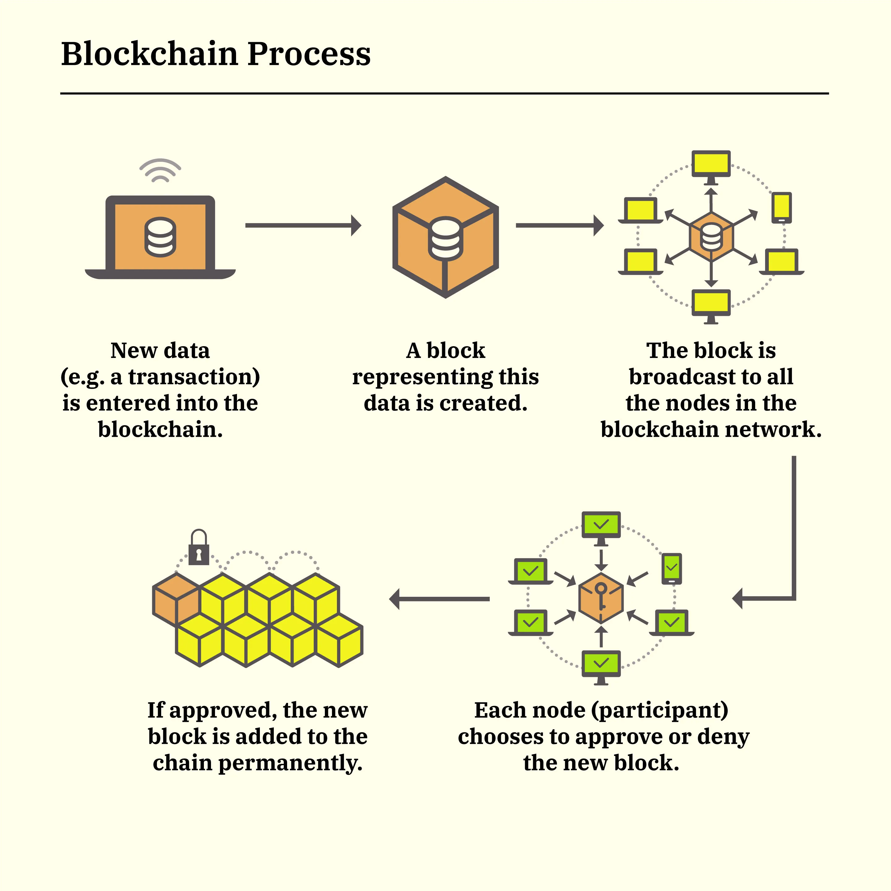
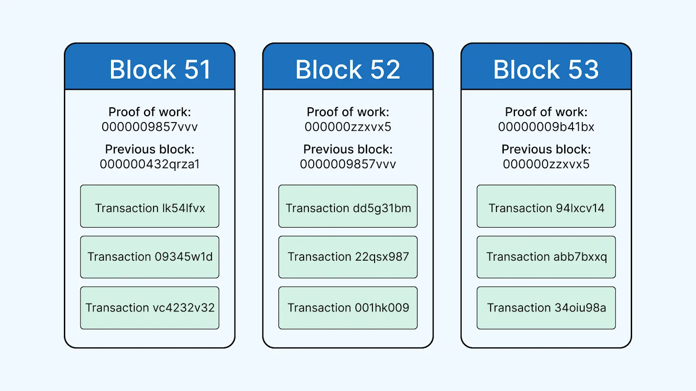
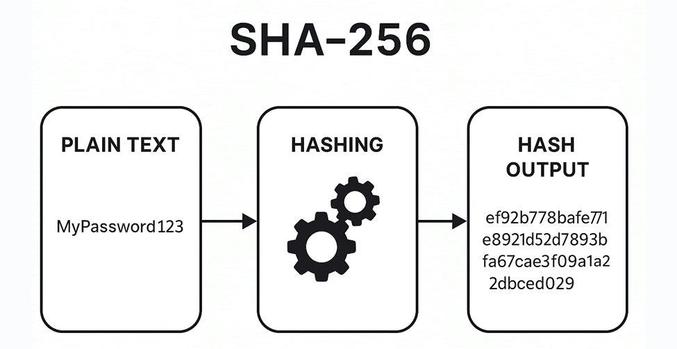
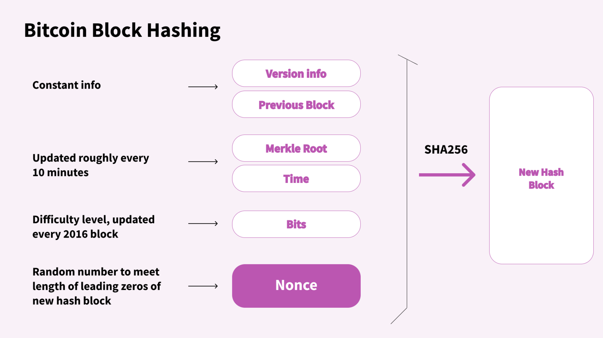
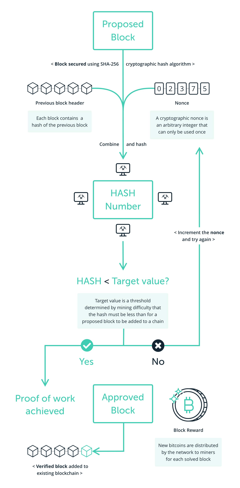
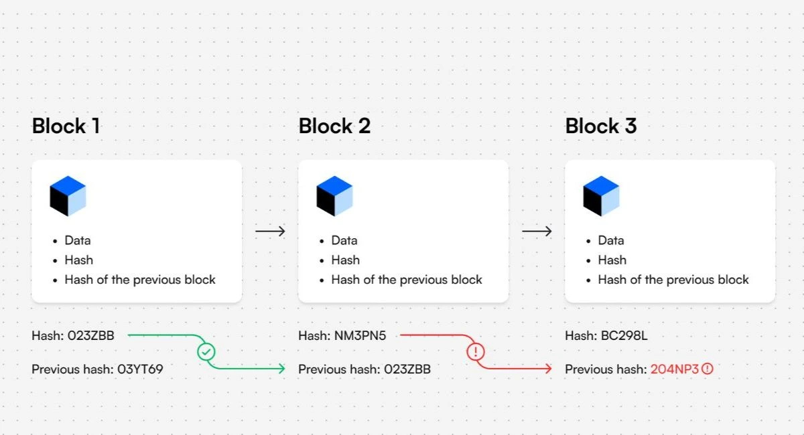

# Module 02. Blockchain Fundamentals

## Deskripsi

Modul ini membahas konsep dasar blockchain dan implementasi sederhananya menggunakan Python. Selain memahami struktur kode, peserta juga akan mempelajari teori dasar blockchain, seperti bagaimana data disimpan, bagaimana integritas dijaga menggunakan hash, dan bagaimana mekanisme Proof of Work bekerja melalui proses mining.

Pada modul ini, implementasi blockchain mencakup:

1. Transaksi sederhana
2. Pembentukan block
3. Pengaitan block dengan hash
4. Mining menggunakan **nonce**
5. Validasi blockchain
6. Pengukuran waktu eksekusi dan penggunaan memori

Berikut adalah (full code)[blockchain/blockchain.py] yang dibahas pada modul ini.

## Prasyarat

Sebelum mempelajari modul ini, peserta sebaiknya:

1. [Menginstall Python dan Visual Studio Code](module-01.md)
2. Memahami [dasar pemrograman Python](https://github.com/Python-Crash-Course/Python101)
3. Mengetahui [konsep class dan object](https://github.com/mocatfrio/data-structure-oop/blob/main/module-02.md)
4. Memahami [list, method, dan function di Python](https://nbviewer.org/github/Python-Crash-Course/Python101/blob/master/Session%203%20-%20Functions/Session%203%20-%20Functions.ipynb)

## List of Contents

- [List of Contents](#list-of-contents)
- [Deskripsi](#deskripsi)
- [Prasyarat](#prasyarat)
- [1. Teori Dasar Blockchain](#1-teori-dasar-blockchain)
  - [1.1 Apa itu Blockchain?](#11-apa-itu-blockchain)
  - [1.2 Mengapa Blockchain Penting?](#12-mengapa-blockchain-penting)
  - [1.3 Komponen Utama Blockchain](#13-komponen-utama-blockchain)
  - [1.4 Konsep Hash](#14-konsep-hash)
  - [1.5 Previous Hash dan Keterhubungan Block](#15-previous-hash-dan-keterhubungan-block)
  - [1.6 Apa itu Mining?](#16-apa-itu-mining)
  - [1.7 Nonce](#17-nonce)
  - [1.8 Proof of Work](#18-proof-of-work)
  - [1.9 Validasi Blockchain](#19-validasi-blockchain)
- [2. Implementasi Program](#2-implementasi-program)
  - [2.1 Import Library](#21-import-library)
  - [2.2 Membuat Class Transaction](#22-membuat-class-transaction)
  - [2.3 Membuat Class Block](#23-membuat-class-block)
  - [2.4 Menghitung Hash Block](#24-menghitung-hash-block)
  - [2.5 Mining Block](#25-mining-block)
  - [2.6 Membuat Class Blockchain](#26-membuat-class-blockchain)
  - [2.7 Genesis Block](#27-genesis-block)
  - [2.8 Mengambil Block Terakhir](#28-mengambil-block-terakhir)
  - [2.9 Menambahkan Transaksi](#29-menambahkan-transaksi)
  - [2.10 Mining Pending Transactions](#210-mining-pending-transactions)
  - [2.11 Validasi Blockchain](#211-validasi-blockchain)
  - [2.12 Program Utama](#212-program-utama)
- [Latihan](#latihan)

## 1. Teori Dasar Blockchain

### 1.1 Apa itu Blockchain?

**Blockchain** adalah struktur data berbentuk rantai blok, di mana setiap blok menyimpan data dan terhubung dengan blok sebelumnya melalui hash. Blockchain dirancang agar data sulit diubah tanpa terdeteksi.

Secara sederhana, blockchain dapat dipahami sebagai:

- Buku besar digital
- Tersusun dari banyak block
- Setiap block saling terhubung
- Setiap perubahan data akan memengaruhi hash block

Karena setiap block saling terikat, maka manipulasi data pada satu block akan merusak hubungan dengan block berikutnya.



### 1.2 Mengapa Blockchain Penting?

Blockchain penting karena menawarkan beberapa karakteristik utama:

1. **Integritas Data**: Data yang sudah masuk ke blockchain sulit diubah tanpa mengubah seluruh rantai berikutnya
2. **Transparansi**: Setiap block menyimpan riwayat transaksi secara terurut
3. **Keamanan**: Keamanan blockchain diperkuat oleh fungsi hash dan mekanisme konsensus
4. **Desentralisasi**: Dalam blockchain nyata, data tidak hanya disimpan di satu tempat, tetapi tersebar di banyak node.

> Pada modul ini, kita belum membangun blockchain terdistribusi penuh. Kita hanya membuat simulasi blockchain lokal untuk memahami konsep dasarnya.

### 1.3 Komponen Utama Blockchain

Secara umum, blockchain terdiri dari tiga komponen utama:

1. **Transaction**: Transaction adalah data yang akan dicatat ke dalam blockchain.

   Contoh:

   - Alice mengirim 10 coin ke Bob
   - Bob mengirim 5 coin ke Charlie
2. **Block**: Block adalah wadah yang menyimpan sekumpulan transaksi beserta metadata penting seperti timestamp, hash, nonce, dan previous hash.
3. **Chain**: Chain adalah rangkaian block yang dihubungkan melalui previous hash.



### 1.4 Konsep Hash

**Hash** adalah hasil dari fungsi matematika yang mengubah input data menjadi string unik dengan panjang tetap.

Pada blockchain, hash memiliki beberapa fungsi penting:

- Menjadi identitas unik block
- Mendeteksi perubahan isi data
- Menghubungkan block satu dengan block sebelumnya

Karakteristik hash:

- Input yang sama menghasilkan hash yang sama
- Perubahan kecil pada input menghasilkan hash yang sangat berbeda
- Sulit menebak input asli dari hash
- Sulit menemukan dua input berbeda dengan hash yang sama

Pada modul ini kita menggunakan algoritma **[SHA-256](https://github.com/Shigoto-dev19/SHA-256-StartersGuide)**.

Contoh sederhana:

- Data: `Alice`
- Hash: `3bc51062973c458d5a6f2d8d64a023246354ad7e064b1e4e009ec8a0699a3043`

Jika data berubah menjadi `"alice"` saja, maka hash-nya akan berubah total.

- Data: `alice`
- Hash: `2bd806c97f0e00af1a1fc3328fa763a9269723c8db8fac4f93af71db186d6e90`



### 1.5 Previous Hash dan Keterhubungan Block

Setiap block menyimpan `previous_hash`, yaitu hash dari block sebelumnya.

Tujuannya:

- Menjaga keterhubungan antar-block
- Memastikan urutan block tetap konsisten
- Mempermudah deteksi manipulasi data

Misalnya:

- Block 1 punya hash `3bc51062973c458d5a6f2d8d64a023246354ad7e064b1e4e009ec8a0699a3043`
- Block 2 menyimpan `previous_hash = 3bc51062973c458d5a6f2d8d64a023246354ad7e064b1e4e009ec8a0699a3043`

Jika isi Block 1 diubah, maka hash Block 1 berubah, sehingga Block 2 menjadi tidak valid karena `previous_hash`-nya tidak lagi cocok.

- Block 1 diubah, sehingga punya hash `2bd806c97f0e00af1a1fc3328fa763a9269723c8db8fac4f93af71db186d6e90`
- Block 2 menyimpan `previous_hash = 3bc51062973c458d5a6f2d8d64a023246354ad7e064b1e4e009ec8a0699a3043`
- Block 1 hash != Block 2 previous_hash

### 1.6 Apa itu Mining?

**Mining** adalah proses mencari hash block yang memenuhi syarat tertentu.

Pada implementasi ini, syaratnya adalah:

- Hash harus diawali sejumlah angka nol tertentu,
- Jumlah nol ditentukan oleh `difficulty`.

Contoh:

- difficulty = 3 → hash harus diawali `000`
- difficulty = 5 → hash harus diawali `00000`

Karena hash tidak bisa diatur langsung, program akan mencoba banyak nilai `nonce` (brute-force iterasi) sampai menemukan hash yang sesuai.

### 1.7 Nonce

**Nonce** adalah angka yang diubah berulang kali selama proses mining.

Fungsi nonce:

- Memmberikan variasi input ke fungsi hash
- Memungkinkan sistem mencoba-coba sampai menemukan hash valid.

Semakin besar difficulty, semakin banyak percobaan nonce yang biasanya dibutuhkan.



### 1.8 Proof of Work

**Proof of Work** adalah mekanisme pembuktian kerja komputasi. Untuk membuat block yang valid, miner harus melakukan kerja komputasi berupa pencarian nonce yang menghasilkan hash sesuai target.

Tujuan Proof of Work:

- Mencegah manipulasi data secara mudah
- Membuat pembuatan block memerlukan usaha
- Meningkatkan keamanan rantai

Dalam blockchain nyata seperti Bitcoin, Proof of Work dilakukan oleh jaringan besar dan memerlukan sumber daya komputasi tinggi. Dalam modul ini, versi yang digunakan jauh lebih sederhana dan hanya untuk pembelajaran.



### 1.9 Validasi Blockchain

Sebuah blockchain dianggap valid jika:

1. Hash setiap block sesuai dengan isi block tersebut,
2. `previous_hash` pada block saat ini sama dengan hash block sebelumnya.

Jika salah satu kondisi ini gagal, maka blockchain tidak valid.



## 2. Implementasi Program

### 2.1 Import Library

```python
import hashlib
import datetime
import json
import time
import tracemalloc
```

Penjelasan:

* `hashlib` digunakan untuk membuat hash SHA-256
* `datetime` digunakan untuk mencatat waktu pembuatan block
* `json` digunakan untuk mengubah isi block menjadi string terstruktur
* `time` digunakan untuk mengukur lama proses mining
* `tracemalloc` digunakan untuk memantau penggunaan memori

### 2.2 Membuat Class Transaction

```python
class Transaction:
  def __init__(self, sender, receiver, amount):
    self.sender = sender
    self.receiver = receiver
    self.amount = amount
  
  def to_dict(self):
    return {
      "sender": self.sender,
      "receiver": self.receiver,
      "amount": self.amount
    }  
  
  def print(self):
    print(self.to_dict())
```

Transaksi adalah unit data paling dasar dalam blockchain. Dalam implementasi ini, transaksi hanya berisi:

* Pengirim
* Penerima
* Jumlah

Pada blockchain nyata, transaksi biasanya juga memiliki:

* Timestamp
* Digital signature
* Transaction ID
* Informasi validasi tambahan

Penjelasan Kode:

- Class `Transaction` digunakan untuk membentuk objek transaksi sederhana.
- Method:
  * `to_dict()` mengubah transaksi menjadi dictionary agar mudah diproses ke JSON
  * `print()` menampilkan isi transaksi

### 2.3 Membuat Class Block

```python
class Block:

    def __init__(self, index, transactions, previous_hash):
        self.index = index
        self.transactions = transactions
        self.previous_hash = previous_hash
        self.nonce = 0
        self.timestamp = str(datetime.datetime.now())
        self.hash = self.calculate_hash()
```

Satu block menyimpan sekumpulan transaksi. Selain transaksi, block juga memiliki metadata yang penting untuk integritas rantai.

Komponen block pada implementasi ini:

* `index`: posisi block di dalam blockchain
* `transactions`: daftar transaksi
* `previous_hash`: hash block sebelumnya
* `nonce`: angka yang diubah saat mining
* `timestamp`: waktu pembentukan block
* `hash`: identitas unik block

Ketika block dibuat:

* nonce dimulai dari 0,
* timestamp diisi waktu saat ini,
* hash langsung dihitung dari isi block.

### 2.4 Menghitung Hash Block

Fungsi ini berada pada Class Block.

```python
def calculate_hash(self):
    block = {
        "index": self.index,
        "transactions": [t.to_dict() for t in self.transactions],
        "previous_hash": self.previous_hash,
        "timestamp": self.timestamp,
        "nonce": self.nonce,
    }
    block_string = json.dumps(block, sort_keys=True)
    generated_hash = hashlib.sha256(block_string.encode()).hexdigest()
    return generated_hash
```

**Hash block** harus mewakili seluruh isi block. Jika isi berubah sedikit saja, hash juga harus berubah. Karena itu, semua komponen penting block digabungkan sebelum dihitung hash-nya.

Mengapa `sort_keys=True` penting?

* Agar urutan key JSON konsisten
* Sehingga hash yang dihasilkan stabil untuk data yang sama.

Method ini:

1. Menyusun isi block dalam dictionary
2. Mengubahnya menjadi string JSON
3. Menghitung SHA-256
4. Mengembalikan hasil hash dalam format hexadecimal

### 2.5 Mining Block

Fungsi ini berada pada Class Block.

```python
def mine_block(self, difficulty):
    start = time.time()
    tracemalloc.start()

    while self.hash[:difficulty] != "0" * difficulty:
        self.nonce += 1
        self.hash = self.calculate_hash()
    print("Block mined:", self.hash)

    end = time.time()
    print("Waktu eksekusi:", end - start, "detik")
  
    current, peak = tracemalloc.get_traced_memory()
    print("Memory sekarang:", current / 10**6, "MB")
    print("Memory maksimum:", peak / 10**6, "MB")
    tracemalloc.stop()
```

**Mining** adalah proses trial and error. Program mencoba banyak nilai nonce sampai hash memenuhi target difficulty.

Semakin tinggi difficulty:

* Semakin sulit menemukan hash valid
* Semakin lama waktu komputasi
* Semakin besar kemungkinan sumber daya yang dibutuhkan

Pengukuran waktu dan memori dalam modul ini membantu peserta memahami bahwa mining bukan proses instan, melainkan memerlukan kerja komputasi.

Method ini:

1. Mencatat waktu awal
2. Memulai pelacakan memori
3. Mengulang perhitungan hash sampai hash valid
4. Menampilkan hash hasil mining
5. Menghitung lama eksekusi
6. Menampilkan penggunaan memori saat proses mining

### 2.6 Membuat Class Blockchain

```python
class Blockchain:
    def __init__(self):
        self.chain = [self.init_genesis_block()]
        self.pending_transactions = []
        self.difficulty = 5
```

Blockchain adalah kumpulan block yang tersusun berurutan. Pada implementasi ini terdapat:

* `chain`: daftar block yang sudah valid,
* `pending_transactions`: transaksi yang belum masuk ke block,
* `difficulty`: tingkat kesulitan mining.

Konsep `pending_transactions` meniru sistem blockchain nyata, di mana transaksi tidak selalu langsung dimasukkan ke block, tetapi menunggu diproses terlebih dahulu.

### 2.7 Genesis Block

Fungsi ini berada pada Class Blockchain.

```python
def init_genesis_block(self):
    return Block(0, [], "0")
```

**Genesis block** adalah block pertama dalam blockchain. Karena tidak ada block sebelumnya, maka `previous_hash` biasanya diisi nilai default seperti `"0"`.

Genesis block adalah titik awal dari seluruh rantai.

### 2.8 Mengambil Block Terakhir

Fungsi ini berada pada Class Blockchain.

```python
def get_latest_block(self):
    return self.chain[-1]
```

Method ini digunakan untuk mengambil block terakhir agar block baru bisa terhubung dengan hash block terbaru.

### 2.9 Menambahkan Transaksi

Fungsi ini berada pada Class Blockchain.

```python
def add_transactions(self, transaction):
    self.pending_transactions.append(transaction)
```

Transaksi baru tidak langsung menjadi bagian dari blockchain. Ia masuk ke daftar `pending_transactions` terlebih dahulu.

Dalam blockchain nyata, transaksi biasanya:

* Dikirim ke jaringan
* Menunggu validasi
* Dikumpulkan oleh miner
* Kemudian dimasukkan ke block

### 2.10 Mining Pending Transactions

Fungsi ini berada pada Class Blockchain.

```python
def mine_pending_transactions(self):
    index = len(self.chain)
    previous_hash = self.get_latest_block().hash
    block = Block(
        index, self.pending_transactions, previous_hash
    )
    block.mine_block(self.difficulty)
    self.chain.append(block)
    self.pending_transactions = []
```

Setelah transaksi terkumpul, sistem membuat block baru dan menghubungkannya ke block terakhir. Setelah berhasil ditambang, block ditambahkan ke chain dan daftar transaksi tertunda dikosongkan.

Method ini:

1. Menentukan index block baru
2. Mengambil hash block terakhir
3. Membentuk block dari transaksi tertunda
4. Melakukan mining
5. Menambahkan block ke blockchain
6. Mengosongkan pending transactions

### 2.11 Validasi Blockchain

Fungsi ini berada pada Class Blockchain.

```python
def is_chain_valid(self):
  for i in range(1, len(self.chain)):
        current = self.chain[i]
        prev = self.chain[i-1]
  
        if current.hash != current.calculate_hash():
            return False
  
        if current.previous_hash != prev.hash:
            return False 
  
    return True
```

Validasi blockchain diperlukan untuk memastikan:

* Tidak ada isi block yang diubah
* Hubungan antar-block tetap benar

Jika isi block diubah, `calculate_hash()` akan menghasilkan nilai baru yang berbeda dari hash lama. Jika hubungan `previous_hash` rusak, artinya ada ketidaksesuaian pada rantai.

### 2.12 Program Utama

```python
if __name__ == "__main__":
    my_blockchain = Blockchain()

    trans1 = Transaction("Alice", "Bob", 10)
    print("Transaksi 1")
    trans1.print()
    print("\n")

    trans2 = Transaction("Bob", "Charlie", 5)
    print("Transaksi 2")
    trans2.print()
    print("\n")

    my_blockchain.add_transactions(trans1)
    my_blockchain.add_transactions(trans2)

    print("Mining block...")
    my_blockchain.mine_pending_transactions()
    print("\n")

    trans3 = Transaction("Charlie", "Diana", 3)
    print("Transaksi 3")
    trans3.print()

    print("Mining block...")
    my_blockchain.mine_pending_transactions()
    print("\n")

    print("Blockchain valid?", my_blockchain.is_chain_valid())
```

Penjelasan alur program:

1. Membuat objek blockchain
2. Membuat dua transaksi pertama
3. Menambahkan transaksi ke pending transactions
4. Menambang block pertama
5. Membuat transaksi ketiga
6. Menambang block berikutnya
7. Mengecek validitas blockchain

## Latihan

1. Ubah `difficulty` dari 5 menjadi 3, lalu bandingkan waktu mining
2. Tambahkan 5 transaksi baru dan tambang block baru
3. Tampilkan seluruh isi blockchain
4. Ubah isi transaksi lama lalu cek validitas chain
5. Tambahkan mining reward
6. Tambahkan method untuk menampilkan seluruh block secara rapi
