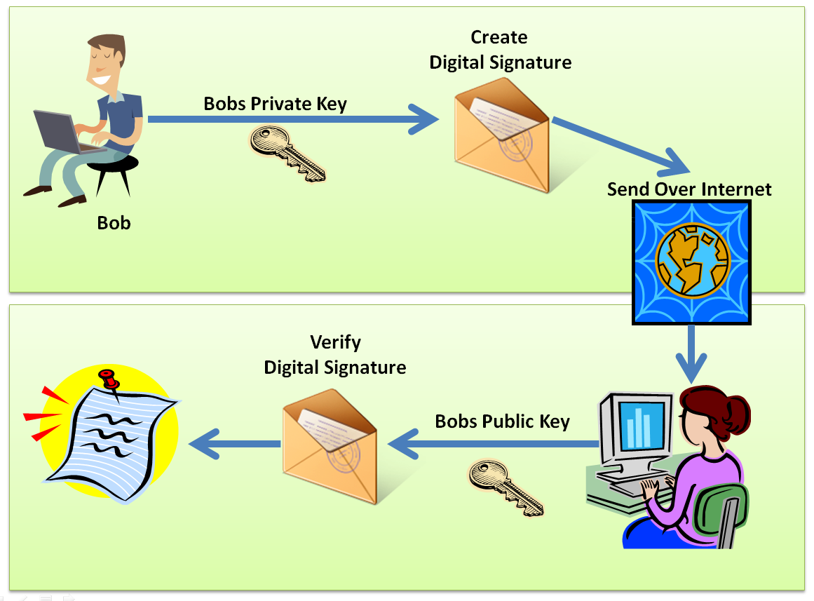
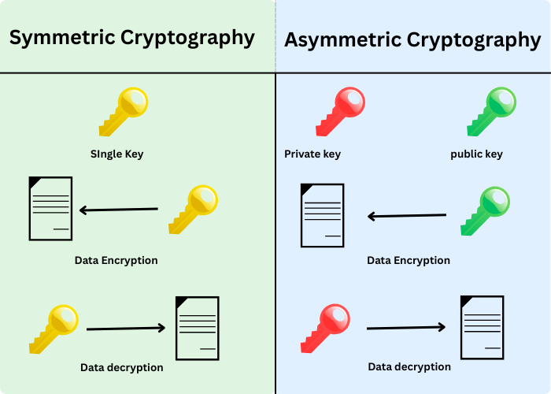
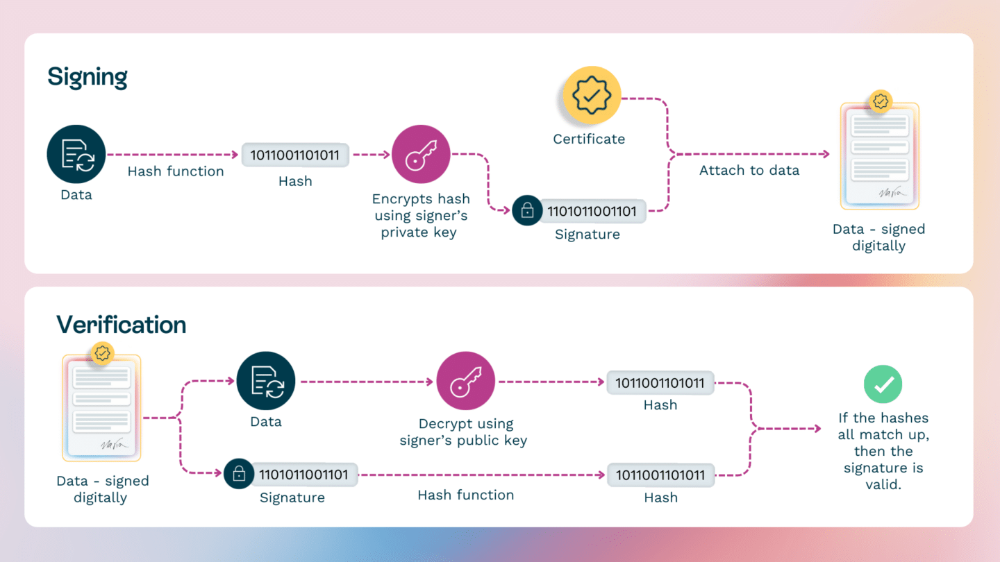

# Module 05. Cryptocurrency

## Deskripsi

Modul ini merupakan kelanjutan dari [Module 04](module-04.md) dan menjadi **solusi dari [Project 01](project-01.md)**. Pada modul ini, kita akan membangun sistem cryptocurrency yang lengkap dengan menggabungkan konsep dari modul-modul sebelumnya:

| Fitur              | Sumber                 |
| ------------------ | ---------------------- |
| Mining Reward      | [Module 03](module-03.md) |
| Multi-Node Network | [Module 04](module-04.md) |
| Flask API          | [Module 04](module-04.md) |
| Digital Signature  | Modul ini              |
| Wallet             | Modul ini              |

Fitur yang diimplementasikan pada modul ini:

1. **Digital Signature** - Memastikan keaslian dan integritas transaksi menggunakan RSA
2. **Wallet** - Mengelola keypair (private key dan public key) untuk kepemilikan coin
3. **Transaction Verification** - Memverifikasi bahwa transaksi benar-benar dibuat oleh pemilik
4. **Mining Reward** - Memberikan insentif kepada miner yang berhasil menambang block
5. **Multi-Node Network** - Mensimulasikan jaringan blockchain terdistribusi dengan minimal 3 node
6. **Consensus (Longest Chain)** - Sinkronisasi antar-node menggunakan aturan chain terpanjang

Berikut adalah [full code](blockchain-project/blockchain.py) dan [Flask app](blockchain-project/app.py) yang dibahas pada modul ini.

## Prasyarat

Sebelum mempelajari modul ini, pastikan telah:

1. Memahami [Module 03 - Advanced Blockchain Concepts](module-03.md)
2. Memahami [Module 04 - Blockchain Network dengan Flask API](module-04.md)
3. Menginstall library yang diperlukan:
   ```bash
   pip install flask requests cryptography
   ```

## List of Contents

- [1. Teori Digital Signature](#1-teori-digital-signature)
  - [1.1 Apa itu Digital Signature?](#11-apa-itu-digital-signature)
  - [1.2 Asymmetric Cryptography](#12-asymmetric-cryptography)
  - [1.3 RSA vs ECDSA](#13-rsa-vs-ecdsa)
  - [1.4 Proses Signing dan Verification](#14-proses-signing-dan-verification)
- [2. Teori Mining Reward](#2-teori-mining-reward)
  - [2.1 Mengapa Mining Reward Diperlukan?](#21-mengapa-mining-reward-diperlukan)
  - [2.2 Coinbase Transaction](#22-coinbase-transaction)
- [3. Teori Multi-Node Network](#3-teori-multi-node-network)
  - [3.1 Desentralisasi](#31-desentralisasi)
  - [3.2 Consensus Mechanism](#32-consensus-mechanism)
  - [3.3 Longest Chain Rule](#33-longest-chain-rule)
- [4. Implementasi Program](#4-implementasi-program)
  - [4.1 Struktur Project](#41-struktur-project)
  - [4.2 Import Library](#42-import-library)
  - [4.3 Class Wallet](#43-class-wallet)
  - [4.4 Class Transaction dengan Digital Signature](#44-class-transaction-dengan-digital-signature)
  - [4.5 Class Block](#45-class-block)
  - [4.6 Class Blockchain dengan Mining Reward](#46-class-blockchain-dengan-mining-reward)
  - [4.7 Flask API](#47-flask-api)
- [5. Menjalankan Multi-Node](#5-menjalankan-multi-node)
  - [5.1 Menjalankan 3 Node](#51-menjalankan-3-node)
  - [5.2 Mendaftarkan Node](#52-mendaftarkan-node)
- [6. Pengujian dengan Postman](#6-pengujian-dengan-postman)
  - [6.1 Membuat Wallet](#61-membuat-wallet)
  - [6.2 Menambahkan Transaksi](#62-menambahkan-transaksi)
  - [6.3 Mining Block](#63-mining-block)
  - [6.4 Validasi Digital Signature](#64-validasi-digital-signature)
  - [6.5 Sinkronisasi Antar-Node](#65-sinkronisasi-antar-node)

---

## 1. Teori Digital Signature

### 1.1 Apa itu Digital Signature?

**Digital Signature** adalah mekanisme kriptografi yang digunakan untuk:

- **Autentikasi**: Membuktikan bahwa transaksi benar-benar dibuat oleh pemilik yang sah
- **Integritas**: Memastikan data transaksi tidak diubah setelah ditandatangani
- **Non-repudiation**: Pengirim tidak dapat menyangkal bahwa ia telah membuat transaksi

Dalam konteks blockchain:

- Setiap user memiliki **private key** (rahasia) dan **public key** (publik)
- Private key digunakan untuk **menandatangani** transaksi
- Public key digunakan untuk **memverifikasi** tanda tangan



### 1.2 Asymmetric Cryptography

**Asymmetric Cryptography** (Kriptografi Asimetris) menggunakan sepasang kunci:

| Kunci                 | Sifat                            | Fungsi                     |
| --------------------- | -------------------------------- | -------------------------- |
| **Private Key** | Rahasia, hanya diketahui pemilik | Menandatangani transaksi   |
| **Public Key**  | Publik, dapat dibagikan          | Memverifikasi tanda tangan |

Karakteristik penting:

- Private key **TIDAK BISA** diturunkan dari public key
- Sesuatu yang dienkripsi dengan private key hanya bisa didekripsi dengan public key yang berpasangan
- Sesuatu yang dienkripsi dengan public key hanya bisa didekripsi dengan private key yang berpasangan



### 1.3 RSA vs ECDSA

Dua algoritma digital signature yang umum digunakan:

| Aspek                      | RSA                   | ECDSA                                      |
| -------------------------- | --------------------- | ------------------------------------------ |
| **Nama Lengkap**     | Rivest-Shamir-Adleman | Elliptic Curve Digital Signature Algorithm |
| **Ukuran Key**       | 2048-4096 bit         | 256-384 bit                                |
| **Kecepatan**        | Lebih lambat          | Lebih cepat                                |
| **Ukuran Signature** | Lebih besar           | Lebih kecil                                |
| **Penggunaan**       | TLS/SSL, Email        | Bitcoin, Ethereum                          |

Pada modul ini, kita menggunakan **RSA** karena lebih mudah dipahami untuk pembelajaran.

### 1.4 Proses Signing dan Verification

**Proses Signing (Penandatanganan):**

1. Buat hash dari data transaksi
2. Enkripsi hash menggunakan private key pengirim
3. Hasil enkripsi adalah digital signature

**Proses Verification (Verifikasi):**

1. Dekripsi digital signature menggunakan public key pengirim
2. Buat hash dari data transaksi yang diterima
3. Bandingkan kedua hash
4. Jika sama, signature valid



## 2. Teori Mining Reward

### 2.1 Mengapa Mining Reward Diperlukan?

Mining adalah proses yang membutuhkan sumber daya komputasi. Tanpa insentif, tidak ada motivasi bagi node untuk melakukan mining. **Mining Reward** memberikan:

- **Insentif ekonomi**: Miner mendapat imbalan atas kerja komputasinya
- **Distribusi coin**: Cara untuk menerbitkan coin baru ke dalam sistem
- **Keamanan jaringan**: Semakin banyak miner, semakin aman jaringan

Pada Bitcoin:

- Reward awal: 50 BTC per block (2009)
- Halving setiap 210.000 block (~4 tahun)
- Reward saat ini: 3.125 BTC per block (2024)

### 2.2 Coinbase Transaction

**Coinbase Transaction** adalah transaksi khusus yang:

- Tidak memiliki pengirim (sender = "SYSTEM" atau "COINBASE")
- Dibuat otomatis saat mining berhasil
- Mengirimkan reward ke alamat miner
- Selalu menjadi transaksi pertama dalam block

```
┌─────────────────────────────────────────┐
│              BLOCK #5                   │
├─────────────────────────────────────────┤
│  Transaction 1: (Coinbase)              │
│    From: SYSTEM                         │
│    To: Miner_Address                    │
│    Amount: 10 coins                     │
├─────────────────────────────────────────┤
│  Transaction 2:                         │
│    From: Alice                          │
│    To: Bob                              │
│    Amount: 5 coins                      │
├─────────────────────────────────────────┤
│  Transaction 3:                         │
│    From: Bob                            │
│    To: Charlie                          │
│    Amount: 2 coins                      │
└─────────────────────────────────────────┘
```

## 3. Teori Multi-Node Network

### 3.1 Desentralisasi

Blockchain yang sebenarnya berjalan di banyak node (komputer) yang tersebar. Setiap node:

- Menyimpan salinan lengkap blockchain
- Dapat memvalidasi transaksi
- Dapat melakukan mining
- Berkomunikasi dengan node lain

Keuntungan desentralisasi:

- **Tidak ada single point of failure**
- **Tahan sensor** - tidak ada otoritas tunggal
- **Transparansi** - semua node bisa memverifikasi

### 3.2 Consensus Mechanism

**Consensus** adalah mekanisme agar semua node menyetujui state blockchain yang sama. Masalah yang harus diselesaikan:

- Bagaimana jika dua miner menemukan block bersamaan?
- Bagaimana jika ada node jahat yang mengirim data palsu?
- Bagaimana menyinkronkan data antar node?

Beberapa mekanisme konsensus:

- **Proof of Work (PoW)** - Bitcoin, Ethereum Classic
- **Proof of Stake (PoS)** - Ethereum 2.0, Cardano
- **Delegated Proof of Stake (DPoS)** - EOS, Tron

### 3.3 Longest Chain Rule

Pada implementasi sederhana, kita menggunakan **Longest Chain Rule**:

> Chain yang paling panjang dianggap sebagai chain yang valid

Logikanya:

- Chain yang lebih panjang = lebih banyak work yang dilakukan
- Node yang jujur akan selalu bekerja pada chain terpanjang
- Attacker harus mengalahkan seluruh jaringan untuk membuat chain palsu

```
Node A: [Genesis] → [Block 1] → [Block 2] → [Block 3]
Node B: [Genesis] → [Block 1] → [Block 2]
Node C: [Genesis] → [Block 1] → [Block 2] → [Block 3] → [Block 4]

Setelah sinkronisasi, semua node akan mengadopsi chain dari Node C
karena memiliki chain terpanjang.
```

## 4. Implementasi Program

### 4.1 Struktur Project

Buat folder baru `blockchain-project` dengan struktur:

```
blockchain-project/
├── blockchain.py    # Core blockchain logic
├── app.py           # Flask API
└── test_local.py    # Testing tanpa API (opsional)
```

### 4.2 Import Library

```python
# blockchain.py
import hashlib
import json
import time
from cryptography.hazmat.primitives import hashes, serialization
from cryptography.hazmat.primitives.asymmetric import rsa, padding
from cryptography.hazmat.backends import default_backend
from cryptography.exceptions import InvalidSignature
import base64
```

Penjelasan library:

- `hashlib` - untuk membuat hash SHA-256
- `json` - untuk serialisasi data
- `time` - untuk timestamp
- `cryptography` - library kriptografi untuk digital signature
- `base64` - untuk encoding signature agar bisa disimpan sebagai string

### 4.3 Class Wallet

Wallet menyimpan keypair (private key dan public key) untuk user.

```python
class Wallet:
    def __init__(self):
        # Generate RSA key pair
        self.private_key = rsa.generate_private_key(
            public_exponent=65537,
            key_size=2048,
            backend=default_backend()
        )
        self.public_key = self.private_key.public_key()

    def get_public_key_string(self):
        """Mengubah public key menjadi string untuk identifikasi"""
        public_bytes = self.public_key.public_bytes(
            encoding=serialization.Encoding.PEM,
            format=serialization.PublicFormat.SubjectPublicKeyInfo
        )
        return public_bytes.decode('utf-8')

    def get_address(self):
        """Membuat address dari hash public key"""
        public_key_string = self.get_public_key_string()
        return hashlib.sha256(public_key_string.encode()).hexdigest()[:40]

    def sign(self, message):
        """Menandatangani pesan dengan private key"""
        message_bytes = message.encode('utf-8')
        signature = self.private_key.sign(
            message_bytes,
            padding.PKCS1v15(),
            hashes.SHA256()
        )
        return base64.b64encode(signature).decode('utf-8')

    def to_dict(self):
        return {
            'address': self.get_address(),
            'public_key': self.get_public_key_string()
        }
```

Penjelasan:

- `__init__` - Generate keypair RSA 2048-bit
- `get_public_key_string` - Mengubah public key menjadi format PEM string
- `get_address` - Membuat alamat wallet dari hash public key (mirip Bitcoin address)
- `sign` - Menandatangani pesan menggunakan private key

### 4.4 Class Transaction dengan Digital Signature

```python
class Transaction:
    def __init__(self, sender_address, sender_public_key, receiver_address, amount):
        self.sender_address = sender_address
        self.sender_public_key = sender_public_key
        self.receiver_address = receiver_address
        self.amount = amount
        self.timestamp = time.time()
        self.signature = None

    def to_dict(self, include_signature=True):
        data = {
            'sender_address': self.sender_address,
            'sender_public_key': self.sender_public_key,
            'receiver_address': self.receiver_address,
            'amount': self.amount,
            'timestamp': self.timestamp
        }
        if include_signature and self.signature:
            data['signature'] = self.signature
        return data

    def calculate_hash(self):
        """Hash dari data transaksi (tanpa signature)"""
        tx_string = json.dumps(self.to_dict(include_signature=False), sort_keys=True)
        return hashlib.sha256(tx_string.encode()).hexdigest()

    def sign_transaction(self, wallet):
        """Menandatangani transaksi dengan wallet pengirim"""
        if wallet.get_address() != self.sender_address:
            raise Exception("Anda tidak bisa menandatangani transaksi untuk wallet lain!")

        tx_hash = self.calculate_hash()
        self.signature = wallet.sign(tx_hash)

    def is_valid(self):
        """Memverifikasi signature transaksi"""
        # Transaksi dari SYSTEM (mining reward) tidak perlu signature
        if self.sender_address == "SYSTEM":
            return True

        if not self.signature:
            print("Transaksi tidak memiliki signature!")
            return False

        try:
            # Reconstruct public key dari string
            public_key = serialization.load_pem_public_key(
                self.sender_public_key.encode('utf-8'),
                backend=default_backend()
            )

            # Decode signature dari base64
            signature_bytes = base64.b64decode(self.signature)

            # Verify signature
            tx_hash = self.calculate_hash()
            public_key.verify(
                signature_bytes,
                tx_hash.encode('utf-8'),
                padding.PKCS1v15(),
                hashes.SHA256()
            )
            return True
        except InvalidSignature:
            print("Signature tidak valid!")
            return False
        except Exception as e:
            print(f"Error verifikasi: {e}")
            return False
```

Penjelasan:

- `to_dict` - Mengubah transaksi ke dictionary, dengan opsi include signature atau tidak
- `calculate_hash` - Membuat hash dari data transaksi (tanpa signature)
- `sign_transaction` - Menandatangani transaksi menggunakan wallet
- `is_valid` - Memverifikasi bahwa signature valid

### 4.5 Class Block

```python
class Block:
    def __init__(self, index, transactions, previous_hash, nonce=0):
        self.index = index
        self.timestamp = time.time()
        self.transactions = transactions
        self.previous_hash = previous_hash
        self.nonce = nonce
        self.hash = self.calculate_hash()

    def calculate_hash(self):
        block_string = json.dumps({
            'index': self.index,
            'timestamp': self.timestamp,
            'transactions': [tx.to_dict() for tx in self.transactions],
            'previous_hash': self.previous_hash,
            'nonce': self.nonce
        }, sort_keys=True)
        return hashlib.sha256(block_string.encode()).hexdigest()

    def mine(self, difficulty):
        """Mining block dengan Proof of Work"""
        target = '0' * difficulty
        while not self.hash.startswith(target):
            self.nonce += 1
            self.hash = self.calculate_hash()
        return self.hash

    def has_valid_transactions(self):
        """Memverifikasi semua transaksi dalam block"""
        for tx in self.transactions:
            if not tx.is_valid():
                return False
        return True

    def to_dict(self):
        return {
            'index': self.index,
            'timestamp': self.timestamp,
            'transactions': [tx.to_dict() for tx in self.transactions],
            'previous_hash': self.previous_hash,
            'nonce': self.nonce,
            'hash': self.hash
        }
```

Penjelasan:

- `has_valid_transactions` - Method baru untuk memverifikasi semua transaksi dalam block memiliki signature yang valid

### 4.6 Class Blockchain dengan Mining Reward

```python
class Blockchain:
    def __init__(self, difficulty=3):
        self.chain = []
        self.pending_transactions = []
        self.difficulty = difficulty
        self.mining_reward = 10  # Reward untuk miner
        self.nodes = set()       # Daftar node dalam jaringan
        self._create_genesis_block()

    def _create_genesis_block(self):
        """Membuat block pertama (genesis block)"""
        genesis = Block(0, [], '0')
        genesis.mine(self.difficulty)
        self.chain.append(genesis)

    def get_last_block(self):
        return self.chain[-1]

    def add_transaction(self, transaction):
        """Menambahkan transaksi ke pending transactions"""
        # Validasi transaksi (kecuali dari SYSTEM)
        if transaction.sender_address != "SYSTEM":
            if not transaction.is_valid():
                raise Exception("Transaksi tidak valid! Signature tidak cocok.")

        self.pending_transactions.append(transaction)
        return len(self.chain)

    def mine_pending_transactions(self, miner_address):
        """Mining semua pending transactions dan memberikan reward ke miner"""
        # Buat transaksi reward untuk miner
        reward_tx = Transaction(
            sender_address="SYSTEM",
            sender_public_key="",
            receiver_address=miner_address,
            amount=self.mining_reward
        )
        self.pending_transactions.insert(0, reward_tx)  # Coinbase tx di awal

        # Buat block baru
        block = Block(
            index=len(self.chain),
            transactions=self.pending_transactions,
            previous_hash=self.get_last_block().hash
        )

        # Mining
        print(f"Mining block #{block.index}...")
        block.mine(self.difficulty)
        print(f"Block #{block.index} berhasil di-mining: {block.hash[:16]}...")

        # Tambahkan ke chain
        self.chain.append(block)

        # Reset pending transactions
        self.pending_transactions = []

        return block

    def get_balance(self, address):
        """Menghitung saldo dari sebuah address"""
        balance = 0
        for block in self.chain:
            for tx in block.transactions:
                if tx.sender_address == address:
                    balance -= tx.amount
                if tx.receiver_address == address:
                    balance += tx.amount
        return balance

    def is_chain_valid(self):
        """Memvalidasi keseluruhan blockchain"""
        for i in range(1, len(self.chain)):
            current = self.chain[i]
            previous = self.chain[i - 1]

            # Cek hash block
            if current.hash != current.calculate_hash():
                print(f"Hash block #{current.index} tidak valid!")
                return False

            # Cek previous hash
            if current.previous_hash != previous.hash:
                print(f"Previous hash block #{current.index} tidak valid!")
                return False

            # Cek semua transaksi dalam block
            if not current.has_valid_transactions():
                print(f"Transaksi dalam block #{current.index} tidak valid!")
                return False

        return True

    # === Multi-Node Functions ===

    def register_node(self, address):
        """Mendaftarkan node baru ke jaringan"""
        self.nodes.add(address)

    def replace_chain(self, new_chain_data):
        """Mengganti chain lokal dengan chain baru yang lebih panjang"""
        if len(new_chain_data) <= len(self.chain):
            return False

        # Reconstruct chain dari data
        new_chain = []
        for block_data in new_chain_data:
            transactions = []
            for tx_data in block_data['transactions']:
                tx = Transaction(
                    sender_address=tx_data['sender_address'],
                    sender_public_key=tx_data.get('sender_public_key', ''),
                    receiver_address=tx_data['receiver_address'],
                    amount=tx_data['amount']
                )
                tx.timestamp = tx_data['timestamp']
                tx.signature = tx_data.get('signature')
                transactions.append(tx)

            block = Block(
                index=block_data['index'],
                transactions=transactions,
                previous_hash=block_data['previous_hash'],
                nonce=block_data['nonce']
            )
            block.timestamp = block_data['timestamp']
            block.hash = block_data['hash']
            new_chain.append(block)

        # Validasi chain baru
        for i in range(1, len(new_chain)):
            current = new_chain[i]
            previous = new_chain[i - 1]
            if current.previous_hash != previous.hash:
                return False

        self.chain = new_chain
        return True
```

Penjelasan fitur baru:

- `mining_reward` - Jumlah coin yang diberikan ke miner
- `nodes` - Set untuk menyimpan alamat node lain
- `mine_pending_transactions` - Menambahkan reward transaction sebelum mining
- `get_balance` - Menghitung saldo berdasarkan riwayat transaksi
- `register_node` - Mendaftarkan node lain
- `replace_chain` - Mengganti chain dengan chain yang lebih panjang (consensus)

### 4.7 Flask API

```python
# app.py
from flask import Flask, jsonify, request
from blockchain import Blockchain, Transaction, Wallet
import requests

app = Flask(__name__)

# Inisialisasi blockchain dan wallet untuk node ini
blockchain = Blockchain(difficulty=3)
wallets = {}  # Menyimpan wallet yang dibuat di node ini
node_identifier = 'node-default'

# === Wallet Endpoints ===

@app.route('/wallet/new', methods=['GET'])
def create_wallet():
    """Membuat wallet baru"""
    wallet = Wallet()
    wallet_id = wallet.get_address()[:8]  # ID singkat untuk referensi
    wallets[wallet_id] = wallet

    return jsonify({
        'message': 'Wallet baru berhasil dibuat',
        'wallet_id': wallet_id,
        'address': wallet.get_address(),
        'public_key': wallet.get_public_key_string()
    }), 201

@app.route('/wallet/<wallet_id>', methods=['GET'])
def get_wallet(wallet_id):
    """Mendapatkan informasi wallet"""
    if wallet_id not in wallets:
        return jsonify({'message': 'Wallet tidak ditemukan'}), 404

    wallet = wallets[wallet_id]
    balance = blockchain.get_balance(wallet.get_address())

    return jsonify({
        'wallet_id': wallet_id,
        'address': wallet.get_address(),
        'balance': balance
    }), 200

@app.route('/wallets', methods=['GET'])
def list_wallets():
    """Daftar semua wallet di node ini"""
    wallet_list = []
    for wallet_id, wallet in wallets.items():
        wallet_list.append({
            'wallet_id': wallet_id,
            'address': wallet.get_address(),
            'balance': blockchain.get_balance(wallet.get_address())
        })
    return jsonify({'wallets': wallet_list}), 200

# === Transaction Endpoints ===

@app.route('/transactions/new', methods=['POST'])
def new_transaction():
    """Membuat transaksi baru"""
    data = request.get_json()
    required = ['sender_wallet_id', 'receiver_address', 'amount']

    if not all(k in data for k in required):
        return jsonify({'message': 'Data tidak lengkap. Butuh: sender_wallet_id, receiver_address, amount'}), 400

    sender_wallet_id = data['sender_wallet_id']
    if sender_wallet_id not in wallets:
        return jsonify({'message': 'Wallet pengirim tidak ditemukan'}), 404

    sender_wallet = wallets[sender_wallet_id]

    # Cek saldo
    balance = blockchain.get_balance(sender_wallet.get_address())
    if balance < data['amount']:
        return jsonify({
            'message': 'Saldo tidak mencukupi',
            'balance': balance,
            'required': data['amount']
        }), 400

    # Buat transaksi
    tx = Transaction(
        sender_address=sender_wallet.get_address(),
        sender_public_key=sender_wallet.get_public_key_string(),
        receiver_address=data['receiver_address'],
        amount=data['amount']
    )

    # Sign transaksi
    tx.sign_transaction(sender_wallet)

    # Tambahkan ke pending
    try:
        block_index = blockchain.add_transaction(tx)
        return jsonify({
            'message': f'Transaksi akan ditambahkan ke block #{block_index}',
            'transaction': tx.to_dict()
        }), 201
    except Exception as e:
        return jsonify({'message': str(e)}), 400

@app.route('/transactions/pending', methods=['GET'])
def pending_transactions():
    """Melihat transaksi yang menunggu di-mining"""
    return jsonify({
        'pending': [tx.to_dict() for tx in blockchain.pending_transactions],
        'count': len(blockchain.pending_transactions)
    }), 200

# === Mining Endpoints ===

@app.route('/mine', methods=['POST'])
def mine():
    """Mining pending transactions"""
    data = request.get_json()

    if not data or 'miner_wallet_id' not in data:
        # Gunakan node identifier sebagai default
        miner_address = node_identifier
    else:
        wallet_id = data['miner_wallet_id']
        if wallet_id not in wallets:
            return jsonify({'message': 'Wallet miner tidak ditemukan'}), 404
        miner_address = wallets[wallet_id].get_address()

    if not blockchain.pending_transactions:
        return jsonify({'message': 'Tidak ada transaksi untuk di-mining'}), 400

    block = blockchain.mine_pending_transactions(miner_address)

    return jsonify({
        'message': 'Block baru berhasil di-mining!',
        'block': block.to_dict(),
        'miner_reward': blockchain.mining_reward
    }), 200

# === Blockchain Endpoints ===

@app.route('/chain', methods=['GET'])
def get_chain():
    """Mendapatkan seluruh blockchain"""
    return jsonify({
        'chain': [block.to_dict() for block in blockchain.chain],
        'length': len(blockchain.chain)
    }), 200

@app.route('/chain/valid', methods=['GET'])
def validate_chain():
    """Memvalidasi blockchain"""
    is_valid = blockchain.is_chain_valid()
    return jsonify({
        'valid': is_valid,
        'length': len(blockchain.chain)
    }), 200

# === Node Endpoints ===

@app.route('/nodes/register', methods=['POST'])
def register_nodes():
    """Mendaftarkan node baru"""
    data = request.get_json()
    nodes = data.get('nodes')

    if not nodes:
        return jsonify({'message': 'Daftar node tidak boleh kosong'}), 400

    for node in nodes:
        blockchain.register_node(node)

    return jsonify({
        'message': f'{len(nodes)} node berhasil didaftarkan',
        'total_nodes': list(blockchain.nodes)
    }), 201

@app.route('/nodes', methods=['GET'])
def get_nodes():
    """Melihat daftar node yang terdaftar"""
    return jsonify({
        'nodes': list(blockchain.nodes),
        'count': len(blockchain.nodes)
    }), 200

@app.route('/nodes/resolve', methods=['GET'])
def consensus():
    """Sinkronisasi dengan node lain (consensus)"""
    replaced = False
    longest_chain = None
    max_length = len(blockchain.chain)

    for node in blockchain.nodes:
        try:
            response = requests.get(f'{node}/chain', timeout=5)
            if response.status_code == 200:
                data = response.json()
                length = data['length']
                chain = data['chain']

                if length > max_length:
                    max_length = length
                    longest_chain = chain
        except requests.exceptions.RequestException:
            continue

    if longest_chain:
        replaced = blockchain.replace_chain(longest_chain)

    if replaced:
        return jsonify({
            'message': 'Chain lokal diganti dengan chain baru dari jaringan',
            'new_length': len(blockchain.chain)
        }), 200
    else:
        return jsonify({
            'message': 'Chain lokal sudah yang terpanjang',
            'length': len(blockchain.chain)
        }), 200

# === Signature Verification Endpoint ===

@app.route('/verify/transaction', methods=['POST'])
def verify_transaction():
    """Memverifikasi signature transaksi"""
    data = request.get_json()
    required = ['sender_address', 'sender_public_key', 'receiver_address', 'amount', 'timestamp', 'signature']

    if not all(k in data for k in required):
        return jsonify({'message': 'Data transaksi tidak lengkap'}), 400

    tx = Transaction(
        sender_address=data['sender_address'],
        sender_public_key=data['sender_public_key'],
        receiver_address=data['receiver_address'],
        amount=data['amount']
    )
    tx.timestamp = data['timestamp']
    tx.signature = data['signature']

    is_valid = tx.is_valid()

    return jsonify({
        'valid': is_valid,
        'message': 'Signature valid' if is_valid else 'Signature tidak valid'
    }), 200

if __name__ == '__main__':
    import sys
    port = int(sys.argv[1]) if len(sys.argv) > 1 else 5000
    node_identifier = f'node-{port}'
    print(f'Node {node_identifier} berjalan di port {port}')
    app.run(host='0.0.0.0', port=port, debug=True)
```

---

## 5. Menjalankan Multi-Node

### 5.1 Menjalankan 3 Node

Buka 3 terminal berbeda dan jalankan:

**Terminal 1 (Node 1 - Port 5000):**

```bash
cd blockchain-project
python app.py 5000
```

**Terminal 2 (Node 2 - Port 5001):**

```bash
cd blockchain-project
python app.py 5001
```

**Terminal 3 (Node 3 - Port 5002):**

```bash
cd blockchain-project
python app.py 5002
```

### 5.2 Mendaftarkan Node

Setelah semua node berjalan, daftarkan node satu sama lain.

**Pada Node 1 (port 5000), daftarkan Node 2 dan Node 3:**

```bash
curl -X POST http://localhost:5000/nodes/register \
  -H "Content-Type: application/json" \
  -d '{"nodes": ["http://localhost:5001", "http://localhost:5002"]}'
```

**Pada Node 2 (port 5001), daftarkan Node 1 dan Node 3:**

```bash
curl -X POST http://localhost:5001/nodes/register \
  -H "Content-Type: application/json" \
  -d '{"nodes": ["http://localhost:5000", "http://localhost:5002"]}'
```

**Pada Node 3 (port 5002), daftarkan Node 1 dan Node 2:**

```bash
curl -X POST http://localhost:5002/nodes/register \
  -H "Content-Type: application/json" \
  -d '{"nodes": ["http://localhost:5000", "http://localhost:5001"]}'
```

## 6. Pengujian dengan Postman

### 6.1 Membuat Wallet

**Request:**

```
GET http://localhost:5000/wallet/new
```

**Response:**

```json
{
    "message": "Wallet baru berhasil dibuat",
    "wallet_id": "a1b2c3d4",
    "address": "a1b2c3d4e5f6g7h8i9j0...",
    "public_key": "-----BEGIN PUBLIC KEY-----\n..."
}
```

Buat beberapa wallet untuk testing (minimal 2).

### 6.2 Menambahkan Transaksi

Sebelum bisa mengirim coin, wallet harus memiliki saldo. Saldo didapat dari mining reward.

**Langkah 1: Mining untuk mendapatkan reward**

**Request:**

```
POST http://localhost:5000/mine
Content-Type: application/json

{
    "miner_wallet_id": "a1b2c3d4"
}
```

Ini akan memberikan 10 coin (mining reward) ke wallet tersebut.

**Langkah 2: Buat transaksi**

**Request:**

```
POST http://localhost:5000/transactions/new
Content-Type: application/json

{
    "sender_wallet_id": "a1b2c3d4",
    "receiver_address": "alamat_wallet_penerima",
    "amount": 5
}
```

**Response:**

```json
{
    "message": "Transaksi akan ditambahkan ke block #2",
    "transaction": {
        "sender_address": "a1b2c3d4...",
        "sender_public_key": "-----BEGIN PUBLIC KEY-----...",
        "receiver_address": "...",
        "amount": 5,
        "timestamp": 1234567890.123,
        "signature": "base64_encoded_signature..."
    }
}
```


### 6.3 Mining Block

**Request:**

```
POST http://localhost:5000/mine
Content-Type: application/json

{
    "miner_wallet_id": "a1b2c3d4"
}
```

**Response:**

```json
{
    "message": "Block baru berhasil di-mining!",
    "block": {
        "index": 2,
        "timestamp": 1234567890.456,
        "transactions": [...],
        "previous_hash": "00012345...",
        "nonce": 12345,
        "hash": "000abc123..."
    },
    "miner_reward": 10
}
```


### 6.4 Validasi Digital Signature

**Request:**

```
POST http://localhost:5000/verify/transaction
Content-Type: application/json

{
    "sender_address": "a1b2c3d4...",
    "sender_public_key": "-----BEGIN PUBLIC KEY-----...",
    "receiver_address": "...",
    "amount": 5,
    "timestamp": 1234567890.123,
    "signature": "base64_encoded_signature..."
}
```

**Response (Valid):**

```json
{
    "valid": true,
    "message": "Signature valid"
}
```

**Response (Invalid - jika signature diubah):**

```json
{
    "valid": false,
    "message": "Signature tidak valid"
}
```

### 6.5 Sinkronisasi Antar-Node

**Skenario:**

1. Mining beberapa block di Node 1 (port 5000)
2. Node 2 dan Node 3 masih memiliki chain yang lebih pendek
3. Jalankan consensus di Node 2 dan Node 3

**Di Node 2:**

```
GET http://localhost:5001/nodes/resolve
```

**Response:**

```json
{
    "message": "Chain lokal diganti dengan chain baru dari jaringan",
    "new_length": 5
}
```

**Verifikasi chain di semua node:**

```
GET http://localhost:5000/chain
GET http://localhost:5001/chain
GET http://localhost:5002/chain
```

Semua node seharusnya memiliki chain yang sama setelah sinkronisasi.

## Referensi

1. [Bitcoin Whitepaper - Satoshi Nakamoto](https://bitcoin.org/bitcoin.pdf)
2. [Mastering Bitcoin - Andreas M. Antonopoulos](https://github.com/bitcoinbook/bitcoinbook)
3. [Python Cryptography Library](https://cryptography.io/en/latest/)
4. [Flask Documentation](https://flask.palletsprojects.com/)
