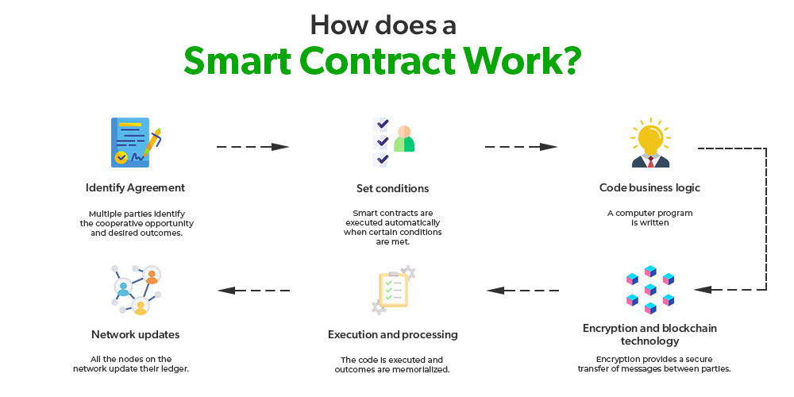
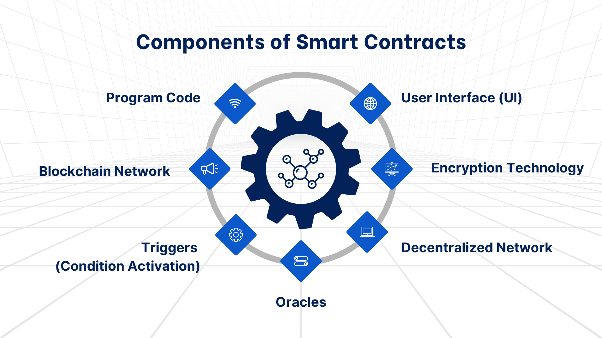
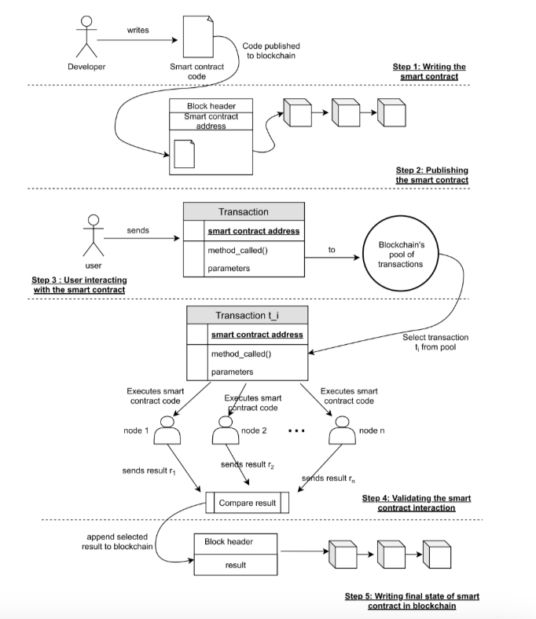
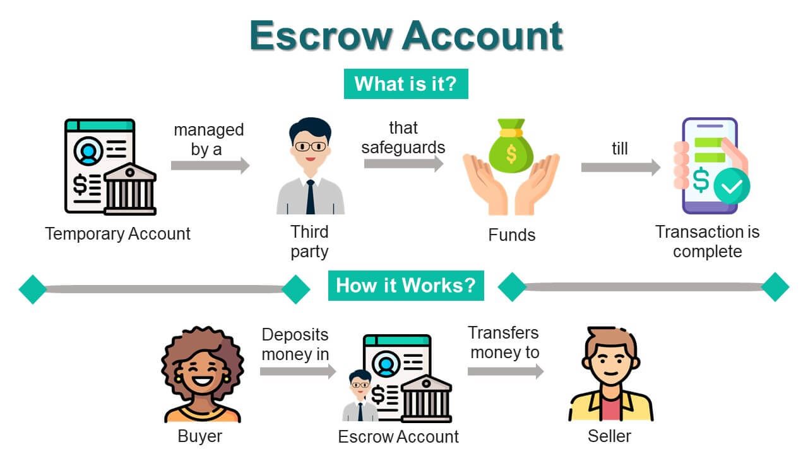

# Module 07. Smart Contracts

## Deskripsi

Modul ini membahas konsep Smart Contract dan implementasi sederhananya menggunakan Python. Selain memahami struktur kode, mahasiswa juga akan mempelajari teori dasar Smart Contract, seperti bagaimana kontrak disimpan di blockchain, bagaimana kondisi eksekusi bekerja secara otomatis, dan bagaimana state kontrak dijaga integritasnya dalam rantai blok.

Pada modul ini, implementasi Smart Contract mencakup:

1. Pembuatan Smart Contract sebagai class Python
2. Deploy contract ke blockchain
3. Eksekusi contract melalui transaksi
4. Penyimpanan state contract di dalam block
5. Simulasi use case Escrow (penitipan dana)
6. Validasi blockchain yang mengandung contract transaction

Berikut adalah [full code](smart-contract/smart_contract.py) yang dibahas pada modul ini.

## Prasyarat

Sebelum mempelajari modul ini, mahasiswa sebaiknya:

1. Memahami [konsep dasar blockchain](module-02.md)
2. Memahami [Cryptocurrency](module-05.md) dan [Advanced Cryptocurrency](module-06.md)
3. Memahami [konsep class dan inheritance di Python](https://github.com/mocatfrio/data-structure-oop/blob/main/module-02.md)
4. Memahami [dictionary dan JSON di Python](https://nbviewer.org/github/Python-Crash-Course/Python101/blob/master/Session%203%20-%20Functions/Session%203%20-%20Functions.ipynb)

## List of Contents

- [Deskripsi](#deskripsi)
- [Prasyarat](#prasyarat)
- [List of Contents](#list-of-contents)
- [1. Teori Dasar Smart Contract](#1-teori-dasar-smart-contract)
  - [1.1 Apa itu Smart Contract?](#11-apa-itu-smart-contract)
  - [1.2 Mengapa Smart Contract Penting?](#12-mengapa-smart-contract-penting)
  - [1.3 Komponen Utama Smart Contract](#13-komponen-utama-smart-contract)
  - [1.4 Bagaimana Smart Contract Dieksekusi?](#14-bagaimana-smart-contract-dieksekusi)
  - [1.5 State pada Smart Contract](#15-state-pada-smart-contract)
  - [1.6 Jenis Use Case Smart Contract](#16-jenis-use-case-smart-contract)
  - [1.7 Perbedaan Blockchain dengan dan tanpa Smart Contract](#17-perbedaan-blockchain-dengan-dan-tanpa-smart-contract)
- [2. Implementasi Program](#2-implementasi-program)
  - [2.1 Import Library](#21-import-library)
  - [2.2 Membuat Class SmartContract (Base)](#22-membuat-class-smartcontract-base)
  - [2.3 Membuat Class EscrowContract](#23-membuat-class-escrowcontract)
  - [2.4 Eksekusi Contract](#24-eksekusi-contract)
  - [2.5 Modifikasi Class Transaction](#25-modifikasi-class-transaction)
  - [2.6 Class Block](#26-class-block)
  - [2.7 Modifikasi Class Blockchain](#27-modifikasi-class-blockchain)
  - [2.8 Deploy Contract ke Blockchain](#28-deploy-contract-ke-blockchain)
  - [2.9 Eksekusi Contract via Blockchain](#29-eksekusi-contract-via-blockchain)
  - [2.10 Program Utama](#210-program-utama)
- [Latihan](#latihan)

## 1. Teori Dasar Smart Contract

### 1.1 Apa itu Smart Contract?

**Smart Contract** adalah program komputer yang berjalan secara otomatis di atas blockchain ketika kondisi tertentu terpenuhi. Tidak ada pihak ketiga yang mengontrol eksekusinya, kode yang mengatur segalanya.

Secara sederhana, Smart Contract dapat dipahami sebagai:

- Perjanjian digital yang ditulis dalam bentuk kode
- Berjalan otomatis tanpa perantara
- Tersimpan permanen di dalam blockchain
- Hasilnya transparan dan dapat diverifikasi siapa saja

Analogi sederhana: Smart Contract seperti mesin penjual otomatis, masukkan uang, tekan tombol, barang keluar.



### 1.2 Mengapa Smart Contract Penting?

Smart Contract penting karena menawarkan beberapa karakteristik utama:

1. **Otomatisasi**: Eksekusi terjadi secara otomatis saat kondisi terpenuhi, tanpa campur tangan manusia
2. **Transparansi**: Kode dan hasilnya dapat dilihat oleh semua pihak di jaringan
3. **Keamanan**: Setelah di-deploy, kode tidak dapat diubah secara sepihak
4. **Efisiensi**: Menghilangkan kebutuhan perantara (notaris, bank, broker)
5. **Kepercayaan**: Pihak-pihak yang bertransaksi tidak perlu saling percaya karena kontrak yang menjamin

> Pada modul ini, kita belum membangun smart contract di jaringan blockchain nyata seperti Ethereum. Kita membuat simulasi Smart Contract dalam Python untuk memahami konsep dasarnya.

### 1.3 Komponen Utama Smart Contract

Secara umum, Smart Contract terdiri dari tiga komponen utama:

1. **State**: Data yang disimpan oleh contract, misalnya saldo, status, atau data pengguna.

   Contoh:
   - `released: False` → dana belum dilepas
   - `amount: 50` → jumlah dana yang dititipkan

2. **Action**: Fungsi yang dapat dipanggil untuk mengubah state contract.

   Contoh:
   - `release` → melepaskan dana ke penerima
   - `check` → memeriksa kondisi contract

3. **Condition**: Syarat yang harus dipenuhi sebelum action dapat dieksekusi.

   Contoh:
   - Hanya `owner` yang boleh memanggil `release`
   - Dana hanya boleh dilepas satu kali



### 1.4 Bagaimana Smart Contract Dieksekusi?

Smart Contract dieksekusi melalui transaksi khusus yang dikirim ke alamat contract di blockchain.

Alur eksekusi:

1. Pengguna mengirim transaksi dengan menyertakan `contract_id`, `action`, dan `params`
2. Blockchain meneruskan transaksi ke contract yang dituju
3. Contract memeriksa kondisi (condition)
4. Jika kondisi terpenuhi, state diperbarui
5. Hasil eksekusi dicatat dalam transaksi dan disimpan ke block



### 1.5 State pada Smart Contract

**State** adalah data yang tersimpan di dalam Smart Contract dan dapat berubah seiring waktu melalui eksekusi action.

Karakteristik state:

- Tersimpan permanen di blockchain selama contract aktif
- Hanya dapat diubah melalui action yang sudah didefinisikan
- Setiap perubahan state dicatat dalam transaksi

Contoh perubahan state pada EscrowContract:

```text
State awal   : { 'released': False, 'amount': 50, 'receiver': 'Bob' }
Setelah release: { 'released': True,  'amount': 50, 'receiver': 'Bob' }
```

Karena state lama tersimpan di block sebelumnya, riwayat perubahan tetap dapat ditelusuri.

### 1.6 Jenis Use Case Smart Contract

Smart Contract memiliki banyak penerapan di dunia nyata:

| Use Case                   | Deskripsi                                                     |
| -------------------------- | ------------------------------------------------------------- |
| **Escrow**                 | Dana dititipkan dan hanya dilepas saat kondisi terpenuhi      |
| **Token / Cryptocurrency** | Aturan pencetakan dan transfer token ditentukan oleh contract |
| **Voting**                 | Proses pemungutan suara yang transparan dan anti-manipulasi   |
| **Supply Chain**           | Pelacakan perpindahan barang secara otomatis                  |
| **Asuransi**               | Klaim otomatis berdasarkan data eksternal (oracle)            |
| **NFT**                    | Kepemilikan aset digital yang dapat diverifikasi              |

Pada modul ini, use case yang diimplementasikan adalah **Escrow**.

### 1.7 Perbedaan Blockchain dengan dan tanpa Smart Contract

| Aspek               | Blockchain Biasa     | Blockchain + Smart Contract |
| ------------------- | -------------------- | --------------------------- |
| Data yang disimpan  | Transaksi saja       | Transaksi + kode + state    |
| Eksekusi logika     | Manual oleh pengguna | Otomatis oleh contract      |
| Kebutuhan perantara | Bisa ada             | Tidak diperlukan            |
| Fleksibilitas       | Terbatas             | Tinggi                      |
| Contoh              | Bitcoin              | Ethereum                    |

## 2. Implementasi Program

### 2.1 Import Library

```python
import hashlib
import datetime
import json
import time
import tracemalloc
```

Penjelasan:

- `hashlib` digunakan untuk membuat hash SHA-256
- `datetime` digunakan untuk mencatat waktu pembuatan block
- `json` digunakan untuk mengubah isi block dan contract menjadi string terstruktur
- `time` digunakan untuk mengukur lama proses mining
- `tracemalloc` digunakan untuk memantau penggunaan memori

### 2.2 Membuat Class SmartContract (Base)

```python
class SmartContract:
    def __init__(self, contract_id, owner, initial_state=None):
        self.contract_id = contract_id
        self.owner = owner
        self.state = initial_state if initial_state else {}
        self.is_deployed = False

    def deploy(self):
        self.is_deployed = True
        print(f"contract '{self.contract_id}' deployed oleh {self.owner}")

    def execute(self, action, params):
        raise NotImplementedError('Subclass harus mengimplementasikan execute()')

    def to_dict(self):
        return {
            'contract_id': self.contract_id,
            'owner': self.owner,
            'state': self.state,
            'is_deployed': self.is_deployed
        }

    def print(self):
        print(json.dumps(self.to_dict(), indent=2))
```

`SmartContract` adalah **base class** (parent class) yang mendefinisikan kerangka dasar sebuah contract.

Penjelasan komponen:

- `contract_id`: identitas unik contract
- `owner`: alamat pemilik contract, biasanya yang men-deploy
- `state`: dictionary yang menyimpan data internal contract
- `is_deployed`: status apakah contract sudah aktif di blockchain

Method:

- `deploy()`: mengaktifkan contract
- `execute()`: method abstrak yang harus diimplementasikan oleh subclass
- `to_dict()`: mengubah contract menjadi dictionary untuk disimpan ke JSON
- `print()`: menampilkan isi contract

### 2.3 Membuat Class EscrowContract

```python
class EscrowContract(SmartContract):
    def __init__(self, contract_id, owner, receiver, amount):
        self.contract_id = contract_id
        self.owner = owner
        self.state = {
            'receiver': receiver,
            'amount': amount,
            'released': False
        }
        self.is_deployed = False
```

`EscrowContract` adalah turunan dari `SmartContract` yang mengimplementasikan logika penitipan dana (escrow).

State awal escrow:

- `receiver`: pihak yang akan menerima dana
- `amount`: jumlah dana yang dititipkan
- `released`: status apakah dana sudah dilepas

### 2.4 Eksekusi Contract

Fungsi ini berada pada Class EscrowContract.

```python
def execute(self, action, params):
    if not self.is_deployed:
        return {'status': 'failed', 'message': 'Contract belum di-deploy'}

    if action == 'release':
        caller = params.get('caller')
        if caller != self.owner:
            return {'status': 'failed', 'message': 'Hanya owner yang dapat melepas dana'}
        if self.state['released']:
            return {'status': 'failed', 'message': 'Dana sudah pernah dilepas'}
        self.state['released'] = True
        return {
            'status': 'success',
            'message': f"Dana sebesar {self.state['amount']} berhasil dikirim ke {self.state['receiver']}'
        }

    if action == 'check':
        return {'status': 'info', 'state': self.state}

    return {'status': 'failed', 'message': f"Aksi '{action}' tidak dikenali'}
```

Method `execute()` mengimplementasikan logika bisnis contract. Setiap action diperiksa kondisinya sebelum dieksekusi.

Penjelasan alur `release`:

1. Periksa apakah contract sudah di-deploy
2. Periksa apakah pemanggil adalah owner
3. Periksa apakah dana belum pernah dilepas
4. Ubah state `released` menjadi `True`
5. Kembalikan hasil eksekusi



### 2.5 Modifikasi Class Transaction

```python
class Transaction:
    def __init__(self, sender, receiver, amount,
                 tx_type='transfer', contract_id=None, action=None, params=None):
        self.sender = sender
        self.receiver = receiver
        self.amount = amount
        self.tx_type = tx_type
        self.contract_id = contract_id
        self.action = action
        self.params = params or {}

    def to_dict(self):
        return {
            'sender': self.sender,
            'receiver': self.receiver,
            'amount': self.amount,
            'tx_type': self.tx_type,
            'contract_id': self.contract_id,
            'action': self.action,
            'params': self.params
        }

    def print(self):
        print(self.to_dict())
```

Class `Transaction` diperluas untuk mendukung dua jenis transaksi:

| `tx_type`    | Deskripsi                                              |
| ------------ | ------------------------------------------------------ |
| `'transfer'` | Transaksi pengiriman koin biasa (seperti di Module 02) |
| `'contract'` | Transaksi eksekusi Smart Contract                      |

Atribut tambahan untuk transaksi contract:

- `contract_id`: ID contract yang dituju
- `action`: aksi yang dipanggil
- `params`: parameter untuk aksi tersebut

### 2.6 Class Block

Class `Block` tidak mengalami perubahan dari Module 02. Block tetap menyimpan daftar transaksi, termasuk transaksi bertipe `'contract'`.

```python
class Block:
    def __init__(self, index, transactions, previous_hash):
        self.index = index
        self.transactions = transactions
        self.previous_hash = previous_hash
        self.nonce = 0
        self.timestamp = str(datetime.datetime.now())
        self.hash = self.calculate_hash()

    def calculate_hash(self):
        block = {
            'index': self.index,
            'transactions': [t.to_dict() for t in self.transactions],
            'previous_hash': self.previous_hash,
            'timestamp': self.timestamp,
            'nonce': self.nonce,
        }
        block_string = json.dumps(block, sort_keys=True)
        generated_hash = hashlib.sha256(block_string.encode()).hexdigest()
        return generated_hash

    def mine_block(self, difficulty):
        start = time.time()
        tracemalloc.start()

        while self.hash[:difficulty] != '0' * difficulty:
            self.nonce += 1
            self.hash = self.calculate_hash()
        print('block mined:', self.hash)

        end = time.time()
        print('waktu eksekusi:', end - start, 'detik')

        current, peak = tracemalloc.get_traced_memory()
        print('memory sekarang:', current / 10**6, 'MB')
        print('memory maksimum:', peak / 10**6, 'MB')
        tracemalloc.stop()
```

Karena `to_dict()` pada class `Transaction` sudah menyertakan field `tx_type`, `contract_id`, `action`, dan `params`, maka block secara otomatis menyimpan informasi eksekusi contract di dalamnya.

### 2.7 Modifikasi Class Blockchain

```python
class Blockchain:
    def __init__(self):
        self.chain = [self.init_genesis_block()]
        self.pending_transactions = []
        self.difficulty = 3
        self.contracts = {}

    def init_genesis_block(self):
        return Block(0, [], '0')

    def get_latest_block(self):
        return self.chain[-1]

    def add_transaction(self, transaction):
        self.pending_transactions.append(transaction)

    def mine_pending_transactions(self):
        index = len(self.chain)
        previous_hash = self.get_latest_block().hash
        block = Block(index, self.pending_transactions, previous_hash)
        block.mine_block(self.difficulty)
        self.chain.append(block)
        self.pending_transactions = []

    def is_chain_valid(self):
        for i in range(1, len(self.chain)):
            current = self.chain[i]
            prev = self.chain[i - 1]
            if current.hash != current.calculate_hash():
                return False
            if current.previous_hash != prev.hash:
                return False
        return True
```

Perubahan pada class `Blockchain`:

- Ditambahkan atribut `contracts`: dictionary yang menyimpan semua contract yang sudah di-deploy, dengan `contract_id` sebagai key
- Method `add_transactions` diubah nama menjadi `add_transaction` (singular) agar lebih konsisten

### 2.8 Deploy Contract ke Blockchain

Fungsi ini berada pada Class Blockchain.

```python
def deploy_contract(self, contract):
    contract.deploy()
    self.contracts[contract.contract_id] = contract
```

**Deploy** adalah proses mendaftarkan Smart Contract ke blockchain agar dapat dieksekusi.

Method ini:

1. Memanggil `deploy()` pada contract untuk mengaktifkannya
2. Menyimpan contract ke dictionary `self.contracts`

Setelah di-deploy, contract dapat dipanggil kapan saja melalui transaksi.

### 2.9 Eksekusi Contract via Blockchain

Fungsi ini berada pada Class Blockchain.

```python
def execute_contract(self, contract_id, action, params):
    if contract_id not in self.contracts:
        print(f"contract '{contract_id}' tidak ditemukan")
        return None

    contract = self.contracts[contract_id]
    result = contract.execute(action, params)

    tx = Transaction(
        sender=params.get('caller', 'unknown'),
        receiver=contract_id,
        amount=0,
        tx_type='contract',
        contract_id=contract_id,
        action=action,
        params=params
    )
    self.pending_transactions.append(tx)
    return result
```

Setiap eksekusi contract dicatat sebagai transaksi bertipe `'contract'` dan masuk ke `pending_transactions`. Artinya, eksekusi baru benar-benar tersimpan permanen di blockchain setelah blok dimining.

Method ini:

1. Memeriksa apakah contract terdaftar di blockchain
2. Memanggil `execute()` pada contract
3. Membuat transaksi pencatatan eksekusi
4. Menambahkan transaksi ke pending
5. Mengembalikan hasil eksekusi

### 2.10 Program Utama

```python
if __name__ == '__main__':
    my_blockchain = Blockchain()

    # deploy escrow contract
    print('deploy smart contract')
    escrow = EscrowContract('escrow-001', owner='Alice', receiver='Bob', amount=50)
    my_blockchain.deploy_contract(escrow)
    print()

    # cek state awal contract
    print('cek state awal contract')
    result = my_blockchain.execute_contract('escrow-001', 'check', {'caller': 'Alice'})
    print(result)
    print()

    # tambahkan transaksi biasa
    print('tambah transaksi biasa')
    tx1 = Transaction('Alice', 'Bob', 50)
    tx1.print()
    my_blockchain.add_transaction(tx1)
    print()

    # mining block 1
    print('mining block 1')
    my_blockchain.mine_pending_transactions()
    print()

    # eksekusi contract: release dana
    print('eksekusi contract: release dana')
    result = my_blockchain.execute_contract('escrow-001', 'release', {'caller': 'Alice'})
    print(result)
    print()

    # coba release lagi (harus gagal)
    print('eksekusi contract: release dana (kedua kali)')
    result = my_blockchain.execute_contract('escrow-001', 'release', {'caller': 'Alice'})
    print(result)
    print()

    # mining block 2
    print('mining block 2')
    my_blockchain.mine_pending_transactions()
    print()

    # validasi blockchain
    print('blockchain valid?', my_blockchain.is_chain_valid())
```

Penjelasan alur program:

1. Membuat objek blockchain
2. Membuat dan men-deploy EscrowContract
3. Mengecek state awal contract
4. Menambahkan transaksi biasa ke pending
5. Mining block pertama (menyimpan transaksi biasa + cek state)
6. Mengeksekusi contract untuk melepas dana
7. Mencoba melepas dana kedua kali (harus gagal karena kondisi tidak terpenuhi)
8. Mining block kedua (menyimpan kedua eksekusi contract)
9. Memvalidasi seluruh blockchain

Contoh output program:

```text
deploy smart contract
contract 'escrow-001' deployed oleh Alice

cek state awal contract
{'status': 'info', 'state': {'receiver': 'Bob', 'amount': 50, 'released': False}}

tambah transaksi biasa
{'sender': 'Alice', 'receiver': 'Bob', 'amount': 50, 'tx_type': 'transfer', ...}

mining block 1
block mined: 000a3f...
waktu eksekusi: 0.312 detik

eksekusi contract: release dana
{'status': 'success', 'message': 'Dana sebesar 50 berhasil dikirim ke Bob'}

eksekusi contract: release dana (kedua kali)
{'status': 'failed', 'message': 'Dana sudah pernah dilepas'}

mining block 2
block mined: 000b7c...
waktu eksekusi: 0.287 detik

blockchain valid? True
```

## Latihan

1. tambahkan validasi bahwa contract hanya bisa di-deploy satu kali (cegah deploy ulang dengan `contract_id` yang sama)
2. buat class `VotingContract` yang menyimpan daftar kandidat dan menghitung suara
3. tambahkan action `refund` pada `EscrowContract` yang memungkinkan owner menarik kembali dana jika belum di-release
4. tampilkan seluruh isi blockchain beserta jenis transaksi (`transfer` atau `contract`) secara rapi
5. ubah state contract secara langsung (tanpa melalui `execute()`), lalu cek apakah blockchain tetap valid — amati perbedaannya
6. buat `TokenContract` sederhana yang memiliki method `mint` (cetak token) dan `transfer` (kirim token antar alamat)
