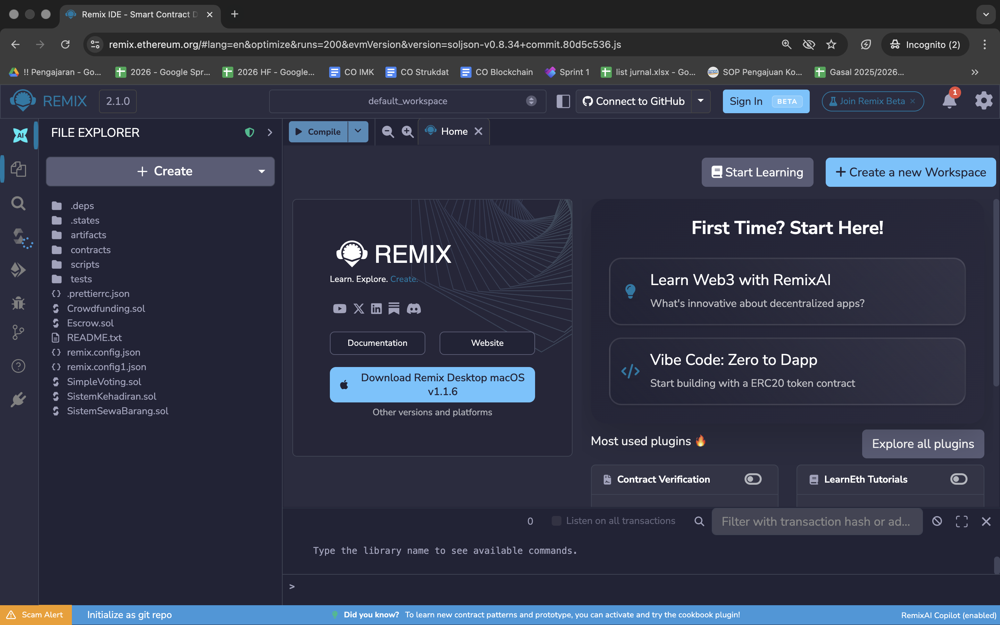

# Module 08. Smart Contract dengan Solidity dan Remix IDE

## Deskripsi

Modul ini merupakan panduan hands-on untuk memahami dasar-dasar smart contract menggunakan Remix IDE. Fokus modul ini adalah **pemahaman konsep dan logika**, bukan menulis kode dari nol.

**Tools:** Browser, Remix Ethereum IDE
**Prasyarat:** Paham dasar blockchain, transaksi, wallet, dan konsep address secara umum

## Tujuan Pembelajaran

Setelah mengikuti modul ini, peserta diharapkan mampu:

1. Menjelaskan apa itu smart contract
2. Mengenali bagian dasar kode Solidity
3. Menjalankan smart contract sederhana di Remix
4. Membedakan function, state, dan constructor
5. Memahami `require`, `msg.sender`, dan owner-only access
6. Menguji skenario transaksi berhasil dan gagal

## List of Contents

- [Module 07. Smart Contract dengan Remix IDE](#module-07-smart-contract-dengan-remix-ide)
  - [Deskripsi](#deskripsi)
  - [Tujuan Pembelajaran](#tujuan-pembelajaran)
  - [List of Contents](#list-of-contents)
  - [1. Konsep Dasar Smart Contract](#1-konsep-dasar-smart-contract)
    - [1.1 Apa itu Smart Contract?](#11-apa-itu-smart-contract)
    - [1.2 Perbedaan dengan Program Biasa](#12-perbedaan-dengan-program-biasa)
    - [1.3 Istilah Penting](#13-istilah-penting)
  - [2. Mengenal Remix IDE](#2-mengenal-remix-ide)
    - [2.1 Apa itu Remix?](#21-apa-itu-remix)
    - [2.2 Komponen Utama Remix](#22-komponen-utama-remix)
  - [3. Implementasi Contract: Simple Voting](#3-implementasi-contract-simple-voting)
    - [3.1 License dan Pragma](#31-license-dan-pragma)
    - [3.2 State Variables](#32-state-variables)
    - [3.3 Constructor](#33-constructor)
    - [3.4 Function voteYes()](#34-function-voteyes)
    - [3.5 Function resetVoting()](#35-function-resetvoting)
  - [4. Langkah Praktik di Remix](#4-langkah-praktik-di-remix)
    - [4.1 Membuka Remix](#41-membuka-remix)
    - [4.2 Membuat File Contract](#42-membuat-file-contract)
    - [4.3 Compile Contract](#43-compile-contract)
    - [4.4 Deploy Contract](#44-deploy-contract)
    - [4.5 Berinteraksi dengan Contract](#45-berinteraksi-dengan-contract)
    - [4.6 Modifikasi 1: Tambah Vote &#34;No&#34;](#46-modifikasi-1-tambah-vote-no)
    - [4.7 Modifikasi 2: Total Vote](#47-modifikasi-2-total-vote)
    - [4.8 Modifikasi 3: Voting Open/Close](#48-modifikasi-3-voting-openclose)
    - [4.9 Modifikasi 4: Event](#49-modifikasi-4-event)
  - [5. Mengenal Solidity](#5-mengenal-solidity)
    - [5.1 Tipe Data Solidity](#51-tipe-data-solidity)
      - [Value Types](#value-types)
      - [Reference Types](#reference-types)
      - [Mapping](#mapping)
    - [5.2 Visibility Modifiers](#52-visibility-modifiers)
    - [5.3 Function Modifiers](#53-function-modifiers)
      - [State Mutability](#state-mutability)
    - [5 Custom Modifiers](#5-custom-modifiers)
  - [9. Gas dan Biaya Transaksi](#9-gas-dan-biaya-transaksi)
    - [9.1 Apa itu Gas?](#91-apa-itu-gas)
    - [9.2 Estimasi Gas di Remix](#92-estimasi-gas-di-remix)
    - [9.3 Tips Menghemat Gas](#93-tips-menghemat-gas)
  - [10. Skenario Testing](#10-skenario-testing)
    - [10.1 Test Case: Voting Berhasil](#101-test-case-voting-berhasil)
    - [10.2 Test Case: Double Voting (Gagal)](#102-test-case-double-voting-gagal)
    - [10.3 Test Case: Reset oleh Non-Owner (Gagal)](#103-test-case-reset-oleh-non-owner-gagal)
    - [10.4 Membaca Error Message](#104-membaca-error-message)
  - [11. Langkah Selanjutnya](#11-langkah-selanjutnya)
  - [Latihan](#latihan)
    - [Latihan 1: Eksplorasi Tipe Data](#latihan-1-eksplorasi-tipe-data)
    - [Latihan 2: Visibility Testing](#latihan-2-visibility-testing)
    - [Latihan 3: Modifier dan Access Control](#latihan-3-modifier-dan-access-control)
    - [Latihan 4: Gas Analysis](#latihan-4-gas-analysis)
    - [Latihan 5: Complete Voting System](#latihan-5-complete-voting-system)
    - [Latihan 6: Deploy ke Testnet](#latihan-6-deploy-ke-testnet)
    - [Latihan 7: Challenge - Token Sederhana](#latihan-7-challenge---token-sederhana)

## 1. Konsep Dasar Smart Contract

### 1.1 Apa itu Smart Contract?

**Smart contract** adalah program yang berjalan di blockchain untuk menjalankan aturan secara otomatis. Bayangkan seperti mesin penjual otomatis (vending machine):

```
┌─────────────────────────────────────────────────────────────┐
│                    VENDING MACHINE                          │
│                                                             │
│  1. Masukkan uang ──────► Cek jumlah uang                   │
│  2. Pilih minuman  ──────► Cek ketersediaan                 │
│  3. Jika valid     ──────► Keluarkan minuman + kembalian    │
│  4. Jika tidak     ──────► Batalkan transaksi               │
│                                                             │
│  Tidak ada manusia yang mengoperasikan!                     │
└─────────────────────────────────────────────────────────────┘
```

Smart contract bekerja dengan cara yang sama:

- **Input:** Data/perintah dari pengguna
- **Logic:** Aturan yang sudah terprogram
- **Output:** Hasil eksekusi (perubahan state atau penolakan)

### 1.2 Perbedaan dengan Program Biasa

| Aspek                 | Program Biasa            | Smart Contract                |
| --------------------- | ------------------------ | ----------------------------- |
| **Lokasi**      | Server/komputer tertentu | Blockchain (terdistribusi)    |
| **Kontrol**     | Pemilik server           | Tidak ada yang bisa mengubah  |
| **Eksekusi**    | Satu mesin               | Semua node di jaringan        |
| **Kepercayaan** | Perlu trust ke pemilik   | Trustless (kode adalah hukum) |
| **Perubahan**   | Bisa diubah kapan saja   | Immutable (tidak bisa diubah) |

### 1.3 Istilah Penting

| Istilah                  | Penjelasan                                                | Analogi                    |
| ------------------------ | --------------------------------------------------------- | -------------------------- |
| **State Variable** | Data yang disimpan oleh contract                          | Variabel di database       |
| **Function**       | Aksi yang bisa dijalankan pada contract                   | Method/fungsi program      |
| **Constructor**    | Function khusus yang berjalan sekali saat contract dibuat | Setup awal                 |
| **msg.sender**     | Address yang sedang memanggil function                    | "Siapa yang login?"        |
| **require**        | Syarat yang harus dipenuhi, jika tidak transaksi gagal    | if-else dengan auto-reject |
| **revert**         | Keadaan saat transaksi dibatalkan                         | Rollback transaction       |
| **owner**          | Address pemilik contract (biasanya pembuat)               | Admin sistem               |

## 2. Mengenal Remix IDE

### 2.1 Apa itu Remix?

**Remix IDE** adalah Integrated Development Environment berbasis web untuk menulis, compile, deploy, dan menguji smart contract Ethereum.

**URL:** https://remix.ethereum.org

Kelebihan Remix:

- Tidak perlu instalasi
- Gratis dan open source
- Mendukung simulasi blockchain (Remix VM)
- Cocok untuk belajar dan prototyping

### 2.2 Komponen Utama Remix

```
┌─────────────────────────────────────────────────────────────────┐
│                        REMIX IDE                                │
├─────────────┬───────────────────────────────────────────────────┤
│             │                                                   │
│   SIDEBAR   │              EDITOR AREA                          │
│             │                                                   │
│  ┌───────┐  │  ┌─────────────────────────────────────────────┐  │
│  │ Files │  │  │ // SPDX-License-Identifier: MIT             │  │
│  │       │  │  │ pragma solidity ^0.8.20;                    │  │
│  │ ────  │  │  │                                             │  │
│  │ ────  │  │  │ contract SimpleVoting {                     │  │
│  │ ────  │  │  │     address public owner;                   │  │
│  └───────┘  │  │     ...                                     │  │
│             │  └─────────────────────────────────────────────┘  │
│  ┌───────┐  ├───────────────────────────────────────────────────┤
│  │Compile│  │              TERMINAL / OUTPUT                    │
│  └───────┘  │  ┌─────────────────────────────────────────────┐  │
│             │  │ [Transaction Log]                           │  │
│  ┌───────┐  │  │ [Compile Status]                            │  │
│  │Deploy │  │  │ [Error Messages]                            │  │
│  └───────┘  │  └─────────────────────────────────────────────┘  │
└─────────────┴───────────────────────────────────────────────────┘
```

**Komponen yang perlu diperhatikan:**

1. **File Explorer** (icon folder)

   - Tempat menyimpan dan mengelola file contract
   - Bisa membuat folder dan file baru
2. **Solidity Compiler** (icon S)

   - Compile kode Solidity menjadi bytecode
   - Menampilkan error jika ada kesalahan syntax
3. **Deploy & Run Transactions** (icon Ethereum)

   - Deploy contract ke blockchain (VM atau testnet)
   - Menjalankan function pada contract
   - Mengatur account dan environment
4. **Deployed Contracts**

   - Daftar contract yang sudah di-deploy
   - Tempat untuk berinteraksi dengan contract

## 3. Implementasi Contract: Simple Voting

Salin dan gunakan kode berikut di Remix:

```sol
// SPDX-License-Identifier: MIT
pragma solidity ^0.8.20;

contract SimpleVoting {
    address public owner;          
    uint public yesCount;          
    mapping(address => bool) public hasVoted;  

    constructor() {
        owner = msg.sender;  // Pembuat contract menjadi owner
    }

    function voteYes() public {
        require(!hasVoted[msg.sender], "You have already voted");
        hasVoted[msg.sender] = true;
        yesCount += 1;
    }

    function resetVoting() public {
        require(msg.sender == owner, "Only owner can reset voting");
        yesCount = 0;
    }
}
```

### 3.1 License dan Pragma

```sol
// SPDX-License-Identifier: MIT
pragma solidity ^0.8.20;
```

- `SPDX-License-Identifier`: Lisensi kode (MIT = open source)
- `pragma solidity`: Versi compiler yang digunakan

### 3.2 State Variables

```sol
address public owner;
uint public yesCount;
mapping(address => bool) public hasVoted;
```

| Variable     | Tipe        | Fungsi                             |
| ------------ | ----------- | ---------------------------------- |
| `owner`    | `address` | Menyimpan address pemilik contract |
| `yesCount` | `uint`    | Menyimpan jumlah vote "yes"        |
| `hasVoted` | `mapping` | Mencatat apakah address sudah vote |

**Kata kunci `public`:** Membuat variable dapat dibaca dari luar contract

### 3.3 Constructor

```sol
constructor() {
    owner = msg.sender;
}
```

- Dijalankan **sekali saja** saat contract dibuat
- `msg.sender` = address yang men-deploy contract
- Menjadikan deployer sebagai `owner`

### 3.4 Function voteYes()

```sol
function voteYes() public {
    require(!hasVoted[msg.sender], "You have already voted");
    hasVoted[msg.sender] = true;
    yesCount += 1;
}
```

**Alur kerja:**

```
┌────────────────────────────────────────────────────────────┐
│                   voteYes() dipanggil                      │
└─────────────────────────┬──────────────────────────────────┘
                          │
                          ▼
            ┌─────────────────────────────┐
            │ hasVoted[msg.sender] == true?│
            └──────────────┬──────────────┘
                   ┌───────┴───────┐
                   │               │
                  YES             NO
                   │               │
                   ▼               ▼
            ┌──────────┐    ┌────────────────────┐
            │  REVERT  │    │ hasVoted = true    │
            │  (gagal) │    │ yesCount += 1      │
            └──────────┘    │ (berhasil)         │
                            └────────────────────┘
```

### 3.5 Function resetVoting()

```sol
function resetVoting() public {
    require(msg.sender == owner, "Only owner can reset voting");
    yesCount = 0;
}
```

**Access Control:**

- Hanya `owner` yang bisa menjalankan function ini
- Jika bukan owner, transaksi akan revert

## 4. Langkah Praktik di Remix

### 4.1 Membuka Remix

1. Buka browser (Chrome/Firefox recommended)
2. Akses https://remix.ethereum.org
3. Tunggu sampai IDE selesai loading



### 4.2 Membuat File Contract

1. Klik icon **File Explorer** di sidebar
2. Klik icon **Create New File** (atau klik kanan → New File)
3. Beri nama: `SimpleVoting.sol`
4. Salin kode contract ke file tersebut

### 4.3 Compile Contract

1. Klik icon **Solidity Compiler** di sidebar
2. Pastikan versi compiler sesuai (0.8.x)
3. Klik tombol **Compile SimpleVoting.sol**
4. Jika berhasil, akan muncul centang hijau

**Jika ada error:**

- Baca pesan error dengan teliti
- Biasanya typo atau versi tidak sesuai

### 4.4 Deploy Contract

1. Klik icon **Deploy & Run Transactions** di sidebar
2. Pengaturan:
   - **Environment:** `Remix VM (Cancun)` atau `Remix VM (Shanghai)`
   - **Account:** Pilih salah satu (ada 10 test account dengan 100 ETH masing-masing)
   - **Contract:** Pastikan `SimpleVoting` terpilih
3. Klik tombol **Deploy**
4. Contract akan muncul di bagian **Deployed Contracts**

### 4.5 Berinteraksi dengan Contract

Setelah deploy, di bagian **Deployed Contracts** akan muncul:

```
▼ SIMPLEVOTING AT 0x...
   ├── owner          [button]  ← Baca owner address
   ├── yesCount       [button]  ← Baca jumlah vote
   ├── hasVoted       [input]   ← Cek apakah address sudah vote
   ├── voteYes        [button]  ← Berikan vote
   └── resetVoting    [button]  ← Reset voting (owner only)
```

**Warna tombol:**

- **Biru:** Function read-only (gratis, tidak mengubah state)
- **Orange:** Function yang mengubah state (membutuhkan transaksi)

### 4.6 Modifikasi 1: Tambah Vote "No"

```sol
uint public noCount;

function voteNo() public {
    require(!hasVoted[msg.sender], "You have already voted");
    hasVoted[msg.sender] = true;
    noCount += 1;
}
```

### 4.7 Modifikasi 2: Total Vote

```sol
function getTotalVotes() public view returns (uint) {
    return yesCount + noCount;
}
```

### 4.8 Modifikasi 3: Voting Open/Close

```sol
bool public votingOpen = true;

modifier onlyWhenOpen() {
    require(votingOpen, "Voting is closed");
    _;
}

function voteYes() public onlyWhenOpen {
    // ... kode vote
}

function closeVoting() public {
    require(msg.sender == owner, "Only owner");
    votingOpen = false;
}
```

### 4.9 Modifikasi 4: Event

```sol
event VoteCasted(address indexed voter, bool vote);

function voteYes() public {
    require(!hasVoted[msg.sender], "Already voted");
    hasVoted[msg.sender] = true;
    yesCount += 1;
    emit VoteCasted(msg.sender, true);  // Emit event
}
```

## 5. Mengenal Solidity

### 5.1 Tipe Data Solidity

Solidity adalah bahasa **statically typed**, artinya setiap variabel harus dideklarasikan tipenya.

#### Value Types

Value types menyimpan data langsung di memory.

| Tipe                     | Deskripsi                     | Contoh                                |
| ------------------------ | ----------------------------- | ------------------------------------- |
| `bool`                 | Boolean (true/false)          | `bool isActive = true;`             |
| `uint`                 | Unsigned integer (>= 0)       | `uint age = 25;`                    |
| `int`                  | Signed integer (bisa negatif) | `int temperature = -5;`             |
| `address`              | Alamat Ethereum (20 bytes)    | `address owner = msg.sender;`       |
| `bytes1` - `bytes32` | Fixed-size byte arrays        | `bytes32 hash = keccak256("data");` |

**Variasi uint dan int:**

```
┌─────────────────────────────────────────────────────────────────┐
│                    INTEGER TYPES                                │
├─────────────────────────────────────────────────────────────────┤
│  uint8   : 0 to 255                                             │
│  uint16  : 0 to 65,535                                          │
│  uint32  : 0 to 4,294,967,295                                   │
│  uint64  : 0 to 18,446,744,073,709,551,615                      │
│  uint128 : 0 to 340,282,366,920,938,463,463,374,607,431,768,... │
│  uint256 : 0 to 2^256 - 1  (default untuk "uint")               │
├─────────────────────────────────────────────────────────────────┤
│  int8    : -128 to 127                                          │
│  int256  : -(2^255) to (2^255 - 1)  (default untuk "int")       │
└─────────────────────────────────────────────────────────────────┘
```

**Contoh penggunaan:**

```sol
// SPDX-License-Identifier: MIT
pragma solidity ^0.8.20;

contract DataTypes {
    bool public isActive = true;
    uint256 public totalSupply = 1000000;
    int256 public temperature = -10;
    address public contractOwner;

    enum Status { Pending, Active, Completed, Cancelled }
    Status public currentStatus = Status.Pending;

    constructor() {
        contractOwner = msg.sender;
    }
}
```

#### Reference Types

Reference types menyimpan referensi ke lokasi data (memory, storage, calldata).

| Tipe       | Deskripsi               | Contoh                     |
| ---------- | ----------------------- | -------------------------- |
| `string` | Text dinamis (UTF-8)    | `string name = "Alice";` |
| `bytes`  | Dynamic byte array      | `bytes data = "hello";`  |
| `array`  | Kumpulan elemen sejenis | `uint[] numbers;`        |
| `struct` | Custom data structure   | `struct Person { ... }`  |

**Contoh penggunaan:**

```sol
// SPDX-License-Identifier: MIT
pragma solidity ^0.8.20;

contract ReferenceTypes {
    // String
    string public name = "My Contract";

    // Dynamic array
    uint[] public numbers;

    // Fixed-size array
    uint[5] public fixedNumbers = [1, 2, 3, 4, 5];

    // Struct
    struct Person {
        string name;
        uint age;
        address wallet;
    }

    Person[] public people;

    function addPerson(string memory _name, uint _age) public {
        people.push(Person({
            name: _name,
            age: _age,
            wallet: msg.sender
        }));
    }

    function addNumber(uint _num) public {
        numbers.push(_num);
    }

    function getNumbersLength() public view returns (uint) {
        return numbers.length;
    }
}
```

#### Mapping

Mapping adalah struktur data key-value seperti dictionary/hashmap.

```sol
// Syntax: mapping(KeyType => ValueType) visibility name;

mapping(address => uint) public balances;
mapping(address => bool) public isRegistered;
mapping(uint => string) public idToName;

// Nested mapping
mapping(address => mapping(address => uint)) public allowances;
```

**Karakteristik Mapping:**

| Fitur              | Keterangan                                      |
| ------------------ | ----------------------------------------------- |
| Default value      | Semua key memiliki default value (0, false, "") |
| Tidak bisa di-loop | Tidak ada cara untuk iterate semua keys         |
| Tidak ada length   | Tidak bisa tahu berapa banyak entries           |
| Key types          | Hanya value types (uint, address, bytes32, dll) |

**Contoh lengkap:**

```sol
// SPDX-License-Identifier: MIT
pragma solidity ^0.8.20;

contract MappingExample {
    mapping(address => uint) public balances;
    mapping(address => bool) public hasAccount;

    function createAccount() public {
        require(!hasAccount[msg.sender], "Account exists");
        hasAccount[msg.sender] = true;
        balances[msg.sender] = 100; // Bonus awal
    }

    function deposit(uint amount) public {
        require(hasAccount[msg.sender], "No account");
        balances[msg.sender] += amount;
    }

    function getBalance() public view returns (uint) {
        return balances[msg.sender];
    }
}
```

### 5.2 Visibility Modifiers

Visibility menentukan siapa yang bisa mengakses function atau variable.

```
┌─────────────────────────────────────────────────────────────────┐
│                    VISIBILITY MODIFIERS                         │
├─────────────────────────────────────────────────────────────────┤
│                                                                 │
│  public     ████████████████████  Bisa diakses dari mana saja   │
│  external   ████████████████░░░░  Hanya dari luar contract      │
│  internal   ████████████░░░░░░░░  Contract ini + turunannya     │
│  private    ████████░░░░░░░░░░░░  Hanya contract ini            │
│                                                                 │
└─────────────────────────────────────────────────────────────────┘
```

| Visibility   | Dari Contract | Dari Turunan | Dari Luar |
| ------------ | ------------- | ------------ | --------- |
| `public`   | Ya            | Ya           | Ya        |
| `external` | Tidak*        | Tidak        | Ya        |
| `internal` | Ya            | Ya           | Tidak     |
| `private`  | Ya            | Tidak        | Tidak     |

*external bisa dipanggil dengan `this.functionName()`

**Contoh penggunaan:**

```sol
// SPDX-License-Identifier: MIT
pragma solidity ^0.8.20;

contract VisibilityExample {
    uint public publicVar = 1;      // Bisa dibaca siapa saja
    uint private privateVar = 2;    // Hanya contract ini
    uint internal internalVar = 3;  // Contract ini + turunan

    // Public: bisa dipanggil dari mana saja
    function publicFunction() public view returns (uint) {
        return publicVar;
    }

    // Private: hanya bisa dipanggil di dalam contract ini
    function privateFunction() private view returns (uint) {
        return privateVar;
    }

    // Internal: contract ini + contract turunan
    function internalFunction() internal view returns (uint) {
        return internalVar;
    }

    // External: hanya bisa dipanggil dari luar
    function externalFunction() external view returns (uint) {
        return publicVar;
    }

    // Memanggil private function dari public function
    function callPrivate() public view returns (uint) {
        return privateFunction(); // OK
    }
}

// Contract turunan
contract ChildContract is VisibilityExample {
    function accessParent() public view returns (uint) {
        // return privateVar;      // ERROR: private
        // return privateFunction(); // ERROR: private
        return internalVar;         // OK: internal
    }
}
```

**Best Practices:**

| Gunakan      | Kapan                                                      |
| ------------ | ---------------------------------------------------------- |
| `private`  | Data sensitif, helper functions internal                   |
| `internal` | Functions yang akan di-override oleh turunan               |
| `public`   | Functions yang perlu diakses dari mana saja                |
| `external` | Functions yang hanya dipanggil dari luar (lebih hemat gas) |

### 5.3 Function Modifiers

#### State Mutability

Menentukan bagaimana function berinteraksi dengan blockchain state.

| Modifier    | Baca State | Ubah State | Terima ETH | Gas Cost  |
| ----------- | ---------- | ---------- | ---------- | --------- |
| (none)      | Ya         | Ya         | Tidak      | Bayar gas |
| `view`    | Ya         | Tidak      | Tidak      | Gratis*   |
| `pure`    | Tidak      | Tidak      | Tidak      | Gratis*   |
| `payable` | Ya         | Ya         | Ya         | Bayar gas |

*Gratis jika dipanggil secara external (bukan dari transaksi)

```sol
// SPDX-License-Identifier: MIT
pragma solidity ^0.8.20;

contract FunctionModifiers {
    uint public counter = 0;

    // Regular function - bisa baca dan ubah state
    function increment() public {
        counter += 1;  // Mengubah state
    }

    // VIEW - hanya membaca state, tidak mengubah
    function getCounter() public view returns (uint) {
        return counter;  // Membaca state
    }

    // PURE - tidak membaca atau mengubah state
    function add(uint a, uint b) public pure returns (uint) {
        return a + b;  // Hanya komputasi
    }

    // PAYABLE - bisa menerima ETH
    function deposit() public payable {
        // msg.value berisi jumlah ETH yang dikirim
        // ETH otomatis masuk ke contract
    }

    // Cek balance contract
    function getBalance() public view returns (uint) {
        return address(this).balance;
    }
}
```

**Kapan menggunakan:**

```
┌─────────────────────────────────────────────────────────────────┐
│  view   → Getter functions, cek kondisi                         │
│  pure   → Kalkulasi matematika, hash, validasi format           │
│  payable → Menerima pembayaran, donation, purchase              │
│  (none) → Setter functions, update state                        │
└─────────────────────────────────────────────────────────────────┘
```

### 5.4 Custom Modifiers

Modifier memungkinkan kita membuat "pre-condition" yang reusable.

```sol
// SPDX-License-Identifier: MIT
pragma solidity ^0.8.20;

contract CustomModifiers {
    address public owner;
    bool public paused = false;

    constructor() {
        owner = msg.sender;
    }

    // Modifier: hanya owner yang bisa akses
    modifier onlyOwner() {
        require(msg.sender == owner, "Not owner");
        _;  // Lanjutkan eksekusi function
    }

    // Modifier: hanya saat tidak di-pause
    modifier whenNotPaused() {
        require(!paused, "Contract is paused");
        _;
    }

    // Modifier: dengan parameter
    modifier minimumValue(uint _min) {
        require(msg.value >= _min, "Value too low");
        _;
    }

    // Menggunakan modifier
    function pause() public onlyOwner {
        paused = true;
    }

    function unpause() public onlyOwner {
        paused = false;
    }

    // Kombinasi multiple modifiers
    function doSomething() public whenNotPaused onlyOwner {
        // Hanya bisa dijalankan jika:
        // 1. Contract tidak di-pause
        // 2. Caller adalah owner
    }

    // Modifier dengan parameter
    function buyItem() public payable minimumValue(0.01 ether) whenNotPaused {
        // Hanya jika value >= 0.01 ETH dan tidak paused
    }
}
```

**Alur eksekusi modifier:**

```
┌────────────────────────────────────────────────────────────────┐
│  function doSomething() public whenNotPaused onlyOwner { ... } │
└────────────────────────────────────────────────────────────────┘
                              │
                              ▼
              ┌───────────────────────────────┐
              │  1. whenNotPaused             │
              │     require(!paused, ...)     │
              │     _; ──────────────────┐    │
              └──────────────────────────┼────┘
                                         │
                                         ▼
              ┌───────────────────────────────┐
              │  2. onlyOwner                 │
              │     require(msg.sender == ...) │
              │     _; ──────────────────┐    │
              └──────────────────────────┼────┘
                                         │
                                         ▼
              ┌───────────────────────────────┐
              │  3. Function body             │
              │     { ... actual code ... }   │
              └───────────────────────────────┘
```

## 6. Gas dan Biaya Transaksi

### 6.1 Apa itu Gas?

**Gas** adalah unit yang mengukur komputasi di Ethereum. Setiap operasi membutuhkan gas.

```
┌─────────────────────────────────────────────────────────────────┐
│                         GAS CONCEPT                             │
├─────────────────────────────────────────────────────────────────┤
│                                                                 │
│  Transaction Fee = Gas Used × Gas Price                         │
│                                                                 │
│  ┌─────────────┐   ┌─────────────┐   ┌─────────────────────┐    │
│  │  Gas Used   │ × │  Gas Price  │ = │  Transaction Fee    │    │
│  │  (units)    │   │  (Gwei)     │   │  (ETH)              │    │
│  └─────────────┘   └─────────────┘   └─────────────────────┘    │
│                                                                 │
│  Contoh:                                                        │
│  21,000 gas × 30 Gwei = 630,000 Gwei = 0.00063 ETH              │
│                                                                 │
└─────────────────────────────────────────────────────────────────┘
```

**Biaya operasi umum:**

| Operasi                   | Gas Cost (approx)       |
| ------------------------- | ----------------------- |
| Transfer ETH              | 21,000                  |
| SSTORE (simpan data baru) | 20,000                  |
| SSTORE (update data)      | 5,000                   |
| SLOAD (baca data)         | 2,100                   |
| ADD, SUB, MUL             | 3-5                     |
| Deployment contract       | 32,000 + (200 × bytes) |

### 6.2 Estimasi Gas di Remix

Setelah menjalankan transaksi di Remix, lihat **Terminal** untuk informasi gas:

```
┌─────────────────────────────────────────────────────────────────┐
│  [vm] from: 0x5B3...eddC4                                       │
│  to: SimpleVoting.voteYes()                                     │
│  value: 0 wei                                                   │
│  data: 0xc6...                                                  │
│  logs: 0                                                        │
│  hash: 0x123...                                                 │
│                                                                  │
│  transaction cost: 46,213 gas  ← Total gas yang digunakan       │
│  execution cost: 24,925 gas    ← Gas untuk eksekusi saja        │
└─────────────────────────────────────────────────────────────────┘
```

- **Transaction cost**: Total gas termasuk overhead transaksi
- **Execution cost**: Gas untuk menjalankan kode contract

### 6.3 Tips Menghemat Gas

| Tips                 | Penjelasan                         | Contoh                             |
| -------------------- | ---------------------------------- | ---------------------------------- |
| Gunakan `uint256`  | Default size, tidak perlu konversi | `uint256` bukan `uint8`        |
| Pack variables       | Variabel kecil berdekatan          | `uint128 a; uint128 b;`          |
| Gunakan `calldata` | Untuk parameter read-only          | `function f(string calldata s)`  |
| Hindari loop besar   | Loop = gas × iterations           | Batasi array size                  |
| Short-circuit        | Kondisi murah di depan             | `require(a && expensiveCheck())` |
| Gunakan events       | Lebih murah dari storage           | `emit` vs `array.push()`       |

**Contoh optimasi:**

```sol
// KURANG OPTIMAL
contract BadGas {
    uint8 a;    // 1 byte
    uint256 b;  // 32 bytes
    uint8 c;    // 1 byte - slot baru!
    // Total: 3 storage slots
}

// LEBIH OPTIMAL
contract GoodGas {
    uint8 a;    // 1 byte  ┐
    uint8 c;    // 1 byte  ├── Packed dalam 1 slot
    uint256 b;  // 32 bytes - slot terpisah
    // Total: 2 storage slots
}
```

## 7. Skenario Testing

### 7.1 Test Case: Voting Berhasil

**Langkah:**

1. Deploy contract SimpleVoting
2. Pastikan Account 1 terpilih (deployer = owner)
3. Klik tombol `voteYes`
4. Klik tombol `yesCount` untuk verifikasi

**Expected Result:**

```
┌─────────────────────────────────────────────────────────────────┐
│  ✓ Transaksi berhasil (hijau di terminal)                       │
│  ✓ yesCount berubah dari 0 menjadi 1                            │
│  ✓ hasVoted[Account1] = true                                    │
└─────────────────────────────────────────────────────────────────┘
```

### 7.2 Test Case: Double Voting (Gagal)

**Langkah:**

1. Setelah voting pertama berhasil
2. Klik `voteYes` lagi dengan account yang sama

**Expected Result:**

```
┌─────────────────────────────────────────────────────────────────┐
│  ✗ Transaksi gagal (merah di terminal)                          │
│  ✗ Error: "You have already voted"                              │
│  ✗ yesCount tetap 1 (tidak berubah)                             │
│  ✗ Gas tetap digunakan untuk validasi                           │
└─────────────────────────────────────────────────────────────────┘
```

### 7.3 Test Case: Reset oleh Non-Owner (Gagal)

**Langkah:**

1. Ganti ke Account 2 (bukan owner) di dropdown Account
2. Klik tombol `resetVoting`

**Expected Result:**

```
┌─────────────────────────────────────────────────────────────────┐
│  ✗ Transaksi gagal (merah di terminal)                          │
│  ✗ Error: "Only owner can reset voting"                         │
│  ✗ yesCount tidak berubah                                       │
└─────────────────────────────────────────────────────────────────┘
```

### 7.4 Membaca Error Message

Ketika transaksi gagal, Remix menampilkan informasi di Terminal:

```
┌─────────────────────────────────────────────────────────────────┐
│  transact to SimpleVoting.voteYes errance:                      │
│                                                                 │
│  revert                                                         │
│    The transaction has been reverted to the initial state.      │
│                                                                 │
│  Reason provided by the contract:                               │
│    "You have already voted"   ← Pesan dari require()            │
│                                                                 │
│  Debug the transaction to get more information.                 │
└─────────────────────────────────────────────────────────────────┘
```

**Tips Debugging:**

1. **Baca error message** - Biasanya cukup jelas
2. **Cek account aktif** - Pastikan menggunakan account yang benar
3. **Cek value** - Untuk function payable, pastikan mengirim ETH
4. **Gunakan Debugger** - Klik "Debug" untuk step-by-step execution

## Latihan

Kerjakan latihan berikut di rumah untuk memperdalam pemahaman:

### Latihan 1: Eksplorasi Tipe Data

1. Deklarasikan variabel untuk setiap tipe data:

   - bool, uint, int, address, string
2. Buat struct "Product" dengan field:

   - name (string)
   - price (uint)
   - isAvailable (bool)
3. Buat array products dan mapping owner ke Product
4. Implementasi function:

   - addProduct(name, price)
   - toggleAvailability(index)
   - getProduct(index) returns Product

### Latihan 2: Visibility Testing

1. Buat contract "Parent" dengan:

   - publicVar, privateVar, internalVar
   - publicFunc(), privateFunc(), internalFunc()
2. Buat contract "Child is Parent" dan coba akses:

   - Mana yang bisa diakses?
   - Mana yang error?

### Latihan 3: Modifier dan Access Control

1. State variables:

   - owner (address)
   - balance (uint)
   - paused (bool)
2. Modifiers:

   - onlyOwner
   - whenNotPaused
   - minimumDeposit(uint _min)
3. Functions:

   - deposit() payable - minimal 0.01 ether
   - withdraw(uint amount) - hanya owner
   - pause() / unpause() - hanya owner
   - transferOwnership(address newOwner)

### Latihan 4: Gas Analysis

1. Deploy SimpleVoting
2. Catat gas cost untuk:

   - voteYes() pertama kali
   - voteYes() kedua kali (gagal)
   - resetVoting()
3. Bandingkan:

   - Transaksi berhasil vs gagal
   - Function yang baca state vs ubah state
4. Buat tabel perbandingan hasil

### Latihan 5: Complete Voting System

1. State:

   - owner, yesCount, noCount
   - votingOpen (bool)
   - votingDeadline (uint timestamp)
   - voters (mapping address => bool)
   - voterList (address[]) - untuk tracking
2. Events:

   - VoteCasted(voter, choice)
   - VotingClosed(yesCount, noCount, winner)
3. Modifiers:

   - onlyOwner
   - onlyWhenOpen
   - beforeDeadline
4. Functions:

   - constructor(uint durationInMinutes)
   - voteYes()
   - voteNo()
   - closeVoting() - owner only
   - getResults() returns (yes, no, winner)
   - getVoterCount() returns uint
   - hasVoted(address) returns bool
5. Testing:

   - Deploy dengan duration 5 menit
   - Vote dari 3 account berbeda
   - Coba vote setelah deadline
   - Close voting dan cek hasil

### Latihan 6: Buat contoh Smart Contract lain

Kelompok 1: Sistem Kehadiran
Kelompok 2: Sistem Sewa Barang
Kelompok 3: Escrow Pembayaran
Kelompok 4: Crowdfunding
