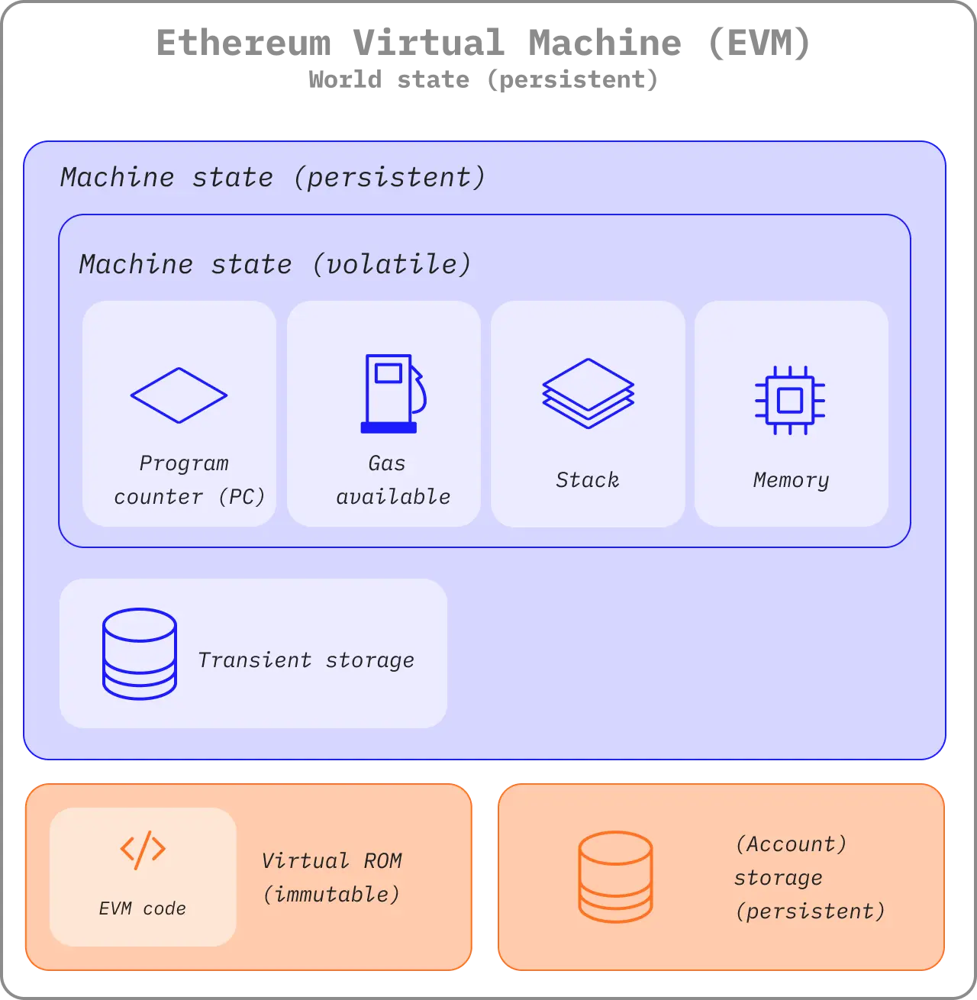
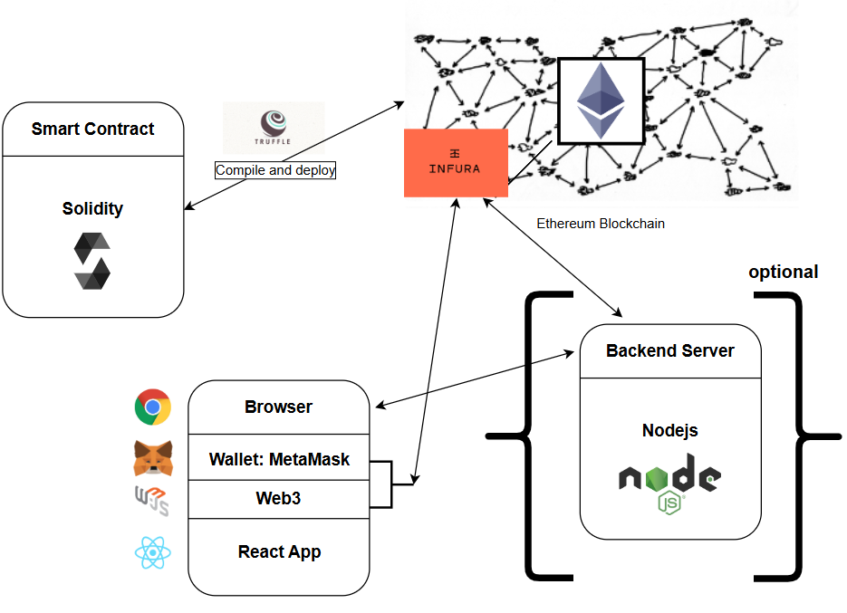

# Module 09. Smart Contract dengan Solidity dan Hardhat

## Deskripsi

Modul ini adalah kelanjutan dari Module 08, di mana Smart Contract disimulasikan menggunakan Python. Pada modul ini, Smart Contract diimplementasikan secara nyata menggunakan **Solidity** - bahasa pemrograman khusus untuk Smart Contract di jaringan Ethereum - dan di-deploy ke blockchain lokal menggunakan **Hardhat** dan local blockchain node.

Pada modul ini, implementasi Smart Contract mencakup:

1. Menulis Smart Contract menggunakan bahasa Solidity
2. Mengkompilasi dan men-deploy contract menggunakan Hardhat
3. Berinteraksi dengan contract yang sudah di-deploy menggunakan ethers.js
4. Menguji kebenaran contract secara otomatis menggunakan Hardhat Test

Berikut adalah [full code](smart-contract/contracts/) yang dibahas pada modul ini.

## Prasyarat

Sebelum mempelajari modul ini, mahasiswa sebaiknya:

1. [Menginstall Python dan Visual Studio Code](module-01.md)
2. Memahami [konsep dasar blockchain](module-02.md)
3. Memahami [konsep Smart Contract (simulasi Python)](module-09.md)
4. Menginstall [Node.js](https://nodejs.org) versi 18 ke atas
5. Menginstall salah satu local blockchain node: [Ganache](https://trufflesuite.com/ganache), [Anvil](https://book.getfoundry.sh/anvil/) (Foundry), atau menggunakan Hardhat Network bawaan

Install dependensi yang dibutuhkan:

```bash
cd smart-contract/contracts
pnpm install
```

## List of Contents

- [Deskripsi](#deskripsi)
- [Prasyarat](#prasyarat)
- [List of Contents](#list-of-contents)
- [1. Teori Dasar](#1-teori-dasar)
  - [1.1 Dari Simulasi ke Implementasi Nyata](#11-dari-simulasi-ke-implementasi-nyata)
  - [1.2 Ethereum Virtual Machine (EVM)](#12-ethereum-virtual-machine-evm)
  - [1.3 Apa itu Solidity?](#13-apa-itu-solidity)
  - [1.4 Komponen Utama Solidity](#14-komponen-utama-solidity)
  - [1.5 Apa itu Hardhat?](#15-apa-itu-hardhat)
  - [1.6 Local Blockchain untuk Development](#16-local-blockchain-untuk-development)
  - [1.7 Alur Kerja Smart Contract di Ethereum](#17-alur-kerja-smart-contract-di-ethereum)
- [2. Implementasi Program](#2-implementasi-program)
  - [2.1 Struktur Proyek](#21-struktur-proyek)
  - [2.2 Menulis Smart Contract](#22-menulis-smart-contract)
  - [2.3 State Variables](#23-state-variables)
  - [2.4 Constructor](#24-constructor)
  - [2.5 Functions dan Access Control](#25-functions-dan-access-control)
  - [2.6 Konfigurasi Hardhat](#26-konfigurasi-hardhat)
  - [2.7 Kompilasi Contract](#27-kompilasi-contract)
  - [2.8 Deploy Contract ke Blockchain](#28-deploy-contract-ke-blockchain)
  - [2.9 Interaksi dengan Contract](#29-interaksi-dengan-contract)
  - [2.10 Program Utama](#210-program-utama)
- [3. Pengujian Contract](#3-pengujian-contract)
  - [3.1 Mengapa Contract Perlu Diuji?](#31-mengapa-contract-perlu-diuji)
  - [3.2 Struktur Test](#32-struktur-test)
  - [3.3 Menulis Test Case](#33-menulis-test-case)
  - [3.4 Menjalankan Test](#34-menjalankan-test)
- [Latihan](#latihan)

---

## 1. Teori Dasar

### 1.1 Dari Simulasi ke Implementasi Nyata

Pada Module 08, Smart Contract disimulasikan menggunakan Python untuk memahami konsepnya secara mendasar. Simulasi tersebut berjalan di memori Python biasa - tidak ada blockchain sungguhan, tidak ada kriptografi nyata, dan tidak ada jaringan.

Pada modul ini, konsep yang sama diimplementasikan secara nyata:

| Aspek      | Module 08 (Python)          | Module 09 (Solidity)                             |
| ---------- | --------------------------- | ------------------------------------------------ |
| Bahasa     | Python                      | Solidity                                         |
| Lingkungan | Memori Python               | Ethereum Virtual Machine (EVM)                   |
| Blockchain | Dibuat sendiri              | Local blockchain (Ganache/Anvil/Hardhat Network) |
| Deploy     | Panggil fungsi Python       | Transaksi ke blockchain                          |
| Verifikasi | `is_chain_valid()` manual | Test otomatis (Hardhat)                          |

> Pada Module 08 bahkan sudah disebutkan: _"kita belum membangun smart contract di jaringan blockchain nyata seperti Ethereum."_ - Modul ini mengimplementasikan dari pernyataan tersebut.

Perbandingan komponen antara simulasi Python dan implementasi Solidity:

| Komponen                    | Python (Module 08) | Solidity (Module 09)                  |
| --------------------------- | ------------------ | ------------------------------------- |
| `self.contract_id`        | `string`         | `string public contractId`          |
| `self.owner`              | `string`         | `address private owner`             |
| `self.is_deployed`        | `bool`           | `bool public isDeployed`            |
| `self.state['released']`  | `bool`           | `bool public released`              |
| `def deploy()`            | method Python      | `function deployContract() public`  |
| `execute('release')`      | method Python      | `function setRelease() external`    |
| `execute('check')`        | method Python      | `function getState() external view` |
| `if caller != self.owner` | validasi manual    | `require(msg.sender == owner, ...)` |

### 1.2 Ethereum Virtual Machine (EVM)

**EVM (Ethereum Virtual Machine)** adalah mesin komputasi terdesentralisasi yang mengeksekusi smart contract. Setiap node Ethereum di seluruh dunia menjalankan EVM yang identik, sehingga hasil eksekusi contract selalu sama di mana pun dijalankan.

Karakteristik EVM:

- **Deterministik**: input yang sama selalu menghasilkan output yang sama
- **Terisolasi**: contract tidak dapat mengakses sistem file, jaringan, atau data eksternal secara langsung
- **Berbasis gas**: setiap operasi memiliki biaya komputasi (gas) untuk mencegah penyalahgunaan sumber daya



Kode Solidity tidak langsung dieksekusi - ia terlebih dahulu dikompilasi menjadi **bytecode** yang dipahami EVM.


### 1.3 Apa itu Solidity?

**[Solidity](https://docs.soliditylang.org)** adalah bahasa pemrograman statically-typed yang dirancang khusus untuk menulis Smart Contract yang berjalan di EVM. Bahasa ini terinspirasi dari JavaScript, C++, dan Python.

Ciri khas Solidity dibanding bahasa pemrograman umum:

- Memiliki tipe data khusus blockchain seperti `address` dan `uint`
- Setiap variabel yang tersimpan di contract otomatis tersimpan di blockchain
- Memiliki konsep `msg.sender` - alamat wallet yang memanggil fungsi
- Tidak ada penanganan exception seperti `try/except` - menggunakan `require()` untuk validasi

Contoh contract Solidity paling sederhana:

```solidity
// SPDX-License-Identifier: MIT
pragma solidity ^0.8.0;

contract Simpan {
    uint public angka;

    function simpan(uint _angka) public {
        angka = _angka;
    }
}
```

Contract di atas hanya menyimpan satu angka. Siapapun dapat memanggil `simpan()` dan membaca `angka`. Meskipun sederhana, ini sudah merupakan Smart Contract yang valid dan bisa di-deploy ke Ethereum.

### 1.4 Komponen Utama Solidity

#### Tipe Data

Solidity memiliki beberapa tipe data yang sering digunakan:

| Tipe        | Contoh                           | Keterangan                       |
| ----------- | -------------------------------- | -------------------------------- |
| `uint`    | `uint public amount = 50`      | Bilangan bulat positif           |
| `bool`    | `bool public released = false` | Nilai benar/salah                |
| `string`  | `string public name = "Alice"` | Teks                             |
| `address` | `address private owner`        | Alamat wallet Ethereum (20 byte) |

#### Visibility

Setiap variabel dan fungsi memiliki **visibility** yang menentukan siapa yang boleh mengaksesnya:

| Visibility   | Variabel | Fungsi | Keterangan                                                                                      |
| ------------ | -------- | ------ | ----------------------------------------------------------------------------------------------- |
| `public`   | ✅       | ✅     | Dapat diakses dari luar dan dalam contract. Variabel `public` otomatis memiliki fungsi getter |
| `private`  | ✅       | ✅     | Hanya dapat diakses dari dalam contract                                                         |
| `external` | ❌       | ✅     | Hanya dapat dipanggil dari luar contract. Lebih hemat gas dibanding `public`                  |
| `internal` | ✅       | ✅     | Dapat diakses dari dalam contract dan contract turunan                                          |

#### Data Location

Untuk tipe data dinamis seperti `string`, Solidity memerlukan informasi lokasi penyimpanan sementara:

| Lokasi       | Keterangan                                                       | Bisa diubah? |
| ------------ | ---------------------------------------------------------------- | ------------ |
| `memory`   | Disimpan sementara di memori, dihapus setelah fungsi selesai     | Ya           |
| `calldata` | Data yang dikirim bersama pemanggilan fungsi, bersifat read-only | Tidak        |

```solidity
// memory: data bisa dimodifikasi di dalam fungsi
function ubah(string memory _teks) public { ... }

// calldata: lebih hemat gas, cocok untuk fungsi external
function simpan(string calldata _teks) external { ... }
```

#### require()

`require()` adalah cara Solidity menerapkan kondisi. Jika kondisi tidak terpenuhi, transaksi dibatalkan (revert) dan gas yang tersisa dikembalikan:

```solidity
function tarikDana() external {
    require(msg.sender == owner, "hanya owner yang boleh");
    require(saldo > 0, "saldo kosong");
    // eksekusi hanya sampai di sini jika kedua kondisi terpenuhi
}
```



### 1.5 Apa itu Hardhat?

**[Hardhat](https://hardhat.org/docs)** adalah development environment untuk Smart Contract Ethereum. Ia menyediakan tiga fungsi utama:

1. **Compile**: mengubah kode Solidity (`.sol`) menjadi bytecode dan ABI yang dapat di-deploy ke EVM
2. **Test**: menjalankan test case otomatis terhadap contract menggunakan blockchain in-memory
3. **Deploy**: mengirim contract ke blockchain (lokal maupun testnet/mainnet)

**ABI (Application Binary Interface)** adalah deskripsi JSON dari fungsi-fungsi yang dimiliki contract. ABI digunakan oleh **[ethers.js](https://docs.ethers.org)** untuk mengetahui cara memanggil fungsi contract dari luar blockchain.

```
smart-contracts.sol
       │
       ▼  npx hardhat compile
artifacts/
├── bytecode  → dikirim ke blockchain saat deploy
└── ABI       → digunakan ethers.js untuk interact
```

### 1.6 Local Blockchain untuk Development

Untuk keperluan development, kita tidak langsung deploy ke Ethereum mainnet karena membutuhkan biaya gas nyata. Sebagai gantinya, digunakan **local blockchain** - implementasi Ethereum yang berjalan di komputer lokal secara gratis.

Beberapa pilihan yang umum digunakan:

| Tool                                                                        | Keterangan                                                           | Port Default |
| --------------------------------------------------------------------------- | -------------------------------------------------------------------- | ------------ |
| **[Ganache](https://trufflesuite.com/ganache)**                          | Blockchain lokal dengan GUI visual, cocok untuk eksplorasi manual    | 7545         |
| **[Anvil](https://book.getfoundry.sh/anvil/)** (Foundry)                 | Blockchain lokal berbasis CLI, sangat cepat                          | 8545         |
| **[Hardhat Network](https://hardhat.org/hardhat-network/docs/overview)** | Blockchain in-memory bawaan Hardhat, otomatis digunakan saat testing | 8545         |

Semua pilihan di atas menyediakan akun dengan saldo ETH gratis dan RPC endpoint yang kompatibel dengan ethers.js - pilih sesuai preferensi dan kebutuhan.


Perbedaan utama antara Hardhat Network dan tool eksternal (Ganache/Anvil):

|                            | Hardhat Network            | Ganache / Anvil                  |
| -------------------------- | -------------------------- | -------------------------------- |
| Tipe                       | In-memory, reset tiap sesi | Persisten selama proses berjalan |
| Cocok untuk                | Testing otomatis           | Deploy & interaksi manual        |
| Perlu dijalankan terpisah? | Tidak                      | Ya                               |

### 1.7 Alur Kerja Smart Contract di Ethereum

Secara keseluruhan, alur kerja Smart Contract dari penulisan hingga pengujian adalah:

```
1. Tulis contract (.sol)
         │
         ▼
2. Compile (Hardhat) → bytecode + ABI
         │
         ▼
3. Deploy (ethers.js + local blockchain) → contract address
         │
         ▼
4. Interact (ethers.js) → panggil fungsi contract
         │
         ▼
5. Test (Hardhat Test) → verifikasi perilaku contract (opsional tapi baik jika dilakukan)
```

---

## 2. Implementasi Program

### 2.1 Struktur Proyek

```
smart-contract/
├── contracts/
│   ├── contract/
│   │   └── smart-contracts.sol   # kode Solidity
│   ├── test/
│   │   └── BlockchainClass.test.ts
│   ├── artifacts/                # hasil compile (auto-generated)
│   ├── deploy.ts                 # script deploy ke blockchain lokal
│   ├── interact.ts               # script interaksi dengan contract
│   ├── hardhat.config.ts         # konfigurasi Hardhat
│   ├── .env                      # variabel environment
│   └── package.json
└── smart_contract.py             # simulasi Python (Module 08)
```

### 2.2 Menulis Smart Contract

File Smart Contract ditulis dengan ekstensi `.sol`. Setiap file Solidity diawali dengan dua deklarasi wajib:

```solidity
// SPDX-License-Identifier: MIT
pragma solidity ^0.8.0;
```

- **SPDX License**: menyatakan lisensi kode secara eksplisit
- **pragma solidity**: menentukan versi compiler Solidity yang digunakan. `^0.8.0` berarti versi 0.8.0 ke atas namun di bawah 0.9.0

Selanjutnya, contract dideklarasikan menggunakan kata kunci `contract`:

```solidity
contract NamaContract {
    // isi contract
}
```

Satu file `.sol` dapat berisi lebih dari satu contract, namun umumnya satu file berisi satu contract utama.

### 2.3 State Variables

**State variables** adalah variabel yang nilainya tersimpan permanen di blockchain selama contract aktif. Setiap perubahan state memerlukan transaksi dan mengonsumsi gas.

```solidity
contract EscrowContract {
    string public contractId;   // ID unik contract
    address private owner;      // pemilik contract
    bool public isDeployed;     // status aktif

    // state escrow
    string public receiver;     // penerima dana
    uint public amount;         // jumlah dana
    bool public released;       // status dana sudah dilepas
}
```

Penjelasan setiap variabel:

- `contractId`: padanan `self.contract_id` di Python
- `owner`: padanan `self.owner` di Python, bertipe `address` bukan `string`
- `isDeployed`: padanan `self.is_deployed` di Python
- `receiver`, `amount`, `released`: padanan `self.state` di Python

Perlu diperhatikan bahwa variabel `owner` bersifat `private` - alamat owner tidak perlu diekspos ke publik karena hanya digunakan untuk validasi internal di dalam contract. Informasi ini hanya bisa diakses melalui fungsi `getOwner()` yang didefinisikan secara eksplisit.

### 2.4 Constructor

**Constructor** adalah fungsi khusus yang dijalankan **sekali** saat contract pertama kali di-deploy ke blockchain. Constructor digunakan untuk menginisialisasi state awal contract.

```solidity
constructor(string memory _contractId, string memory _receiver, uint _amount) {
    contractId = _contractId;
    owner = msg.sender;   // deployer otomatis menjadi owner
    receiver = _receiver;
    amount = _amount;
}
```

`msg.sender` adalah variabel global Solidity yang berisi alamat wallet dari pengirim transaksi saat ini. Ketika contract di-deploy, `msg.sender` adalah alamat wallet yang men-deploy - sehingga deployer otomatis menjadi owner.

Perbandingan dengan Python:

```python
# Python (Module 08)
def __init__(self, contract_id, owner, receiver, amount):
    self.contract_id = contract_id
    self.owner = owner          # owner diisi manual
    self.state = { ... }
```

```solidity
// Solidity (Module 08)
constructor(string memory _contractId, string memory _receiver, uint _amount) {
    contractId = _contractId;
    owner = msg.sender;         // owner diisi otomatis dari transaksi
    receiver = _receiver;
    amount = _amount;
}
```

### 2.5 Functions dan Access Control

Contract memiliki beberapa fungsi yang dapat dipanggil dari luar:

#### deployContract()

```solidity
function deployContract() public {
    require(!isDeployed, "contract sudah di-deploy");
    isDeployed = true;
}
```

Padanan `deploy()` di Python. Fungsi ini mengaktifkan contract dan memastikan ia hanya bisa dipanggil sekali melalui `require(!isDeployed, ...)`.

#### getOwner()

```solidity
function getOwner() public view returns (address) {
    return owner;
}
```

Kata kunci `view` menandakan fungsi ini hanya membaca state, tidak mengubah apapun - sehingga tidak memerlukan transaksi dan tidak mengonsumsi gas.

#### setRelease()

```solidity
function setRelease() external {
    require(isDeployed, "contract belum di-deploy");
    require(msg.sender == owner, "hanya owner yang bisa release");
    require(!released, "dana sudah pernah di-release");
    released = true;
}
```

Padanan `execute('release', ...)` di Python. Tiga `require()` memastikan:

1. Contract sudah diaktifkan sebelumnya
2. Hanya owner yang boleh memanggil fungsi ini
3. Dana hanya bisa dilepas satu kali

Alur eksekusi `setRelease()`:

```
pemanggil → setRelease()
              │
              ├─ require(isDeployed)?    → REVERT jika belum deploy
              ├─ require(msg.sender == owner)?  → REVERT jika bukan owner
              ├─ require(!released)?     → REVERT jika sudah pernah release
              │
              └─ released = true  ✔ state diperbarui di blockchain
```

#### getState()

```solidity
function getState() external view returns (string memory, uint, bool) {
    return (receiver, amount, released);
}
```

Padanan `execute('check', ...)` di Python. Mengembalikan tiga nilai sekaligus: receiver, amount, dan status released.

### 2.6 Konfigurasi Hardhat

```typescript
// hardhat.config.ts
import { defineConfig } from "hardhat/config";
import hardhatEthers from "@nomicfoundation/hardhat-ethers";
import hardhatMocha from "@nomicfoundation/hardhat-mocha";

export default defineConfig({
  plugins: [hardhatEthers, hardhatMocha],
  solidity: {
    version: "0.8.28",
  },
  paths: {
    sources: "./contract",
  },
});
```

Penjelasan konfigurasi:

- `plugins`: mendaftarkan plugin ethers.js dan test runner Mocha ke Hardhat
- `solidity.version`: versi compiler Solidity yang digunakan
- `solidity.settings.evmVersion`: versi EVM target. Perlu disesuaikan dengan local blockchain yang digunakan - beberapa tool versi lama tidak mendukung opcode EVM terbaru (gunakan `"istanbul"` atau `"london"` jika terjadi error `invalid opcode`)
- `paths.sources`: direktori tempat file `.sol` berada (default: `"./contracts"`)

### 2.7 Kompilasi Contract

```bash
npx hardhat compile
```

Perintah ini membaca semua file `.sol` di direktori `sources`, mengkompilasinya, dan menghasilkan folder `artifacts/`:

```
artifacts/
└── contract/
    └── smart-contracts.sol/
        └── NamaContract.json
```

File JSON tersebut berisi dua hal penting:

- **`bytecode`**: kode biner yang akan dikirim ke blockchain saat deploy
- **`abi`**: deskripsi fungsi-fungsi contract dalam format JSON, digunakan ethers.js untuk berinteraksi

### 2.8 Deploy Contract ke Blockchain

Sebelum deploy, buat file `.env` yang berisi konfigurasi koneksi ke local blockchain:

```env
RPC_URL=HTTP://127.0.0.1:7545
PRIVATE_KEY=0x_private_key_dari_akun_lokal
```

> RPC URL dan private key tersedia di tool yang digunakan. Di Ganache: klik ikon kunci (🔑) di samping akun. Di Anvil: tampil otomatis saat dijalankan di terminal.

Script deploy (`deploy.ts`) melakukan tiga hal: koneksi ke local blockchain, membaca artifact, dan mengirim transaksi deploy:

```typescript
import dotenv from "dotenv";
import { ethers } from "ethers";
import { readFileSync } from "fs";

dotenv.config();

async function main() {
  // 1. koneksi ke local blockchain
  const provider = new ethers.JsonRpcProvider(process.env.RPC_URL);
  const wallet = new ethers.Wallet(process.env.PRIVATE_KEY!, provider);

  // 2. baca artifact hasil compile
  const artifact = JSON.parse(
    readFileSync("./artifacts/contract/NamaFile.sol/NamaContract.json", "utf8"),
  );

  // 3. deploy contract
  const factory = new ethers.ContractFactory(
    artifact.abi,
    artifact.bytecode,
    wallet,
  );
  const contract = await factory.deploy(/* parameter constructor */);
  await contract.waitForDeployment();

  console.log("Contract deployed ke:", await contract.getAddress());
}

main().catch(console.error);
```

Jalankan:

```bash
node deploy.ts
```

Output:

```
Contract deployed ke: 0xAbCd...1234
```

Alamat contract ini unik dan permanen - digunakan untuk berinteraksi dengan contract di langkah berikutnya.

### 2.9 Interaksi dengan Contract

Setelah contract di-deploy, script interact (`interact.ts`) digunakan untuk memanggil fungsi-fungsi contract:

```typescript
import dotenv from "dotenv";
import { ethers } from "ethers";
import { readFileSync } from "fs";

dotenv.config();

const CONTRACT_ADDRESS = "0xAbCd...1234"; // dari hasil deploy

async function main() {
  const provider = new ethers.JsonRpcProvider(process.env.RPC_URL);
  const wallet = new ethers.Wallet(process.env.PRIVATE_KEY!, provider);
  const artifact = JSON.parse(
    readFileSync("./artifacts/contract/NamaFile.sol/NamaContract.json", "utf8"),
  );

  // NonceManager memastikan nonce transaksi bertambah otomatis
  // saat memanggil beberapa fungsi secara berurutan
  const managed = new ethers.NonceManager(wallet);
  const contract = new ethers.Contract(CONTRACT_ADDRESS, artifact.abi, managed);

  // memanggil fungsi view (tidak perlu transaksi)
  const state = await contract.getState();
  console.log("State:", state);

  // memanggil fungsi yang mengubah state (perlu transaksi)
  const tx = await contract.deployContract();
  await tx.wait(); // tunggu transaksi dikonfirmasi
  console.log("Deploy contract selesai");
}

main().catch(console.error);
```

Perbedaan penting antara memanggil fungsi `view` dan fungsi biasa:

|                    | Fungsi `view`                | Fungsi biasa                           |
| ------------------ | ------------------------------ | -------------------------------------- |
| Contoh             | `getState()`, `getOwner()` | `deployContract()`, `setRelease()` |
| Perlu transaksi?   | Tidak                          | Ya                                     |
| Konsumsi gas?      | Tidak                          | Ya                                     |
| Perlu `.wait()`? | Tidak                          | Ya - tunggu konfirmasi block           |

### 2.10 Program Utama

Contoh output saat menjalankan script interact secara lengkap:

```
=== state awal ===
receiver : Bob
amount   : 100
released : false

=== aktivasi contract ===
contract berhasil di-deploy

=== cek owner ===
owner: 0xAbCd...1234

=== release dana ===
dana berhasil di-release

=== state akhir ===
receiver : Bob
amount   : 100
released : true
```

Perhatikan bahwa `released` berubah dari `false` menjadi `true` setelah `setRelease()` dipanggil - perubahan state ini tersimpan permanen di blockchain dan dapat dilihat di local blockchain tool yang digunakan.

---

## 3. Pengujian Contract

### 3.1 Mengapa Contract Perlu Diuji?

Pada Module 08, validasi dilakukan secara manual menggunakan `is_chain_valid()` setelah program selesai berjalan. Di dunia Smart Contract nyata, pendekatan ini tidak cukup karena:

- Setelah contract di-deploy ke mainnet, **kode tidak bisa diubah**
- Bug di contract bisa menyebabkan dana hilang permanen
- Setiap perubahan state mengonsumsi gas (biaya nyata)

Oleh karena itu, contract harus diuji secara menyeluruh **sebelum** di-deploy. Hardhat menyediakan blockchain in-memory khusus untuk testing - tidak perlu local blockchain berjalan, dan setiap test dimulai dari state yang bersih.

### 3.2 Struktur Test

File test diletakkan di direktori `test/` dengan ekstensi `.test.ts`:

```
test/
└── NamaContract.test.ts
```

Setiap test file menggunakan struktur **Mocha**:

- `describe(...)`: pengelompokan test berdasarkan contract atau fitur
- `it(...)`: satu test case yang menguji satu perilaku spesifik

```typescript
import { expect } from "chai";
import { network } from "hardhat";

const { ethers } = await network.connect();

describe("NamaContract", () => {
  it("deskripsi test case", async () => {
    // setup
    // aksi
    // assertion
  });
});
```

### 3.3 Menulis Test Case

Setiap test case idealnya menguji **satu perilaku spesifik**. Ada dua jenis test yang perlu ditulis:

**1. Test positive** - memverifikasi bahwa alur normal berjalan dengan benar:

```typescript
it("state awal setelah deploy sesuai parameter constructor", async () => {
  const contract = await ethers.deployContract("NamaContract", ["param1", 100]);
  await contract.waitForDeployment();

  const nilai = await contract.getNilai();
  expect(nilai).to.equal(100n);
});
```

**2. Test negative** - memverifikasi bahwa `require()` berfungsi dan transaksi di-revert saat kondisi tidak terpenuhi:

```typescript
async function expectRevert(promise: Promise<unknown>, message: string) {
  try {
    await promise;
    throw new Error("Seharusnya revert");
  } catch (e: any) {
    expect(e.message).to.include(message);
  }
}

it("fungsi gagal jika bukan owner", async () => {
  const [, other] = await ethers.getSigners();
  const contract = await ethers.deployContract("NamaContract", []);
  await contract.waitForDeployment();

  await expectRevert(
    contract.connect(other).fungsiKhususOwner(),
    "hanya owner yang boleh",
  );
});
```

`ethers.getSigners()` mengembalikan daftar akun yang tersedia di Hardhat network - berguna untuk mensimulasikan pemanggilan dari akun berbeda.

### 3.4 Menjalankan Test

```bash
npx hardhat test
```

Output saat semua test lulus:

```
Running Mocha tests

  NamaContract
    ✔ state awal setelah deploy sesuai parameter constructor
    ✔ owner sesuai dengan deployer
    ✔ fungsi aktivasi mengubah status menjadi true
    ✔ fungsi aktivasi tidak bisa dipanggil dua kali
    ✔ fungsi release berhasil pada alur normal
    ✔ fungsi release gagal jika belum diaktifkan
    ✔ fungsi release gagal jika bukan owner
    ✔ fungsi release tidak bisa dipanggil dua kali

  8 passing (163ms)
```

Setiap baris dengan `✔` menandakan satu test case lulus. Jika ada test yang gagal, Hardhat menampilkan pesan error beserta baris kode yang menyebabkan kegagalan.

---

## Latihan

1. tambahkan fungsi `refund()` pada contract yang memungkinkan owner menarik kembali dana jika `released` masih `false`, lalu buat test case untuk memverifikasi fungsi tersebut
2. tambahkan state variable `string public status` yang nilainya `"pending"` saat pertama di-deploy, berubah menjadi `"released"` saat `setRelease()` dipanggil, dan `"refunded"` saat `refund()` dipanggil - ubah `getState()` agar juga mengembalikan `status`
3. buat contract baru `VotingContract` yang menyimpan daftar kandidat, memiliki fungsi `vote(string memory candidate)` di mana setiap alamat hanya boleh vote satu kali, dan fungsi `getResult(string memory candidate)` untuk melihat jumlah suara
4. deploy `VotingContract` ke local blockchain dan uji menggunakan script interact - simulasikan beberapa akun berbeda yang melakukan vote
5. tulis minimal 5 test case untuk `VotingContract`, termasuk test untuk memastikan satu alamat tidak bisa vote dua kali
