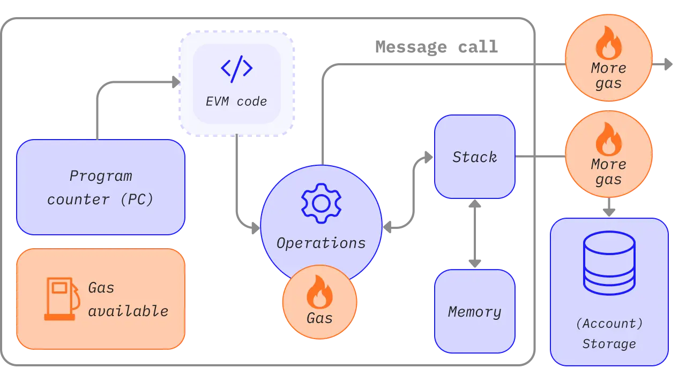

# Module 10. Smart Contract dengan Solidity dan Hardhat

## Deskripsi

Modul ini adalah kelanjutan dari Module 08, di mana Smart Contract disimulasikan menggunakan Python. Pada modul ini, Smart Contract diimplementasikan secara nyata menggunakan **Solidity** - bahasa pemrograman khusus untuk Smart Contract di jaringan Ethereum - dan di-deploy ke blockchain lokal menggunakan **Hardhat** dan local blockchain node.

> **Untuk Pemula**: Jangan khawatir jika belum pernah coding sebelumnya. Modul ini akan memandu langkah demi langkah dengan penjelasan yang detail. Ikuti setiap langkah secara berurutan dan jangan melompat-lompat.

**Apa yang akan kamu pelajari:**

1. Menulis Smart Contract menggunakan bahasa Solidity
2. Mengkompilasi (mengubah kode menjadi program yang bisa dijalankan) dan men-deploy (memasang) contract menggunakan Hardhat
3. Berinteraksi dengan contract yang sudah di-deploy menggunakan ethers.js
4. Menguji kebenaran contract secara otomatis menggunakan Hardhat Test

Berikut adalah [full code](smart-contract/contracts/) yang dibahas pada modul ini.

## Prasyarat

> **PENTING**: Pastikan kamu sudah menyelesaikan **[Module 09: Persiapan Environment](module-09.md)** sebelum melanjutkan!

Sebelum mempelajari modul ini, pastikan:

1. [Menginstall Python dan Visual Studio Code](module-01.md)
2. Memahami [konsep dasar blockchain](module-02.md)
3. Memahami [konsep Smart Contract dengan Remix](module-08.md)
4. **[Sudah menyelesaikan instalasi tools di Module 09](module-09.md)**

### Checklist Kesiapan

Sebelum mulai, pastikan semua ini sudah berfungsi:

| Tool | Cara Cek | Expected |
|------|----------|----------|
| Node.js | `node --version` | v20.x.x atau lebih baru |
| pnpm | `pnpm --version` | 8.x.x atau lebih baru |
| Ganache | Buka aplikasi | Muncul daftar 10 akun |

Jika ada yang belum terinstall, kembali ke **[Module 09](module-09.md)**.

### Sebelum Memulai

Pastikan:
1. **Ganache sudah berjalan** (buka aplikasi, klik Quickstart)
2. **Sudah punya Private Key** dari salah satu akun di Ganache
3. **Sudah install dependensi project**:
   ```bash
   cd smart-contract/contracts
   pnpm install
   ```

## List of Contents

- [Deskripsi](#deskripsi)
- [Prasyarat](#prasyarat)
- [List of Contents](#list-of-contents)
- [1. Teori Dasar](#1-teori-dasar)
  - [1.1 Dari Simulasi ke Implementasi Nyata](#11-dari-simulasi-ke-implementasi-nyata)
  - [1.2 Ethereum Virtual Machine (EVM)](#12-ethereum-virtual-machine-evm)
  - [1.3 Apa itu Solidity?](#13-apa-itu-solidity)
  - [1.4 Komponen Utama Solidity](#14-komponen-utama-solidity)
  - [1.5 Apa itu Hardhat?](#15-apa-itu-hardhat)
  - [1.6 Alur Kerja Smart Contract](#16-alur-kerja-smart-contract)
- [2. Implementasi Program (Hands-On)](#2-implementasi-program-hands-on)
  - [2.1 Struktur Proyek](#21-struktur-proyek)
  - [2.2 Menulis Smart Contract](#22-menulis-smart-contract)
  - [2.3 State Variables](#23-state-variables)
  - [2.4 Constructor](#24-constructor)
  - [2.5 Functions dan Access Control](#25-functions-dan-access-control)
  - [2.6 Konfigurasi Hardhat](#26-konfigurasi-hardhat)
  - [2.7 Kompilasi Contract](#27-kompilasi-contract)
  - [2.8 Deploy Contract ke Blockchain](#28-deploy-contract-ke-blockchain)
  - [2.9 Interaksi dengan Contract](#29-interaksi-dengan-contract)
  - [2.10 Program Utama](#210-program-utama)
- [3. Pengujian Contract](#3-pengujian-contract)
  - [3.1 Mengapa Contract Perlu Diuji?](#31-mengapa-contract-perlu-diuji)
  - [3.2 Struktur Test](#32-struktur-test)
  - [3.3 Menulis Test Case](#33-menulis-test-case)
  - [3.4 Menjalankan Test](#34-menjalankan-test)
- [Latihan](#latihan)

---

## 1. Teori Dasar

### 1.1 Dari Simulasi ke Implementasi Nyata

**Analogi Sederhana:**
- Module 08 (Python) = Bermain monopoli dengan uang mainan di rumah
- Module 10 (Solidity) = Bermain monopoli dengan aturan resmi di kompetisi

Pada Module 08, kita "berpura-pura" membuat Smart Contract menggunakan Python. Itu bagus untuk belajar konsep, tapi belum nyata. Sekarang kita akan membuat Smart Contract yang benar-benar bisa berjalan di blockchain Ethereum.

**Perbedaan utama:**

| Aspek      | Module 08 (Python)          | Module 10 (Solidity)                             |
| ---------- | --------------------------- | ------------------------------------------------ |
| Bahasa     | Python                      | Solidity                                         |
| Lingkungan | Memori komputer biasa       | Ethereum Virtual Machine (EVM)                   |
| Blockchain | Dibuat sendiri (simulasi)   | Local blockchain (Ganache/Anvil/Hardhat Network) |
| Deploy     | Panggil fungsi Python       | Transaksi ke blockchain                          |
| Verifikasi | `is_chain_valid()` manual | Test otomatis (Hardhat)                          |

> Pada Module 08 bahkan sudah disebutkan: _"kita belum membangun smart contract di jaringan blockchain nyata seperti Ethereum."_ - Modul ini mengimplementasikan dari pernyataan tersebut.

**Tabel referensi** - Jika kamu sudah mengerjakan Module 08, berikut perbandingan kode Python dengan Solidity:

| Komponen                    | Python (Module 08) | Solidity (Module 10)                  |
| --------------------------- | ------------------ | ------------------------------------- |
| `self.contract_id`        | `string`         | `string public contractId`          |
| `self.owner`              | `string`         | `address private owner`             |
| `self.is_deployed`        | `bool`           | `bool public isDeployed`            |
| `self.state['released']`  | `bool`           | `bool public released`              |
| `def deploy()`            | method Python      | `function deployContract() public`  |
| `execute('release')`      | method Python      | `function setRelease() external`    |
| `execute('check')`        | method Python      | `function getState() external view` |
| `if caller != self.owner` | validasi manual    | `require(msg.sender == owner, ...)` |

> **Tidak perlu hafal tabel di atas!** Ini hanya untuk referensi. Yang penting adalah memahami konsepnya.

### 1.2 Ethereum Virtual Machine (EVM)

**Analogi Sederhana:**

Bayangkan EVM seperti **mesin arcade** di pusat permainan:
- Semua mesin arcade di seluruh dunia menjalankan game yang sama persis
- Kamu masukkan koin (gas) untuk bermain
- Hasil permainan selalu sama jika kamu melakukan gerakan yang sama
- Mesin tidak bisa mengakses internet atau hal lain di luar game

**EVM (Ethereum Virtual Machine)** adalah "komputer virtual" yang menjalankan Smart Contract di jaringan Ethereum. Setiap komputer (node) di jaringan Ethereum menjalankan EVM yang identik.

**Karakteristik EVM (dalam bahasa sederhana):**

| Karakteristik | Penjelasan | Analogi |
|---------------|------------|---------|
| **Deterministik** | Input sama = output sama, selalu | Seperti kalkulator: 2+2 selalu = 4 |
| **Terisolasi** | Tidak bisa akses file atau internet | Seperti komputer tanpa WiFi |
| **Berbasis gas** | Setiap operasi butuh "biaya bensin" | Seperti mobil yang butuh bensin untuk jalan |


**Proses dari kode ke eksekusi:**

```
Kode Solidity (.sol)     -->    Bytecode (kode mesin)    -->    Dijalankan di EVM
(yang kita tulis)              (hasil compile)                  (di blockchain)
```

Kode Solidity tidak langsung dieksekusi - ia terlebih dahulu **dikompilasi** (diubah) menjadi **bytecode** yang dipahami EVM. Proses ini mirip seperti menerjemahkan bahasa Indonesia ke bahasa mesin.



### 1.3 Apa itu Solidity?

**[Solidity](https://docs.soliditylang.org)** adalah bahasa pemrograman khusus untuk menulis Smart Contract. Jika Python digunakan untuk berbagai macam program, Solidity khusus untuk membuat "perjanjian digital" di blockchain.

> **Untuk Pemula**: Jangan khawatir jika belum pernah coding. Solidity sebenarnya cukup mirip dengan bahasa manusia. Kita akan pelajari pelan-pelan.

**Ciri khas Solidity:**

| Ciri | Penjelasan | Contoh |
|------|------------|--------|
| Tipe data khusus | Ada tipe `address` untuk alamat wallet | `address owner` |
| Data permanen | Variabel tersimpan di blockchain selamanya | `uint public saldo` |
| Pengirim transaksi | Bisa tahu siapa yang memanggil fungsi | `msg.sender` |
| Validasi ketat | Pakai `require()` untuk cek kondisi | `require(umur >= 18)` |

**Contoh contract Solidity paling sederhana:**

```sol
// SPDX-License-Identifier: MIT
pragma solidity ^0.8.0;

contract Simpan {
    uint public angka;

    function simpan(uint _angka) public {
        angka = _angka;
    }
}
```

**Penjelasan baris per baris:**

```sol
// SPDX-License-Identifier: MIT
```
Baris 1: Komentar yang menyatakan lisensi kode (MIT = bebas dipakai siapa saja)

```sol
pragma solidity ^0.8.0;
```
Baris 2: Menyatakan versi Solidity yang digunakan. `^0.8.0` artinya versi 0.8.0 ke atas

```sol
contract Simpan {
```
Baris 3: Membuat contract baru bernama "Simpan". Kurung kurawal `{` menandai awal isi contract

```sol
    uint public angka;
```
Baris 4: Membuat variabel bernama `angka`. `uint` = bilangan bulat positif. `public` = bisa dilihat semua orang

```sol
    function simpan(uint _angka) public {
        angka = _angka;
    }
```
Baris 5-7: Membuat fungsi bernama `simpan` yang menerima input `_angka` dan menyimpannya ke variabel `angka`

```sol
}
```
Baris 8: Kurung kurawal penutup, menandai akhir contract

**Meskipun sederhana, ini sudah merupakan Smart Contract yang valid!** Siapapun dapat memanggil `simpan()` dan membaca `angka`.

### 1.4 Komponen Utama Solidity

> **Tips Belajar**: Tidak perlu hafal semua ini sekarang. Bagian ini bisa dijadikan referensi saat kamu mengerjakan hands-on nanti.

#### Tipe Data (Jenis Variabel)

**Analogi**: Seperti jenis-jenis kotak penyimpanan. Ada kotak untuk angka, kotak untuk teks, dll.

| Tipe        | Contoh                           | Penjelasan Sederhana                       |
| ----------- | -------------------------------- | ------------------------------------------ |
| `uint`    | `uint public amount = 50`      | Angka bulat positif (0, 1, 2, 3, ...)      |
| `bool`    | `bool public released = false` | Nilai benar (`true`) atau salah (`false`)  |
| `string`  | `string public name = "Alice"` | Teks/kata-kata                             |
| `address` | `address private owner`        | Alamat wallet Ethereum (seperti nomor rekening) |

**Contoh penggunaan:**
```sol
uint public umur = 25;           // Angka: 25 tahun
bool public sudahMenikah = false; // Ya/Tidak: belum menikah
string public nama = "Budi";     // Teks: nama Budi
address public pemilik;          // Alamat wallet pemilik
```

#### Visibility (Siapa yang Boleh Akses)

**Analogi**: Seperti pengaturan privasi di media sosial.

| Visibility   | Analogi                        | Penjelasan                                                                                      |
| ------------ | ------------------------------ | ----------------------------------------------------------------------------------------------- |
| `public`   | Profil publik                  | Semua orang bisa lihat dan akses                                                              |
| `private`  | Chat pribadi                   | Hanya bisa diakses dari dalam contract itu sendiri                                              |
| `external` | Hanya untuk orang luar         | Fungsi yang hanya bisa dipanggil dari luar contract                                            |
| `internal` | Grup keluarga                  | Bisa diakses dari contract ini dan contract "anak"nya                                          |

**Yang paling sering dipakai untuk pemula:**
- `public` - untuk variabel/fungsi yang perlu diakses dari luar
- `private` - untuk variabel rahasia (seperti owner)

#### Data Location (Lokasi Penyimpanan Sementara)

**Analogi**: Seperti perbedaan RAM dan hard disk di komputer.

| Lokasi       | Analogi                           | Keterangan                                           |
| ------------ | --------------------------------- | ---------------------------------------------------- |
| `memory`   | Catatan di papan tulis            | Sementara, dihapus setelah fungsi selesai            |
| `calldata` | Surat yang dikirim (read-only)    | Data input, tidak bisa diubah                        |

```sol
// memory: data bisa dimodifikasi di dalam fungsi
function ubah(string memory _teks) public { ... }

// calldata: lebih hemat biaya, cocok untuk input yang tidak diubah
function simpan(string calldata _teks) external { ... }
```

> **Tips**: Untuk pemula, gunakan `memory` dulu. Nanti seiring pengalaman, bisa optimasi dengan `calldata`.

#### require() - Penjaga Keamanan

**Analogi**: Seperti satpam yang mengecek KTP sebelum masuk gedung.

`require()` mengecek kondisi. Jika kondisi **tidak terpenuhi**, transaksi **dibatalkan** dan muncul pesan error.

```sol
function tarikDana() external {
    require(msg.sender == owner, "hanya owner yang boleh");
    require(saldo > 0, "saldo kosong");
    // kode di sini hanya dijalankan jika SEMUA require terpenuhi
}
```

**Cara membaca kode di atas:**
1. Cek: apakah yang memanggil fungsi adalah owner? Jika bukan, batalkan dengan pesan "hanya owner yang boleh"
2. Cek: apakah saldo lebih dari 0? Jika tidak, batalkan dengan pesan "saldo kosong"
3. Jika kedua kondisi OK, lanjut eksekusi


### 1.5 Apa itu Hardhat?

**Analogi**: Hardhat adalah seperti **dapur lengkap** untuk memasak Smart Contract. Di dalamnya ada kompor (compile), alat tes rasa (test), dan wadah untuk menyajikan (deploy).

**[Hardhat](https://hardhat.org/docs)** adalah alat pengembangan untuk Smart Contract Ethereum. Ia menyediakan tiga fungsi utama:

| Fungsi | Penjelasan | Analogi |
|--------|------------|---------|
| **Compile** | Mengubah kode Solidity menjadi kode mesin | Menerjemahkan resep ke bahasa mesin |
| **Test** | Menguji apakah contract bekerja dengan benar | Mencicipi masakan sebelum disajikan |
| **Deploy** | Memasang contract ke blockchain | Menyajikan masakan ke pelanggan |

**Apa itu ABI?**

ABI (Application Binary Interface) adalah "daftar menu" dari contract kita. Ia berisi informasi tentang fungsi apa saja yang ada di contract dan bagaimana cara memanggilnya.

```
smart-contracts.sol          (kode yang kita tulis)
       │
       ▼  npx hardhat compile
artifacts/
├── bytecode  → kode mesin yang dikirim ke blockchain
└── ABI       → "daftar menu" fungsi-fungsi contract
```

**[ethers.js](https://docs.ethers.org)** adalah library JavaScript yang membantu kita berinteraksi dengan blockchain. Ia menggunakan ABI untuk tahu cara "berbicara" dengan contract kita.

### 1.6 Alur Kerja Smart Contract

> **Catatan**: Penjelasan tentang Local Blockchain (Ganache) sudah dibahas di **[Module 09](module-09.md)**. Pastikan Ganache sudah berjalan sebelum melanjutkan.

**Gambaran besar** - ini adalah langkah-langkah yang akan kita lakukan di hands-on:

```
┌─────────────────────────────────────────────────────────────────┐
│  1. TULIS CONTRACT                                              │
│     Buat file .sol dengan kode Solidity                         │
│     📁 contract/smart-contracts.sol                             │
└─────────────────────────────────────────────────────────────────┘
                              │
                              ▼
┌─────────────────────────────────────────────────────────────────┐
│  2. COMPILE (npx hardhat compile)                               │
│     Ubah kode Solidity → bytecode + ABI                         │
│     📁 artifacts/... (hasil otomatis)                           │
└─────────────────────────────────────────────────────────────────┘
                              │
                              ▼
┌─────────────────────────────────────────────────────────────────┐
│  3. DEPLOY (node deploy.ts)                                     │
│     Kirim contract ke blockchain → dapat alamat contract        │
│     Contoh: 0xAbCd...1234                                       │
└─────────────────────────────────────────────────────────────────┘
                              │
                              ▼
┌─────────────────────────────────────────────────────────────────┐
│  4. INTERACT (node interact.ts)                                 │
│     Panggil fungsi-fungsi di contract                           │
│     Contoh: deployContract(), setRelease(), getState()          │
└─────────────────────────────────────────────────────────────────┘
                              │
                              ▼
┌─────────────────────────────────────────────────────────────────┐
│  5. TEST (npx hardhat test)                                     │
│     Verifikasi contract bekerja dengan benar                    │
│     ✓ Test lulus = contract aman untuk di-deploy                │
└─────────────────────────────────────────────────────────────────┘
```

> **Tips**: Simpan diagram ini sebagai referensi. Setiap kali bingung "sedang di langkah mana", lihat kembali diagram ini.

---

## 2. Implementasi Program (Hands-On)

> **Mulai dari sini!** Ikuti setiap langkah secara berurutan. Jangan melompat-lompat.

### 2.1 Struktur Proyek

Pertama, pahami struktur folder project kita:

```
smart-contract/
├── contracts/                    # Folder utama untuk Solidity
│   ├── contract/
│   │   └── smart-contracts.sol   # 📝 Kode Solidity (yang akan kita tulis)
│   ├── test/
│   │   └── BlockchainClass.test.ts  # File test
│   ├── artifacts/                # 📦 Hasil compile (dibuat otomatis)
│   ├── deploy.ts                 # 🚀 Script untuk deploy contract
│   ├── interact.ts               # 🔗 Script untuk berinteraksi dengan contract
│   ├── hardhat.config.ts         # ⚙️ Konfigurasi Hardhat
│   ├── .env                      # 🔑 Variabel rahasia (private key, dll)
│   └── package.json              # 📋 Daftar library yang dibutuhkan
└── smart_contract.py             # Python dari Module 08
```

**Penjelasan file-file penting:**

| File | Fungsi | Kapan dipakai |
|------|--------|---------------|
| `smart-contracts.sol` | Kode Smart Contract | Langkah pertama: menulis contract |
| `deploy.ts` | Script untuk memasang contract | Setelah compile |
| `interact.ts` | Script untuk memanggil fungsi contract | Setelah deploy |
| `.env` | Menyimpan data rahasia (private key) | Dibutuhkan untuk deploy |

### 2.2 Menulis Smart Contract

> **Langkah 1**: Buat file Smart Contract

**Cara membuat file:**
1. Buka VS Code
2. Buka folder `smart-contract/contracts`
3. Buat folder baru bernama `contract` (jika belum ada)
4. Di dalam folder `contract`, buat file baru bernama `smart-contracts.sol`

**Struktur dasar file Solidity:**

Setiap file `.sol` harus dimulai dengan 2 baris wajib:

```sol
// SPDX-License-Identifier: MIT
pragma solidity ^0.8.0;
```

**Penjelasan:**

| Baris | Kode | Fungsi |
|-------|------|--------|
| 1 | `// SPDX-License-Identifier: MIT` | Menyatakan lisensi (MIT = bebas dipakai) |
| 2 | `pragma solidity ^0.8.0;` | Versi Solidity yang digunakan |

> **Catatan**: `^0.8.0` artinya gunakan versi 0.8.0 atau lebih baru, tapi masih di bawah 0.9.0

**Selanjutnya, deklarasikan contract:**

```sol
contract NamaContract {
    // isi contract di sini
}
```

**Analogi**: Membuat contract seperti membuat class di Python atau Java - kita definisikan "cetakan" yang nanti bisa digunakan.

> **Tips**: Satu file `.sol` biasanya berisi satu contract utama. Nama contract sebaiknya menggunakan PascalCase (huruf besar di awal setiap kata).

### 2.3 State Variables (Variabel yang Tersimpan di Blockchain)

> **Langkah 2**: Tambahkan variabel ke dalam contract

**Apa itu State Variables?**

State variables adalah variabel yang nilainya **tersimpan permanen** di blockchain. Berbeda dengan variabel biasa di program komputer yang hilang saat program dimatikan, state variables tetap ada selama contract masih aktif.

**Analogi**: State variables seperti data di database - sekali disimpan, akan tetap ada sampai diubah atau dihapus.

**Kode yang akan kita tulis:**

```sol
contract EscrowContract {
    // Variabel-variabel ini tersimpan permanen di blockchain
    string public contractId;   // ID unik contract
    address private owner;      // pemilik contract (rahasia)
    bool public isDeployed;     // apakah contract sudah aktif?

    // Data escrow (perjanjian)
    string public receiver;     // nama penerima dana
    uint public amount;         // jumlah dana
    bool public released;       // apakah dana sudah dilepas?
}
```

**Penjelasan baris per baris:**

| Kode | Penjelasan |
|------|------------|
| `string public contractId` | Variabel teks, bisa dilihat publik |
| `address private owner` | Alamat wallet pemilik, **rahasia** (private) |
| `bool public isDeployed` | True/false, apakah sudah di-deploy |
| `string public receiver` | Nama penerima, bisa dilihat publik |
| `uint public amount` | Jumlah dana (angka), bisa dilihat publik |
| `bool public released` | True/false, apakah dana sudah dilepas |

**Mengapa `owner` dibuat `private`?**

Karena alamat owner adalah informasi sensitif - kita tidak mau sembarang orang tahu siapa owner-nya. Tapi nanti kita akan buat fungsi khusus `getOwner()` jika memang perlu diakses.

> **Perbandingan dengan Python Module 08:**
> - `string public contractId` = `self.contract_id` di Python
> - `address private owner` = `self.owner` di Python
> - `bool public isDeployed` = `self.is_deployed` di Python

### 2.4 Constructor (Fungsi Inisialisasi)

> **Langkah 3**: Tambahkan constructor ke dalam contract

**Apa itu Constructor?**

Constructor adalah fungsi khusus yang **hanya dijalankan sekali** - yaitu saat contract pertama kali di-deploy (dipasang) ke blockchain. Fungsinya untuk mengisi nilai awal variabel-variabel.

**Analogi**: Constructor seperti formulir pendaftaran yang diisi sekali saat membuat akun baru.

**Kode yang akan kita tulis:**

```sol
constructor(string memory _contractId, string memory _receiver, uint _amount) {
    contractId = _contractId;
    owner = msg.sender;   // deployer otomatis menjadi owner
    receiver = _receiver;
    amount = _amount;
}
```

**Penjelasan langkah demi langkah:**

```sol
constructor(string memory _contractId, string memory _receiver, uint _amount) {
```
Baris ini mendefinisikan constructor dengan 3 parameter input:
- `_contractId` - ID unik untuk contract
- `_receiver` - nama penerima
- `_amount` - jumlah dana

> **Kenapa ada underscore (_)?** Ini adalah konvensi (kebiasaan) di Solidity untuk membedakan parameter input dengan state variable. `_contractId` adalah input, `contractId` adalah state variable.

```sol
    contractId = _contractId;
```
Mengisi state variable `contractId` dengan nilai dari parameter `_contractId`.

```sol
    owner = msg.sender;
```
**Ini bagian penting!** `msg.sender` adalah variabel spesial di Solidity yang berisi **alamat wallet orang yang memanggil fungsi**. Saat contract di-deploy, `msg.sender` adalah alamat orang yang men-deploy - sehingga dia otomatis jadi owner!

```sol
    receiver = _receiver;
    amount = _amount;
}
```
Mengisi state variables dengan nilai dari parameter.

**Perbandingan dengan Python:**

| Python (Module 08) | Solidity (Module 10) |
|--------------------|----------------------|
| `def __init__(self, ...):` | `constructor(...) {` |
| `self.owner = owner` (diisi manual) | `owner = msg.sender` (otomatis!) |

### 2.5 Functions dan Access Control (Fungsi-fungsi Contract)

> **Langkah 4**: Tambahkan fungsi-fungsi ke dalam contract

Contract kita akan memiliki 4 fungsi. Mari kita bahas satu per satu:

---

#### Fungsi 1: deployContract()

**Tujuan**: Mengaktifkan contract (seperti menekan tombol "ON")

```sol
function deployContract() public {
    require(!isDeployed, "contract sudah di-deploy");
    isDeployed = true;
}
```

**Penjelasan baris per baris:**

| Baris | Kode | Penjelasan |
|-------|------|------------|
| 1 | `function deployContract() public {` | Membuat fungsi bernama `deployContract`, bisa dipanggil siapa saja (`public`) |
| 2 | `require(!isDeployed, "contract sudah di-deploy");` | **Cek keamanan**: jika `isDeployed` sudah `true`, batalkan dan tampilkan pesan error |
| 3 | `isDeployed = true;` | Ubah `isDeployed` menjadi `true` |
| 4 | `}` | Akhir fungsi |

> **Catatan**: Tanda `!` artinya "NOT" (kebalikan). `!isDeployed` berarti "isDeployed belum true".

---

#### Fungsi 2: getOwner()

**Tujuan**: Melihat siapa owner contract

```sol
function getOwner() public view returns (address) {
    return owner;
}
```

**Penjelasan:**

| Kata Kunci | Artinya |
|------------|---------|
| `public` | Bisa dipanggil siapa saja |
| `view` | Fungsi ini **hanya membaca**, tidak mengubah data |
| `returns (address)` | Fungsi ini mengembalikan nilai bertipe `address` |

> **Penting**: Fungsi `view` **tidak membutuhkan biaya gas** karena tidak mengubah blockchain - hanya membaca.

---

#### Fungsi 3: setRelease()

**Tujuan**: Melepaskan dana ke penerima (hanya bisa dilakukan owner)

```sol
function setRelease() external {
    require(isDeployed, "contract belum di-deploy");
    require(msg.sender == owner, "hanya owner yang bisa release");
    require(!released, "dana sudah pernah di-release");
    released = true;
}
```

**Penjelasan 3 pengaman (require):**

| Urutan | Require | Penjelasan |
|--------|---------|------------|
| 1 | `require(isDeployed, ...)` | Contract harus sudah aktif |
| 2 | `require(msg.sender == owner, ...)` | Yang memanggil harus owner |
| 3 | `require(!released, ...)` | Dana belum pernah dilepas sebelumnya |

**Diagram alur:**

```
Seseorang memanggil setRelease()
              │
              ▼
┌─────────────────────────────────┐
│ Cek 1: isDeployed == true?      │──NO──→ GAGAL: "contract belum di-deploy"
└─────────────────────────────────┘
              │ YES
              ▼
┌─────────────────────────────────┐
│ Cek 2: msg.sender == owner?     │──NO──→ GAGAL: "hanya owner yang bisa release"
└─────────────────────────────────┘
              │ YES
              ▼
┌─────────────────────────────────┐
│ Cek 3: released == false?       │──NO──→ GAGAL: "dana sudah pernah di-release"
└─────────────────────────────────┘
              │ YES
              ▼
┌─────────────────────────────────┐
│ SUKSES: released = true         │
│ Data tersimpan di blockchain    │
└─────────────────────────────────┘
```

---

#### Fungsi 4: getState()

**Tujuan**: Melihat status contract (receiver, amount, released)

```sol
function getState() external view returns (string memory, uint, bool) {
    return (receiver, amount, released);
}
```

**Penjelasan:**

Fungsi ini mengembalikan **3 nilai sekaligus**:
1. `receiver` (string) - nama penerima
2. `amount` (uint) - jumlah dana
3. `released` (bool) - apakah sudah dilepas

> **`external`** artinya fungsi hanya bisa dipanggil dari **luar** contract. Ini lebih hemat gas dibanding `public`.

### 2.6 Konfigurasi Hardhat

> **Langkah 5**: Periksa file konfigurasi

File `hardhat.config.ts` berisi pengaturan untuk Hardhat. File ini biasanya **sudah ada** di project - kamu hanya perlu memahami isinya.

**Lokasi file**: `smart-contract/contracts/hardhat.config.ts`

```typescript
// hardhat.config.ts
import { defineConfig } from "hardhat/config";
import hardhatEthers from "@nomicfoundation/hardhat-ethers";
import hardhatMocha from "@nomicfoundation/hardhat-mocha";

export default defineConfig({
  plugins: [hardhatEthers, hardhatMocha],
  solidity: {
    version: "0.8.28",
  },
  paths: {
    sources: "./contract",
  },
});
```

**Penjelasan setiap bagian:**

| Bagian | Fungsi | Penjelasan Sederhana |
|--------|--------|----------------------|
| `plugins` | Menambahkan fitur tambahan | ethers.js untuk interact, Mocha untuk test |
| `solidity.version` | Versi compiler | Harus sama dengan `pragma solidity` di file .sol |
| `paths.sources` | Lokasi file .sol | Di mana Hardhat mencari file Solidity |

**Troubleshooting umum:**

| Error | Penyebab | Solusi |
|-------|----------|--------|
| `invalid opcode` | Versi EVM tidak cocok | Tambahkan `evmVersion: "london"` di settings |
| `Source file not found` | Path salah | Periksa `paths.sources` cocok dengan lokasi file .sol |

### 2.7 Kompilasi Contract

> **Langkah 6**: Compile kode Solidity

**Apa yang terjadi saat compile?**

Kode Solidity yang kita tulis (bahasa manusia) diubah menjadi **bytecode** (bahasa mesin) yang bisa dipahami blockchain.

**Cara compile:**

1. Buka Terminal/Command Prompt
2. Pindah ke folder contracts:
   ```bash
   cd smart-contract/contracts
   ```
3. Jalankan perintah compile:
   ```bash
   npx hardhat compile
   ```

**Output yang diharapkan (jika berhasil):**

```
Compiled 1 Solidity file successfully (evm target: paris).
```

**Jika ada error, periksa:**
- Apakah ada typo di kode Solidity?
- Apakah semua tanda kurung `{` `}` sudah berpasangan?
- Apakah setiap baris diakhiri dengan titik koma `;`?

**Hasil compile:**

Setelah berhasil, akan muncul folder baru `artifacts/`:

```
artifacts/
└── contract/
    └── smart-contracts.sol/
        └── EscrowContract.json   ← File penting!
```

**Isi file JSON:**

| Bagian | Fungsi |
|--------|--------|
| `bytecode` | Kode mesin yang akan dikirim ke blockchain |
| `abi` | "Daftar menu" fungsi contract |

> **Tips**: Folder `artifacts/` dibuat otomatis. Jangan edit file di dalamnya secara manual.

### 2.8 Deploy Contract ke Blockchain

> **Langkah 7**: Siapkan koneksi dan deploy contract

**A. Persiapan - Membuat file .env**

File `.env` menyimpan data rahasia yang tidak boleh di-share ke orang lain.

1. Buat file baru bernama `.env` di folder `smart-contract/contracts/`
2. Isi dengan:

```env
RPC_URL=HTTP://127.0.0.1:7545
PRIVATE_KEY=0x_private_key_dari_akun_lokal
```

**Cara mendapatkan nilai-nilai tersebut:**

**Jika menggunakan Ganache:**
1. Buka aplikasi Ganache
2. **RPC URL**: Lihat di bagian atas, biasanya `HTTP://127.0.0.1:7545`
3. **PRIVATE KEY**:
   - Klik ikon kunci di samping salah satu akun
   - Copy private key yang muncul
   - Paste ke file `.env` (awali dengan `0x` jika belum ada)

**Jika menggunakan Anvil:**
1. Jalankan `anvil` di terminal
2. RPC URL dan private key akan muncul otomatis di output

> **PENTING**: Jangan pernah share file `.env` atau commit ke GitHub! Private key adalah seperti password ATM.

---

**B. Memahami Script Deploy**

File `deploy.ts` sudah disiapkan. Mari pahami apa yang dilakukan:

```typescript
import dotenv from "dotenv";
import { ethers } from "ethers";
import { readFileSync } from "fs";

dotenv.config();  // Membaca file .env

async function main() {
  // LANGKAH 1: Koneksi ke local blockchain
  const provider = new ethers.JsonRpcProvider(process.env.RPC_URL);
  const wallet = new ethers.Wallet(process.env.PRIVATE_KEY!, provider);

  console.log("Terhubung dengan wallet:", wallet.address);

  // LANGKAH 2: Baca hasil compile
  const artifact = JSON.parse(
    readFileSync("./artifacts/contract/smart-contracts.sol/EscrowContract.json", "utf8"),
  );

  // LANGKAH 3: Deploy contract dengan parameter constructor
  const factory = new ethers.ContractFactory(
    artifact.abi,
    artifact.bytecode,
    wallet,
  );

  // Parameter: contractId, receiver, amount
  const contract = await factory.deploy("ESCROW-001", "Bob", 100);
  await contract.waitForDeployment();

  console.log("Contract deployed ke:", await contract.getAddress());
}

main().catch(console.error);
```

**Penjelasan setiap langkah:**

| Langkah | Kode | Fungsi |
|---------|------|--------|
| 1 | `new ethers.JsonRpcProvider(...)` | Koneksi ke blockchain |
| 1 | `new ethers.Wallet(...)` | Membuat "dompet" untuk transaksi |
| 2 | `readFileSync(...)` | Membaca hasil compile |
| 3 | `new ethers.ContractFactory(...)` | Menyiapkan "pabrik" contract |
| 3 | `factory.deploy(...)` | Men-deploy dengan parameter |

---

**C. Menjalankan Deploy**

1. Pastikan Ganache/Anvil sudah berjalan
2. Buka terminal di folder `smart-contract/contracts/`
3. Jalankan:
   ```bash
   npx tsx deploy.ts
   ```

**Output yang diharapkan:**

```
Terhubung dengan wallet: 0x1234...5678
Contract deployed ke: 0xAbCd...1234
```

> **PENTING**: Catat alamat contract (`0xAbCd...1234`) - kamu butuh ini untuk langkah selanjutnya!

**Troubleshooting:**

| Error | Penyebab | Solusi |
|-------|----------|--------|
| `connection refused` | Ganache/Anvil tidak jalan | Buka dan jalankan Ganache |
| `invalid private key` | Format private key salah | Pastikan dimulai dengan `0x` |
| `insufficient funds` | Saldo akun 0 | Gunakan akun lain di Ganache |

### 2.9 Interaksi dengan Contract

> **Langkah 8**: Berinteraksi dengan contract yang sudah di-deploy

Setelah contract di-deploy, kita bisa memanggil fungsi-fungsinya menggunakan script `interact.ts`.

**A. Update Alamat Contract**

1. Buka file `interact.ts`
2. Ganti `CONTRACT_ADDRESS` dengan alamat dari hasil deploy:

```typescript
const CONTRACT_ADDRESS = "0xAbCd...1234"; // GANTI dengan alamat dari hasil deploy
```

---

**B. Memahami Script Interact**

```typescript
import dotenv from "dotenv";
import { ethers } from "ethers";
import { readFileSync } from "fs";

dotenv.config();

const CONTRACT_ADDRESS = "0xAbCd...1234"; // dari hasil deploy

async function main() {
  // Koneksi ke blockchain (sama seperti di deploy.ts)
  const provider = new ethers.JsonRpcProvider(process.env.RPC_URL);
  const wallet = new ethers.Wallet(process.env.PRIVATE_KEY!, provider);
  const artifact = JSON.parse(
    readFileSync("./artifacts/contract/smart-contracts.sol/EscrowContract.json", "utf8"),
  );

  // Membuat koneksi ke contract yang sudah di-deploy
  const managed = new ethers.NonceManager(wallet);
  const contract = new ethers.Contract(CONTRACT_ADDRESS, artifact.abi, managed);

  // ===== MEMANGGIL FUNGSI VIEW (gratis, hanya membaca) =====
  console.log("=== State Awal ===");
  const state = await contract.getState();
  console.log("Receiver:", state[0]);
  console.log("Amount:", state[1].toString());
  console.log("Released:", state[2]);

  // ===== MEMANGGIL FUNGSI YANG MENGUBAH DATA (butuh transaksi) =====
  console.log("\n=== Aktivasi Contract ===");
  const tx1 = await contract.deployContract();
  await tx1.wait(); // Tunggu transaksi selesai!
  console.log("Contract berhasil diaktifkan");

  // ===== CEK OWNER =====
  console.log("\n=== Cek Owner ===");
  const owner = await contract.getOwner();
  console.log("Owner:", owner);

  // ===== RELEASE DANA =====
  console.log("\n=== Release Dana ===");
  const tx2 = await contract.setRelease();
  await tx2.wait();
  console.log("Dana berhasil di-release");

  // ===== STATE AKHIR =====
  console.log("\n=== State Akhir ===");
  const finalState = await contract.getState();
  console.log("Receiver:", finalState[0]);
  console.log("Amount:", finalState[1].toString());
  console.log("Released:", finalState[2]);
}

main().catch(console.error);
```

---

**C. Perbedaan Fungsi View vs Fungsi Biasa**

| Aspek | Fungsi `view` | Fungsi biasa |
|-------|---------------|--------------|
| Contoh | `getState()`, `getOwner()` | `deployContract()`, `setRelease()` |
| Mengubah data? | Tidak | Ya |
| Butuh transaksi? | Tidak | Ya |
| Biaya gas? | Gratis | Bayar gas |
| Perlu `.wait()`? | Tidak | **Ya, wajib!** |

> **Penting**: Untuk fungsi yang mengubah data, selalu tambahkan `await tx.wait()` untuk menunggu transaksi dikonfirmasi di blockchain.

---

**D. Menjalankan Interaksi**

```bash
npx tsx interact.ts
```

**Output yang diharapkan:**

```
=== State Awal ===
Receiver: Bob
Amount: 100
Released: false

=== Aktivasi Contract ===
Contract berhasil diaktifkan

=== Cek Owner ===
Owner: 0x1234...5678

=== Release Dana ===
Dana berhasil di-release

=== State Akhir ===
Receiver: Bob
Amount: 100
Released: true
```

Perhatikan bahwa `Released` berubah dari `false` menjadi `true` setelah `setRelease()` dipanggil!

### 2.10 Ringkasan: Apa yang Sudah Kita Lakukan

**Selamat!** Kamu sudah berhasil:

1. Menulis Smart Contract dengan Solidity
2. Meng-compile kode menjadi bytecode
3. Men-deploy contract ke local blockchain
4. Berinteraksi dengan contract (memanggil fungsi)

**Perubahan yang terjadi:**

| State | Sebelum | Sesudah |
|-------|---------|---------|
| `isDeployed` | `false` | `true` |
| `released` | `false` | `true` |

Perubahan ini **tersimpan permanen** di blockchain! Jika kamu membuka Ganache, kamu bisa melihat transaksi-transaksi yang terjadi.

**Cek di Ganache:**

1. Buka tab "TRANSACTIONS" di Ganache
2. Kamu akan melihat beberapa transaksi:
   - Contract Creation (saat deploy)
   - Transaction ke `deployContract()`
   - Transaction ke `setRelease()`

> **Eksperimen**: Coba jalankan `npx tsx interact.ts` lagi. Apa yang terjadi? (Hint: akan error karena `deployContract()` sudah pernah dipanggil!)

---

## 3. Pengujian Contract

> **Bagian ini opsional untuk pemula**, tapi sangat penting dipahami untuk praktik profesional.

### 3.1 Mengapa Contract Perlu Diuji?

**Analogi**: Testing seperti **latihan ujian** sebelum ujian sesungguhnya. Lebih baik menemukan kesalahan saat latihan daripada saat ujian!

**Alasan penting:**

| Masalah | Penjelasan |
|---------|------------|
| Kode tidak bisa diubah | Setelah di-deploy ke mainnet, contract **permanen** |
| Bug = kehilangan uang | Kesalahan bisa menyebabkan dana hilang **selamanya** |
| Setiap aksi butuh biaya | Di mainnet, setiap transaksi membutuhkan ETH sungguhan |

> **Contoh kasus nyata**: Pada tahun 2016, bug di smart contract DAO menyebabkan kerugian 60 juta USD!

**Solusi**: Test contract di lingkungan "aman" (Hardhat Network) sebelum deploy ke mainnet.

### 3.2 Struktur Test

**Lokasi file test:**

```
test/
└── EscrowContract.test.ts
```

**Struktur dasar file test:**

```typescript
import { expect } from "chai";       // Library untuk perbandingan
import { network } from "hardhat";   // Koneksi ke Hardhat

const { ethers } = await network.connect();

describe("NamaContract", () => {
  // Grup test untuk satu contract

  it("deskripsi test case 1", async () => {
    // Test case 1
  });

  it("deskripsi test case 2", async () => {
    // Test case 2
  });
});
```

**Penjelasan struktur:**

| Bagian | Fungsi | Analogi |
|--------|--------|---------|
| `describe(...)` | Mengelompokkan test | Seperti bab di buku |
| `it(...)` | Satu test case | Seperti soal ujian |
| `expect(...)` | Memeriksa hasil | Seperti kunci jawaban |

### 3.3 Menulis Test Case

**Prinsip dasar**: Setiap test case menguji **satu hal saja**.

Ada 2 jenis test:

---

**1. Test Positive (Happy Path)** - Menguji alur normal yang seharusnya berhasil

```typescript
it("state awal setelah deploy sesuai parameter constructor", async () => {
  // STEP 1: Deploy contract dengan parameter
  const contract = await ethers.deployContract("EscrowContract", [
    "ESCROW-001",  // contractId
    "Bob",         // receiver
    100            // amount
  ]);
  await contract.waitForDeployment();

  // STEP 2: Panggil fungsi untuk dapat data
  const state = await contract.getState();

  // STEP 3: Bandingkan dengan yang diharapkan
  expect(state[0]).to.equal("Bob");       // receiver harus "Bob"
  expect(state[1]).to.equal(100n);        // amount harus 100
  expect(state[2]).to.equal(false);       // released harus false
});
```

**Penjelasan `expect`:**
- `expect(A).to.equal(B)` = "Harapkan A sama dengan B"
- Jika tidak sama, test **gagal**

> **Catatan**: `100n` (dengan huruf `n`) adalah BigInt, tipe angka khusus di JavaScript untuk angka besar.

---

**2. Test Negative (Error Path)** - Menguji bahwa error muncul saat kondisi tidak terpenuhi

```typescript
// Fungsi helper untuk mengecek error
async function expectRevert(promise: Promise<unknown>, message: string) {
  try {
    await promise;
    throw new Error("Seharusnya error, tapi tidak");
  } catch (e: any) {
    expect(e.message).to.include(message);
  }
}

it("setRelease gagal jika bukan owner", async () => {
  // STEP 1: Dapatkan 2 akun berbeda
  const [owner, orang_lain] = await ethers.getSigners();

  // STEP 2: Deploy contract (owner = akun pertama)
  const contract = await ethers.deployContract("EscrowContract", [
    "ESCROW-001", "Bob", 100
  ]);
  await contract.waitForDeployment();

  // Aktifkan contract dulu
  await contract.deployContract();

  // STEP 3: Coba panggil setRelease dari akun lain (bukan owner)
  await expectRevert(
    contract.connect(orang_lain).setRelease(),  // Panggil dari orang_lain
    "hanya owner yang bisa release"              // Pesan error yang diharapkan
  );
});
```

**Penjelasan:**
- `ethers.getSigners()` = Dapatkan daftar akun test
- `contract.connect(akun_lain)` = Panggil contract dari akun lain
- Test ini **berhasil** jika muncul error dengan pesan yang sesuai

### 3.4 Menjalankan Test

> **Langkah 9**: Jalankan semua test

**Cara menjalankan:**

```bash
npx hardhat test
```

**Output saat semua test LULUS:**

```
Running Mocha tests

  EscrowContract
    ✔ state awal setelah deploy sesuai parameter constructor
    ✔ owner sesuai dengan deployer
    ✔ fungsi aktivasi mengubah status menjadi true
    ✔ fungsi aktivasi tidak bisa dipanggil dua kali
    ✔ fungsi release berhasil pada alur normal
    ✔ fungsi release gagal jika belum diaktifkan
    ✔ fungsi release gagal jika bukan owner
    ✔ fungsi release tidak bisa dipanggil dua kali

  8 passing (163ms)
```

**Cara membaca output:**
- `✔` = Test lulus (hijau)
- `✘` = Test gagal (merah)
- `8 passing` = 8 dari 8 test berhasil

**Jika ada test GAGAL:**

```
  EscrowContract
    ✔ state awal setelah deploy sesuai parameter constructor
    ✘ owner sesuai dengan deployer
      AssertionError: expected '0x123...' to equal '0x456...'
        at Context.<anonymous> (test/EscrowContract.test.ts:25:18)
```

**Cara debug:**
1. Baca pesan error (`AssertionError: expected ... to equal ...`)
2. Lihat file dan baris yang error (`test/EscrowContract.test.ts:25`)
3. Periksa kode di baris tersebut

> **Tips**: Jalankan test setiap kali kamu mengubah kode contract. Lebih baik menemukan bug lebih awal!

---

## Latihan

> **Petunjuk**: Kerjakan latihan secara berurutan. Latihan 1-2 adalah modifikasi contract yang sudah ada. Latihan 3-5 adalah membuat contract baru.

---

### Latihan 1: Tambah Fungsi Refund (Tingkat: Mudah)

**Tugas**: Tambahkan fungsi `refund()` yang memungkinkan owner menarik kembali dana jika `released` masih `false`.

**Hint kode:**

```sol
function refund() external {
    // 1. Cek apakah pemanggil adalah owner
    // 2. Cek apakah released masih false
    // 3. Lakukan sesuatu (misalnya set released = true dan emit event)
}
```

**Langkah pengerjaan:**
1. Buka file `smart-contracts.sol`
2. Tambahkan fungsi `refund()` di bawah fungsi `setRelease()`
3. Compile ulang: `npx hardhat compile`
4. Buat test case untuk fungsi ini

---

### Latihan 2: Tambah Status Text (Tingkat: Mudah)

**Tugas**: Tambahkan variabel `string public status` yang nilainya berubah sesuai kondisi:
- `"pending"` - saat pertama di-deploy
- `"released"` - setelah `setRelease()` dipanggil
- `"refunded"` - setelah `refund()` dipanggil

**Langkah pengerjaan:**
1. Tambahkan state variable: `string public status;`
2. Di constructor, set: `status = "pending";`
3. Di `setRelease()`, tambahkan: `status = "released";`
4. Di `refund()`, tambahkan: `status = "refunded";`
5. Ubah `getState()` agar juga mengembalikan `status`

---

### Latihan 3: Buat VotingContract (Tingkat: Menengah)

**Tugas**: Buat contract baru untuk sistem voting sederhana.

**Spesifikasi:**
- Menyimpan daftar kandidat dan jumlah suaranya
- Fungsi `vote(string memory candidate)` - setiap alamat hanya boleh vote 1x
- Fungsi `getResult(string memory candidate)` - melihat jumlah suara

**Hint struktur:**

```sol
contract VotingContract {
    // Mapping untuk menyimpan jumlah suara per kandidat
    mapping(string => uint) public votes;

    // Mapping untuk mencatat siapa saja yang sudah vote
    mapping(address => bool) public hasVoted;

    function vote(string memory candidate) public {
        // 1. Cek apakah pemanggil sudah pernah vote
        // 2. Jika belum, tambah suara ke kandidat
        // 3. Tandai bahwa pemanggil sudah vote
    }

    function getResult(string memory candidate) public view returns (uint) {
        // Kembalikan jumlah suara kandidat
    }
}
```

> **Konsep baru: `mapping`** - Seperti dictionary di Python. `mapping(string => uint)` artinya "dari string ke angka".

---

### Latihan 4: Deploy dan Test VotingContract (Tingkat: Menengah)

**Tugas**: Deploy `VotingContract` ke local blockchain dan test menggunakan script interact.

**Langkah:**
1. Buat file `deploy-voting.ts` (copy dari `deploy.ts`, sesuaikan nama contract)
2. Buat file `interact-voting.ts` untuk simulasi voting
3. Simulasikan beberapa akun berbeda yang melakukan vote

**Hint untuk menggunakan akun berbeda:**

```typescript
// Di Ganache, kamu bisa copy private key dari beberapa akun berbeda
const wallet1 = new ethers.Wallet(PRIVATE_KEY_1, provider);
const wallet2 = new ethers.Wallet(PRIVATE_KEY_2, provider);

// Atau gunakan provider.getSigner() jika pakai Hardhat Network
```

---

### Latihan 5: Test Case untuk VotingContract (Tingkat: Menengah)

**Tugas**: Tulis minimal 5 test case untuk `VotingContract`.

**Test case yang disarankan:**
1. Vote berhasil menambah jumlah suara
2. Satu alamat tidak bisa vote dua kali (harus error)
3. Dua alamat berbeda bisa vote kandidat yang sama
4. `getResult()` mengembalikan 0 untuk kandidat yang belum pernah di-vote
5. Vote dari 3 akun berbeda ke kandidat yang sama menghasilkan total 3 suara

**Template test:**

```typescript
describe("VotingContract", () => {
  it("vote berhasil menambah jumlah suara", async () => {
    // Deploy contract
    // Vote untuk "Alice"
    // Cek getResult("Alice") == 1
  });

  it("satu alamat tidak bisa vote dua kali", async () => {
    // Deploy contract
    // Vote pertama (harus berhasil)
    // Vote kedua (harus error)
  });

  // ... tambahkan test case lainnya
});
```

---

## Checklist Penyelesaian

Tandai setiap item yang sudah selesai:

- [ ] Berhasil install Node.js dan pnpm
- [ ] Berhasil menjalankan Ganache
- [ ] Berhasil compile contract (`npx hardhat compile`)
- [ ] Berhasil deploy contract (`npx tsx deploy.ts`)
- [ ] Berhasil interact dengan contract (`npx tsx interact.ts`)
- [ ] Berhasil menjalankan test (`npx hardhat test`)
- [ ] Menyelesaikan Latihan 1
- [ ] Menyelesaikan Latihan 2
- [ ] Menyelesaikan Latihan 3
- [ ] Menyelesaikan Latihan 4
- [ ] Menyelesaikan Latihan 5

> **Butuh bantuan?** Jika stuck, coba baca ulang bagian teori yang relevan atau tanyakan ke asisten/dosen.
